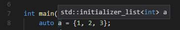

### auto decltype
#### 一. auto 可以自动推断类型
* 当引用被用做初始值时，真正参与初始化的是引用对象的值，此时编译器以引用对象的类型作为auto的类型
```C++
int a = 3;
int &r = a;
auto r1 = r;
r1 = 4;
cout << a << " " << r1 << endl;
```
可以发现r1无法改变a的值，所以`auto r1 = r`相当于`int r1 = r`
* auto会忽略顶层const，保留底层const
```C++
int a = 3;
int b = 4;
int *const p = &a; // 顶层const
auto p1 = p;
p1 = &b;  // 顶层const被忽略，所以指针p1自身可以改变
```
```C++
const int a = 3;
const int *p1 = &a;
auto p2 = p1;
*p2 = 4;  // 错误，底层const保留，无法通过指针改变被指向的对象
```
* auto类型的引用，使用规则同普通类型的引用，但初始值中的顶层const不会被忽略
```C++
const int a = 3;
auto &r = a;
r = 4;  // 错误
```
* 当使用数组作为一个auto变量的初始值时，推断得到的是指针而非数组
```C++
int a[] = {0, 1, 2, 3, 4, 5};
auto b = a;
```
相当于`int *b = &a[0]`
* 当使用列表作为初始值时，得到`std::initializer_list`类型：   


#### 二. decltype可以从表达式的类型推断出要定义的变量的类型
* decltype处理顶层const和引用的方式与auto不同，如果decltype使用的表达式是一个变量，则decltype返回该变量的类型（包括顶层const和引用在内）
```C++
const int ci = 0;
const int &cj = ci;
decltype(ci) x = 0;   // const int x
decltype(cj) y = x;   // const int &y
decltype(cj) z;       // 错误，z是一个引用，必须初始化
```
* 如果decltype使用的表达式不是一个变量，则decltype返回表达式结果对应的类型
```C++
int a = 3;
int &r = a;
decltype(r + 0) b;  // int b;
```
* 表达式的内容是解引用指针，则得到引用类型
```C++
int a = 3;
int *p = &a;
decltype(*p) b;  // 错误，引用未初始化
```
* 如果decltype表达式使用的是一个不加括号的变量，则得到该变量的类型，如果变量名加括号，则得到引用类型
```C++
int a = 3;
decltype(a) b;    // int b;
decltype((a)) c;  // 错误，引用未初始化
```
* 当数组用于decltype时，返回的类型是数组类型，而不是指针类型
```C++
int a[] = {0, 1, 2, 3, 4, 5};
decltype(a) b = {1, 2, 3, 4, 5, 6};
```
返回的类型是一个由6个整数构成的数组