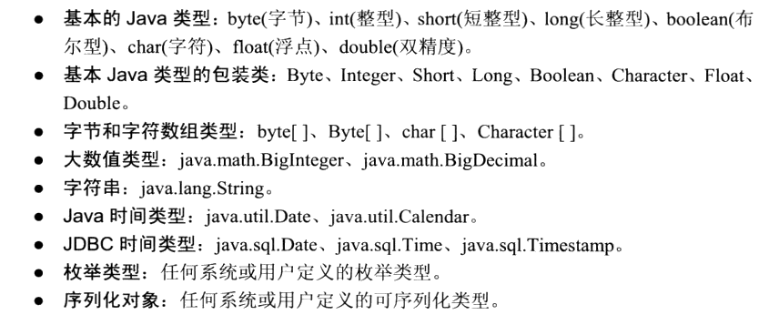

### 实体映射
```java
@Entity
@Table(name = "employee")
public class Employee {
    private int id;
    private String name;
    private long salary;

    @Id
    @GeneratedValue(strategy = GenerationType.IDENTITY)
    public int getId() {
        return id;
    }

    public void setId(int id) {
        this.id = id;
    }

    @Basic
    @Column(name = "employee_name")
    public String getName() {
        return name;
    }

    public void setName(String name) {
        this.name = name;
    }

    public long getSalary() {
        return salary;
    }

    public void setSalary(long salary) {
        this.salary = salary;
    }
}
```
1. `@Entity`注解说明这是一个实体，该注解有一个`name`属性，默认为该类的非限定名称。
2. `@Table`注解可以指定表名，`schema`和`catalog`。
3. `@Id`注解指明主键字段，同时也指明了JPA以何种方式访问该实体类，该注解位于字段上时，使用字段访问直接访问该字段，此时该字段访问权限必须是`protected`，`package`或`private`，不允许使用`public`；位于`getter`方法上时，采用属性访问，程序运行时通过`getter`，`setter`方法访问字段，这两种方法的可见性必须是`public`或`protected`。
4. 混合访问，如果由个别字段要采取和默认的不同的访问策略例如，默认字段访问，`phoneNumber`字段要属性访问：
    1. 在实体类上用`@Access`注解指明该实体类的默认访问策略为字段访问。 
    2. 在要改变访问策略的字段的`getter`方法上标注属性访问。
    3. 在该字段上标注`@Transient`避免该属性被重复映射
    ```java
    @Entity
    @Access(AccessType.FIELD)
    public class Employee {
        @Id
        private int id;
        private String name;
        private long salary;
        @Transient
        private String phoneNumber;

        @Access(AccessType.PROPERTY)
        public String getPhone() {
            return phoneNumber;
        }

        public void setPhone(String phone) {
            this.phoneNumber = phone;
        }
    }    
    ```
5. `@Basic`注解，用于简单类型映射，也叫基本映射，可以放在属性或方法之上，这个注解并不是必须的，主要是用于文档化的目的。如果没有标注此注解，那么将采用此注解的属性的默认值。    
    简单类型映射：   
     
6. `@Column`注解可以用于重写列名，以及配置一些字段约束
7. 枚举类型映射，默认映射到数据库的是枚举元素的序号，可以使用`@Enumerated(EnumType.STRING)`来指定使用枚举类型的字符串值，默认是`@Enumerated(EnumType.ORDINAL)`   
    ```java
    public enum EmployeeType {
        FULL_TIME_EMPLOYEE,
        PART_TIME_EMPLOYEE,
        CONTRACT_EMPLOYEE
    }    
    ```
    ```java
    @Enumerated(EnumType.ORDINAL)
    private EmployeeType employeeType;
    ```
8. `@GeneratedValue`指定主键生成策略，有`TABLE`，`SEQUENCE`，`IDENTITY`，`AUTO`四种。
9. 时间类型映射，`java.sql.Date`，`java.sql.Time`，`java.sql.Timestamp`这三个可以直接使用，`java.util.Date`与`java.util.Calendar`需要使用`@Temporal`注解指定当与JDBC驱动进行通信时使用哪种JDBC java.sql类型，有三个枚举值：`DATE`，`TIME`，`TIMESTAMP`。  
    ```java
    @Temporal(TemporalType.TIMESTAMP)
    private Date startDate;    
    ```