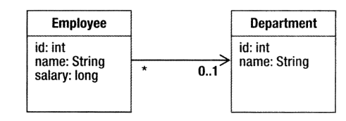
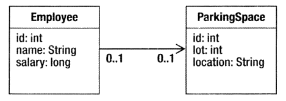
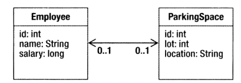
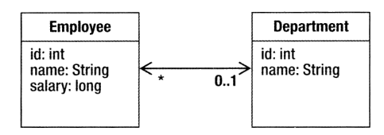
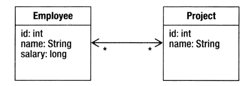
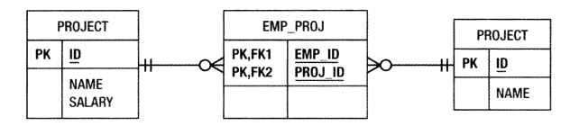
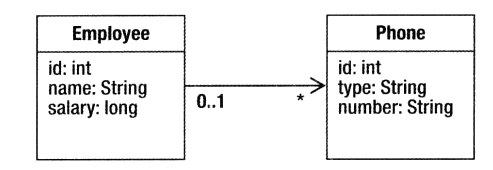
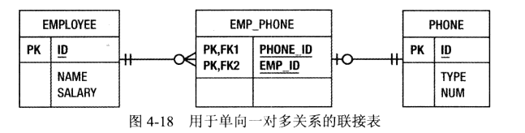

### 映射
#### 一. 多对一映射
多个员工可以工作在同一个部门，所以员工与部门之间存在多对一关系。    
  
```java
@Entity
public class Department {
    @Id
    private int id;
    private String name;

    ...
}
```
```java
@Entity
public class Employee {
    @Id
    private int id;
    private String name;
    private long salary;

    @ManyToOne
    @JoinColumn(name = "dept_id")
    private Department department;

    ...
}
```
> 在数据库中，映射关系意味着一个表有指向另一个表的引用。用于引用另一个表中的键（通常是主键）的列，在数据库中的术语是外键列。在JPA中，称它们联接列（join column)，而`@JoinColumn`注解是主要用于配置这些类型的列的注解。几乎在每个映射关系中，源方与目标方中的一个将在其表中拥有联接列，那一方成为所有方或者关系的所有者，不具有联接列的一方称之为非所有方或反方。`@JoinColumn`注解总是在关系的所有方。

hibernate自动建表后会自动向`employee`表添加外键关联到`department`表：
```sql
create table Department
(
  id   integer not null,
  name varchar(255),
  primary key (id)
) ENGINE = InnoDB  DEFAULT CHARSET = utf8mb4  COLLATE utf8mb4_general_ci;

create table Employee
(
  id      integer not null,
  name    varchar(255),
  salary  bigint  not null,
  dept_id integer,
  primary key (id)
) ENGINE = InnoDB  DEFAULT CHARSET = utf8mb4  COLLATE utf8mb4_general_ci

alter table Employee
  add constraint FK8k3xj28l84p1pg87a7t7ffmnw foreign key (dept_id) references Department (id)
```
#### 二. 单向一对一映射
一个员工拥有一个停车位，从员工获取指定给他的停车位，就将创建从员工到停车位的一对一的关系。    
   
```java
@Entity
public class ParkingSpace {
    @Id
    private int id;
    private int lot;
    private String location;
}
```
```java
@Entity
public class Employee {
    @Id
    private int id;
    private String name;
    private long salary;

    @OneToOne
    @JoinColumn(name = "pspace_id", unique = true)
    private ParkingSpace parkingSpace;
}
```
可以用`@JoinColumn`的`unique`属性为该主键列添加一个唯一性约束。  
```sql
create table Employee
(
  id        integer not null,
  name      varchar(255),
  salary    bigint  not null,
  pspace_id integer,
  primary key (id)
) ENGINE = InnoDB  DEFAULT CHARSET = utf8mb4  COLLATE utf8mb4_general_ci

create table ParkingSpace
(
  id       integer not null,
  location varchar(255),
  lot      integer not null,
  primary key (id)
) ENGINE = InnoDB  DEFAULT CHARSET = utf8mb4  COLLATE utf8mb4_general_ci

alter table Employee
  drop index UK_pjklynf9ci2cwbfn403jsnl4w
alter table Employee
  add constraint UK_pjklynf9ci2cwbfn403jsnl4w unique (pspace_id)
alter table Employee
  add constraint FKeghm8j3bcryoyxyo60o8pit0h foreign key (pspace_id) references ParkingSpace (id)
```
#### 三. 双向一对一映射
一对一的目标实体经常会有指向回源实体的关系，例如`ParkingSpace`有一个指向使用它的`Employee`的引用，这种成为双向的一对一的关系。   
   
> 双向关联映射与单向关联映射的原理是一样的，双向关联映射并不影响存储，只影响加载。所以，双向关联映射和单向关联映射的关系模型是一样的即数据库的表结构是一样的。放弃维护关联关系的一方需要配置`@OneToOne`的`mappedBy`属性，用于指定由对方的哪个属性来映射，如下面的`ParkingSpace`类中，指定由`Employee`对象的`parkingSpace`属性来关联到自己。同时不能使用`@JoinColum`注解，因为放弃维护关联关系的一方所对应的数据表没有外键列。 
```java
@Entity
public class Employee {
    @Id
    private int id;
    private String name;
    private long salary;

    @OneToOne
    @JoinColumn(unique = true)
    private ParkingSpace parkingSpace;
}
```
```java
@Entity
public class ParkingSpace {
    @Id
    private int id;
    private int lot;
    private String location;
    @OneToOne(mappedBy = "parkingSpace")
    private Employee employee;
}
```
#### 四. 双向一对多映射
当一个实体与其他实体的集合相关联时，最常采用一对多映射方式。例如，一个部门通常会有多个员工。  
在一个一对多映射中，一个源实体中会有任意数目的目标实体存放在它的集合中，由于无法在单行中存储任意数量的外键，所以必须让集合中的实体表具有指回到源实体表的外键，这就是为什么一对多关联几乎总是双向的，而不仅仅是所有方的。  
   
在定义双向一对多（或多对一）关系时，需要记住两个重点：  
1. 多对一放是所有方，所以在那一方定义联接列
2. 一对多映射是反方，所以必须使用`mappedBy`元素。如果没有，则JPA会当成单向一对多处理，使用一张联接表来处理映射关系。
```java
@Entity
public class Employee {
    @Id
    private int id;
    private String name;
    private long salary;
    @ManyToOne
    @JoinColumn(name = "dept_id")
    private Department department;
}
```
```java
@Entity
public class Department {
    @Id
    private int id;
    private String name;
    @OneToMany(mappedBy = "department")
    private Collection<Employee> employees;
}
```
#### 五. 多对多映射   
多对多映射关系中的每一方的每个实体将与一个集合值相关联。例如，每个员工可以在多个项目中工作，而每个项目可以由多个员工为其工作。  
> 实现多对多关系的唯一途径是利用一个单独的联接表。   

    

`@JoinTable`注解用来配置关系的联接表，`joinColumns`描述所有方的联接列，`inverseJoinColumns`指定反方的联接列。   
```java
@Entity
public class Employee {
    @Id
    private int id;
    private String name;
    private long salary;
    @ManyToMany
    @JoinTable(name = "EMP_PROJ",
            joinColumns = @JoinColumn(name = "EMP_ID"),
            inverseJoinColumns = @JoinColumn(name = "PROJ_ID"))
    private Collection<Project> projects;
}
```
```java
@Entity
public class Project {
    @Id
    private int id;
    private String name;
    @ManyToMany(mappedBy = "projects")
    private Collection<Employee> employees;
}
```
联接表，两个外键分别关联到`Employee`和`Project`表。
```sql
create table EMP_PROJ
(
  EMP_ID  integer not null,
  PROJ_ID integer not null
) ENGINE = InnoDB  DEFAULT CHARSET = utf8mb4  COLLATE utf8mb4_general_ci

alter table EMP_PROJ
  add constraint FK1dsexaoois76h41q5gsjg04y5 foreign key (PROJ_ID) references Project (id)
alter table EMP_PROJ
  add constraint FKq1mo1yi9i857fwpjub6chvgi9 foreign key (EMP_ID) references Employee (id)
```

#### 六. 单向集合映射
当一个实体到目标实体存在一对多映射，但是`@OneToMany`注解不包括`mappedBy`元素时，就认为它存在与目标实体的单向关系。这意味着目标实体不具有指回源实体的多对一映射。同时在源实体表中的一行也不能存储任意多个外键值，所以额外需要一张联接表来存储映射关系。   
如图，一个员工拥有多个手机号   
   
```java
@Entity
public class Phone {
    @Id
    private int id;
    private String type;
    private String number;
}
```
```java
@Entity
public class Employee {
    @Id
    private int id;
    private String name;
    private long salary;
    @OneToMany
    @JoinTable(name = "EMP_PHONE",
            joinColumns = @JoinColumn(name = "EMP_ID "),
            inverseJoinColumns = @JoinColumn(name = "PHONE_ID"))
    private Collection<Phone> phones;
}
```
