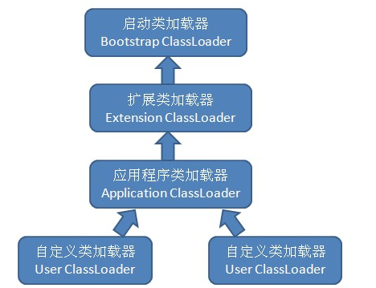

### 类加载器与双亲委派机制

#### 一. 类加载器
对于任意一个类，都需要由加载它的类加载器和这个类本身一同确立其在Java虚拟机中的唯一性，每一个类加载器都有一个独立的类名称空间。*比较两个类是否“相等”，只有在这两个类是由同一个类加载器加载的前提下才有意义，否则即使这两个类来自同一个Class文件，被同一个虚拟机加载，只要加载它们的类加载器不同，那这两个类必定不相等*   
这里的相等，包括代表类的Class对象的`equals()`方法，`isAssignableFrom()`方法，`isInstance()`方法，也包括使用`instance of`做对象所属关系判定等情况。
```java
public class Main {

    public static void main(String[] args) throws ClassNotFoundException, IllegalAccessException, InstantiationException {
        ClassLoader classLoader = new ClassLoader() {
            @Override
            public Class<?> loadClass(String name) throws ClassNotFoundException {
                String fileName = name.substring(name.lastIndexOf(".") + 1) + ".class";
                try {
                    InputStream inputStream = getClass().getResourceAsStream(fileName);
                    byte[] bytes = new byte[inputStream.available()];
                    inputStream.read(bytes);
                    return defineClass(name, bytes, 0, bytes.length);
                } catch (IOException e) {
                    throw new ClassNotFoundException(name);
                }
            }
        };

        Object obj1 = classLoader.loadClass("com.test.loader.Test").newInstance();
        Object obj2 = new Test();

        System.out.println(obj1.getClass());
        System.out.println(obj2.getClass().equals(obj1.getClass()));
        System.out.println(obj1 instanceof Test);
    }
}
```
```bash
class com.test.loader.Test
false
false
```
#### 二. 双亲委派机制
类加载器有三种：
1. 启动类加载器：由`C++`实现，负责加载存放在`<JAVA_HOME>\lib`目录下，或被`-Xbootclasspath`参数指定的路径中的，并且可以被虚拟机识别的类，如rt.jar中的。
2. 扩展类加载器：由`sun.misc.Launcher$ExtClassLoader`实现，负责加载`<JAVA_HOME>\lib\ext`目录中，或者被`java.ext.dirs`系统变量所指定的路径中的类库。
3. 应用程序类加载器：由`sun.misc.Launcher$AppClassLoader`实现，负责加载用户类路径上所指定的类库，如果应用程序中没有自定义过自己的类加载器，一般情况下这个就是程序中默认的类加载器。

双亲委派模型要求除了顶层的启动类加载器外，其余的类加载器都应该由自己的父类加载器。如果一个类加载器接收到了类加载请求，它首先不会自己去尝试加载这个类，而是把这个请求委派给父类加载器去完成，每一个层次的类加载器都是如此，因此所有的加载请求最终都会传送到顶层的启动类加载器中，只有当父类加载器无法完成这个加载请求时(它的搜索范围中没有找到所需的类)，子加载器才会尝试自己去加载。   



> 双亲委派机制很好地解决了各个类加载器的基础类的统一问题，越基础的类由越上层的加载器进行加载。

#### 三. 破坏双亲委派模型
1. 重写`ClassLoader`的`loadClass`方法
```java
protected Class<?> loadClass(String name, boolean resolve) throws ClassNotFoundException {
    synchronized (getClassLoadingLock(name)) {
        // 检查这个类是否已经加载过
        Class c = findLoadedClass(name);
        if (c == null) {
            long t0 = System.nanoTime();
            // 如果没加载过，先尝试让父类加载器去加载
            try { 
                if (parent != null) {
                    c = parent.loadClass(name, false);
                } else {
                    c = findBootstrapClassOrNull(name);
                }
            } catch (ClassNotFoundException e) {
                // 父类加载器无法加载会抛出异常，然后在下面调用findClass方法由自己去加载
            }

            if (c == null) {
                long t1 = System.nanoTime();
                c = findClass(name);
                sun.misc.PerfCounter.getParentDelegationTime().addTime(t1 - t0);
                sun.misc.PerfCounter.getFindClassTime().addElapsedTimeFrom(t1);
                sun.misc.PerfCounter.getFindClasses().increment();
            }
        }
        if (resolve) {
            resolveClass(c);
        }
        return c;
    }
}
```
为了破坏双亲委派机制，只需要重写`loadClass`方法，让它别调用父类加载器就可以了。所以在实现自己的类加载器时，为了遵循双亲委派机制，应重写`findClass`方法，而不是`loadClass`方法。
```java
public static void main(String[] args) throws ClassNotFoundException, IllegalAccessException, InstantiationException {
    ClassLoader classLoader = new ClassLoader() {
        @Override
        protected Class<?> findClass(String name) throws ClassNotFoundException {
            String fileName = name.substring(name.lastIndexOf(".") + 1) + ".class";
            try {
                InputStream inputStream = getClass().getResourceAsStream(fileName);
                if (inputStream == null) {
                    return super.loadClass(name);
                }
                byte[] bytes = new byte[inputStream.available()];
                inputStream.read(bytes);
                return defineClass(name, bytes, 0, bytes.length);
            } catch (IOException e) {
                throw new ClassNotFoundException(name);
            }
        }
    };

    Object obj1 = classLoader.loadClass("com.test.loader.Test").newInstance();
    Object obj2 = new Test();

    System.out.println(obj1.getClass());
    System.out.println(obj2.getClass().equals(obj1.getClass()));
    System.out.println(obj1 instanceof Test);
}
```
```bash
class com.test.loader.Test
true
true
```
2. 线程上下文类加载器：解决基础类调用回用户的代码的问题。`JNDI`服务的代码由启动类加载器加载，它还需要调用由独立厂商实现并部署在应用程序的`ClassPath`下的`JNDI`接口提供者的代码，但启动类加载器并不认识这些代码。比如`JDBC`，它本身只是一套接口，并没有具体的实现，具体的实现在第三方驱动中，`JDBC`中的类是由启动类加载器加载的，而具体实现中的类在用户`classpath`中，无法被启动类加载器加载，这时引入线程上下文类加载器，把原本需要由启动类加载器加载的代码*逆向*请求子类加载器加载。
3. 代码热替换，模块热部署。