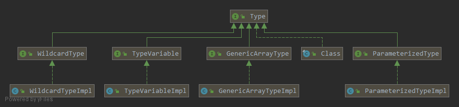
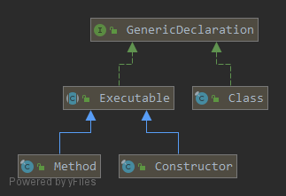

### Type接口  
#### 一. Type接口
`Type`接口是Java语言里所有类型的公共父接口
```java
package java.lang.reflect;

public interface Type {

    default String getTypeName() {
        return toString();
    }
}
```
`Type`接口有一个实现类和四个子接口，这四个子接口又有各自的实现类，用于描述不同的类型信息，在使用时Java会根据要描述的类型来选择其中一种来进行描述。    

 
#### 二. Class
> Instances of the class Class represent classes and interfaces in a running Java application. An enum type is a kind of class and an annotation type is a kind of interface. Every array also belongs to a class that is reflected as a Class object that is shared by all arrays with the same element type and number of dimensions. The primitive Java types (boolean, byte, char, short, int, long, float, and double), and the keyword void are also represented as Class objects.  

`Class`类型的实例表示了一个Java应用运行时的类和接口。一个枚举类型是一种类，一个注解类型是一种接口。所有具有相同类型元素且维度相同的数组对象的共享一个`Class`对象。原生类型(boolean, byte, char, short, int, long, float, double) 和 关键字`void`也可以用`Class`对象表示。
#### 三. ParameterizedType
`ParameterizedType`用于描述带有泛型的类型信息，比如`Collection<String>`
```java
package java.lang.reflect;

public interface ParameterizedType extends Type {
    
    // 返回泛型参数列表
    Type[] getActualTypeArguments();

    // 获取原生类型信息，就是返回Class对象
    Type getRawType();
    
    // 返回此类型所属的类型信息
    Type getOwnerType();
}
```
```java
public class Main {
    Map.Entry<String, Integer> entry;

    public static void main(String[] args) throws Exception {
        Class<Main> mainClass = Main.class;
        Field field = mainClass.getDeclaredField("entry");

        Type fieldType = field.getGenericType();
        if (fieldType instanceof ParameterizedType) {
            ParameterizedType parameterizedType = (ParameterizedType) fieldType;

            Type[] types = parameterizedType.getActualTypeArguments();
            for (Type type : types) {
                System.out.println(type.getTypeName()); // java.lang.String java.lang.Integer
            }

            Type type = parameterizedType.getRawType();
            System.out.println(type.getTypeName()); // java.util.Map$Entry
            System.out.println(type instanceof Class); // true

            Type ownerType = parameterizedType.getOwnerType();
            System.out.println(ownerType.getTypeName()); // java.util.Map
            System.out.println(ownerType instanceof Class); // true
        }
    }
}
```

#### 四. TypeVariable
`TypeVariable`类型变量用于描述比如`List<E>`，`Map<K, V>`中的`E，K, V`这些信息
```java
package java.lang.reflect;

public interface TypeVariable<D extends GenericDeclaration> extends Type, AnnotatedElement {
    // 返回泛型上界，比如class Holder<T extends Cloneable & Serializable> {}
    // 如果没定义上界，则是Object
    Type[] getBounds();

    // 返回这个泛型信息是在哪里声明的
    D getGenericDeclaration();

    // 返回T, K, V这种声明泛型时用的标识符
    String getName();

    AnnotatedType[] getAnnotatedBounds();
}
```

`GenericDeclaration`接口定义了在哪里可以声明泛型
```java
package java.lang.reflect;

public interface GenericDeclaration extends AnnotatedElement {

    public TypeVariable<?>[] getTypeParameters();
}
```
它有三个实现类，所以只有类、方法和构造器这三个地方可以声明泛型    

 

```java
public class Main<T extends Cloneable & Serializable> {
    
    T t;

    public static void main(String[] args) throws Exception {
        Class<Main> mainClass = Main.class;
        Field field = mainClass.getDeclaredField("t");
        Type fieldType = field.getGenericType();
        if (fieldType instanceof TypeVariable) {
            TypeVariable typeVariable = (TypeVariable) fieldType;
            System.out.println(typeVariable.getName());  // T

            GenericDeclaration genericDeclaration = typeVariable.getGenericDeclaration();
            if (genericDeclaration instanceof Class) {
                System.out.println(((Class)genericDeclaration).getName()); // com.test.Main
            }

            Type[] bounds = typeVariable.getBounds();
            for (Type type : bounds) {
                System.out.println(type.getTypeName()); // java.lang.Cloneable java.io.Serializable
            }
        }
    }
}
```

#### 五. GenericArrayType
`GenericArrayType`用于描述参数化类型的数组的类型信息(`List<String>[]`) 或 类型变量的数组的类型信息(`T[]`)
```java
package java.lang.reflect;

public interface GenericArrayType extends Type {

    // 返回数组元素的类型信息
    Type getGenericComponentType();
}
```
```java
public class Main {

    List<String>[] lists;

    public static void main(String[] args) throws Exception {
        Class<Main> mainClass = Main.class;
        Field field = mainClass.getDeclaredField("lists");

        Type fieldType = field.getGenericType();
        if (fieldType instanceof GenericArrayType) {
            GenericArrayType arrayType = (GenericArrayType) fieldType;
            System.out.println(arrayType.getTypeName()); // java.util.List<java.lang.String>[]
            ParameterizedType parameterizedType = (ParameterizedType) arrayType.getGenericComponentType();
            System.out.println(parameterizedType.getTypeName()); // java.util.List<java.lang.String>
        }
    }
}
```
```java
public class Main<T> {

    T[] ts;

    public static void main(String[] args) throws Exception {
        Class<Main> mainClass = Main.class;
        Field field = mainClass.getDeclaredField("ts");
        Type fieldType = field.getGenericType();
        if (fieldType instanceof GenericArrayType) {
            GenericArrayType arrayType = (GenericArrayType) fieldType;
            System.out.println(arrayType.getTypeName()); // T[]
            
            TypeVariable typeVariable = (TypeVariable) arrayType.getGenericComponentType();
            Class clazz = (Class)typeVariable.getGenericDeclaration();
            System.out.println(clazz.getName()); // com.test.Main
        }
    }
}
```
#### 六. WildcardType
`WildcardType`通配符类型用于描述一个通配符类型表达式，比如`? extends Number`，`? super Integer`。它内部定义的两个方法分别返回通配符的上下边界。
```java
public interface WildcardType extends Type {

    Type[] getUpperBounds();

    Type[] getLowerBounds();
}
```
对于`List<? extends Cloneable>`这种类型的变量，先用`ParameterizedType`描述，调用`getActualTypeArguments`方法后的`? extends Cloneable`部分用`WildcardType`描述： 
```java
public class Main {

    List<? extends Cloneable> list;

    public static void main(String[] args) throws Exception {
        Class<Main> mainClass = Main.class;
        Field field = mainClass.getDeclaredField("list");
        ParameterizedType parameterizedType = (ParameterizedType) field.getGenericType();
        WildcardType wildcardType = (WildcardType) parameterizedType.getActualTypeArguments()[0];
        showBound(wildcardType.getLowerBounds()); // 无输出，因为没定义下界
        showBound(wildcardType.getUpperBounds()); // interface java.lang.Cloneable
    }

    private static void showBound(Type[] bounds) {
        if (bounds.length > 0) {
            System.out.println(bounds[0]);
        }
    }
}
```