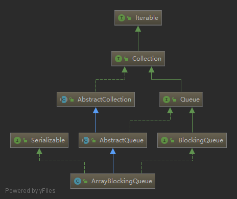

### ArrayBlockingQueue
   
一个有界的阻塞队列，内部是用数组实现的一个循环队列，不能存放`null`。  
#### 一. Fields
```java
// 存放元素的数组
final Object[] items;

// 下一次执行 take, poll, peek, remove操作的元素下标
int takeIndex;

// 下一次执行 put, offer, add操作的下标
int putIndex;

// 队列中元素数量
int count;

// 锁
final ReentrantLock lock;

// 队列非空条件
private final Condition notEmpty;

// 队列非满条件
private final Condition notFull;

transient Itrs itrs;
```
#### 二. Constructors
默认不采用公平锁策略，队列容量要大于0。    
第三个构造器里上锁不是为了线程安全，而是为了保证可见性，保证对数组元素，对count, putIndex的修改能立即同步到主内存。
```java
public ArrayBlockingQueue(int capacity) {
    this(capacity, false);
}

public ArrayBlockingQueue(int capacity, boolean fair) {
    if (capacity <= 0)
        throw new IllegalArgumentException();
    this.items = new Object[capacity];
    lock = new ReentrantLock(fair);
    notEmpty = lock.newCondition();
    notFull =  lock.newCondition();
}

public ArrayBlockingQueue(int capacity, boolean fair,
                            Collection<? extends E> c) {
    this(capacity, fair);

    final ReentrantLock lock = this.lock;
    lock.lock(); // Lock only for visibility, not mutual exclusion
    try {
        final Object[] items = this.items;
        int i = 0;
        try {
            for (E e : c)
                items[i++] = Objects.requireNonNull(e);
        } catch (ArrayIndexOutOfBoundsException ex) {
            throw new IllegalArgumentException();
        }
        count = i;
        putIndex = (i == capacity) ? 0 : i;
    } finally {
        lock.unlock();
    }
}
```
#### 三. Methods
* 有四个向队列添加元素的方法：   
    * `boolean add(E)`：添加成功返回`true`，队列已满抛出`IllegalStateException`；
    * `boolean offer(E)`：添加成功返回`true`，队列已满返回`false`；
    * `void put(E)`：队列已满会阻塞，等待队列非满再添加；
    * `boolean offer(E, long, TimeUnit)`：队列已满会等待一段时间，如果超时后队列还是满，则无法添加返回`false`，添加成功返回`true`
* 四个移除队头的方法：   
    * `E poll()`：队列为空返回`null`，否则移除队头元素并返回；
    * `E take()`：队列为空时线程等待，直到队列不空，移除队头元素返回；
    * `E poll(long, TimeUnit)`：队列空时等待一段时间，超时后队列还是空返回`null`，不空则移除队头元素并返回；
    * `E remove()`：队列为空抛出`NoSuchElementException`，否则移除并返回队头元素。继承自`AbstractQueue`类。
* 一个获取但不移除队头元素的方法：   
    * `E peek()`：返回但不移除队头元素，若队列为空返回`null`。

1. `boolean offer(E)`
    ```java
    public boolean offer(E e) {
        Objects.requireNonNull(e);
        final ReentrantLock lock = this.lock;
        lock.lock();
        try {
            // 队列已满直接返回false
            if (count == items.length)
                return false;
            else {
                enqueue(e);
                return true;
            }
        } finally {
            lock.unlock();
        }
    }
    // 向队尾添加元素，并唤醒一个等待非空条件的线程
    private void enqueue(E e) {
        final Object[] items = this.items;
        items[putIndex] = e;
        if (++putIndex == items.length) putIndex = 0;
        count++;
        notEmpty.signal();
    }
    ```
2. `boolean add(E)`在内部直接调用上面的`offer`方法，对结果做了是否为`false`的判断，如果为`false`抛出异常。这个方法是在父类`AbstractQueue`中实现的。
    ```java
    public boolean add(E e) {
        if (offer(e))
            return true;
        else
            throw new IllegalStateException("Queue full");
    }
    ```
3. `void put(E)`，队列满的时候会一直等待到非满再添加元素。
    ```java
    public void put(E e) throws InterruptedException {
        Objects.requireNonNull(e);
        final ReentrantLock lock = this.lock;
        lock.lockInterruptibly();
        try {
            while (count == items.length)
                notFull.await();
            enqueue(e);
        } finally {
            lock.unlock();
        }
    }
    ```
4. `boolean offer(E, long, TimeUnit)`
    ```java
    public boolean offer(E e, long timeout, TimeUnit unit)
        throws InterruptedException {
        Objects.requireNonNull(e);
        long nanos = unit.toNanos(timeout);
        final ReentrantLock lock = this.lock;
        lock.lockInterruptibly();
        try {
            while (count == items.length) {
                // 等待超时后队列还是满的
                if (nanos <= 0L)
                    return false;
                nanos = notFull.awaitNanos(nanos);
            }
            enqueue(e);
            return true;
        } finally {
            lock.unlock();
        }
    }
    ```
5. `E poll()`
    ```java
    public E poll() {
        final ReentrantLock lock = this.lock;
        lock.lock();
        try {
            // 队列为空返回null，否则移除队头并返回
            return (count == 0) ? null : dequeue();
        } finally {
            lock.unlock();
        }
    }
    // 移除队头并返回，同时唤醒一个等待notFull条件的线程
    private E dequeue() {
        final Object[] items = this.items;
        @SuppressWarnings("unchecked")
        E e = (E) items[takeIndex];
        items[takeIndex] = null;
        if (++takeIndex == items.length) takeIndex = 0;
        count--;
        if (itrs != null)
            itrs.elementDequeued();
        notFull.signal();
        return e;
    }
    ```
6. `E take()`
    ```java
    public E take() throws InterruptedException {
        final ReentrantLock lock = this.lock;
        lock.lockInterruptibly();
        try {
            // 队列空的话等待至队列非空
            while (count == 0)
                notEmpty.await();
            return dequeue();
        } finally {
            lock.unlock();
        }
    }
    ```
7. `E poll(long, TimeUnit)`
    ```java
    public E poll(long timeout, TimeUnit unit) throws InterruptedException {
        long nanos = unit.toNanos(timeout);
        final ReentrantLock lock = this.lock;
        lock.lockInterruptibly();
        try {
            while (count == 0) {
                // 超时后队列还是空的
                if (nanos <= 0L)
                    return null;
                nanos = notEmpty.awaitNanos(nanos);
            }
            return dequeue();
        } finally {
            lock.unlock();
        }
    }
    ```
8. `E remove()`，继承自`AbstractQueue`，内部调用`poll`方法，对结果进行判断，如果`poll`返回`null`则抛异常。
    ```java
    public E remove() {
        E x = poll();
        if (x != null)
            return x;
        else
            throw new NoSuchElementException();
    }
    ```
9. `E peek()`，直接返回数组下标为`takeIndex`的元素，所以如果队列空的话返回`null`
    ```java
    public E peek() {
        final ReentrantLock lock = this.lock;
        lock.lock();
        try {
            return itemAt(takeIndex); // null when queue is empty
        } finally {
            lock.unlock();
        }
    }
    ```