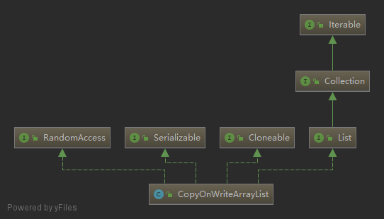
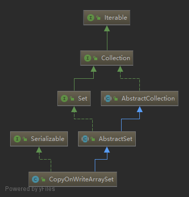

### CopyOnWriteArrayList与CopyOnWriteArraySet
#### 一. CopyOnWriteArrayList
   
`CopyOnWriteArrayList`实现了`List`接口，可以认为是`ArrayList`的一个线程安全的版本。在多个线程读的时候没有限制，就算一个线程在写的时候也可以读，因为对容器的修改操作是将底层数组复制一份，然后对复制出来的新数组进行修改，然后将数组引用指向新数组，这些操作都是加锁同步的，所以不能多个线程同时写。由此可见，`CopyOnWriteArrayList`适合读多写少的场景，而且虽然是线程安全的，但是只能保证最终的数据一致性，不能保证数据的实时一致性。 
1. `get`操作，可以看到，读操作没有加任何限制，成员变量被`volatile`修饰，确保每次调用`getArray()`时获取到的数组都是最新的。
    ```java
    private transient volatile Object[] array;

    public E get(int index) {
        return elementAt(getArray(), index);
    }

    final Object[] getArray() {
        return array;
    }

    static <E> E elementAt(Object[] a, int index) {
        return (E) a[index];
    }
    ```
2. `add`操作被加锁了，所以不能有多个线程同时修改，上锁后，将原来的数组复制到一个新的数组，而且长度加1，然后将插入元素放到新数组中，再将新数组赋给成员变量`array`，其他的修改操作也是类似的。
    ```java
    final transient Object lock = new Object();

    public boolean add(E e) {
        synchronized (lock) {
            Object[] es = getArray();
            int len = es.length;
            es = Arrays.copyOf(es, len + 1);
            es[len] = e;
            setArray(es);
            return true;
        }
    }

    final void setArray(Object[] a) {
        array = a;
    }
    ```
3. 迭代器，和`ArrayList`的迭代器差不多，但是这里为了防止多个线程并发修改，将迭代器的所有写操作都设为不支持的操作。迭代器对象内部保留了一份指向底层数组的引用，所以在一个迭代器对象的生命周期中，使用的都是同一份数组，其内部数据不会被修改。
    ```java
    public Iterator<E> iterator() {
        return new COWIterator<E>(getArray(), 0);
    }

    static final class COWIterator<E> implements ListIterator<E> {
        /** Snapshot of the array */
        private final Object[] snapshot;
        /** Index of element to be returned by subsequent call to next.  */
        private int cursor;

        COWIterator(Object[] es, int initialCursor) {
            cursor = initialCursor;
            snapshot = es;
        }

        public boolean hasNext() {
            return cursor < snapshot.length;
        }

        public boolean hasPrevious() {
            return cursor > 0;
        }

        @SuppressWarnings("unchecked")
        public E next() {
            if (! hasNext())
                throw new NoSuchElementException();
            return (E) snapshot[cursor++];
        }

        @SuppressWarnings("unchecked")
        public E previous() {
            if (! hasPrevious())
                throw new NoSuchElementException();
            return (E) snapshot[--cursor];
        }

        public int nextIndex() {
            return cursor;
        }

        public int previousIndex() {
            return cursor - 1;
        }

        public void remove() {
            throw new UnsupportedOperationException();
        }

        public void set(E e) {
            throw new UnsupportedOperationException();
        }

        public void add(E e) {
            throw new UnsupportedOperationException();
        }

        ...
    }
    ```
4. `subList`返回一个子列表视图，由于这个视图是要能够正确反映出原列表中的数据，所以，无论是在创建这个视图的过程，还是视图对象的所有读写操作，都要加锁，防止在上述操作过程中有其他线程修改列表底层数组。视图对象创建时，保留了一个当前底层数组对象的引用，之后无论时视图对象的读还是写操作，除了要加锁，还要检查保留的引用和真正的底层数组引用是不是一个，如果不一致，说明已被修改，则视图对象应失效，抛出并发修改异常，这一点和`ArrayList`的设计是差不多的，只不过`ArrayList`使用`modCount`来判断是否并发修改，这里直接使用数组引用判断。
    ```java
    public List<E> subList(int fromIndex, int toIndex) {
        synchronized (lock) {
            Object[] es = getArray();
            int len = es.length;
            int size = toIndex - fromIndex;
            if (fromIndex < 0 || toIndex > len || size < 0)
                throw new IndexOutOfBoundsException();
            return new COWSubList(es, fromIndex, size);
        }
    }

    private class COWSubList implements List<E>, RandomAccess {
        private final int offset;
        private int size;
        private Object[] expectedArray;

        COWSubList(Object[] es, int offset, int size) {
            // assert Thread.holdsLock(lock);
            expectedArray = es;
            this.offset = offset;
            this.size = size;
        }

        private void checkForComodification() {
            // assert Thread.holdsLock(lock);
            if (getArray() != expectedArray)
                throw new ConcurrentModificationException();
        }

        ...
    }
    ```
#### 二. CopyOnWriteArraySet
   
`CopyOnWriteArraySet`在内部使用一个`CopyOnWriteArrayList`对象来存放数据，所以对大部分方法的调用都会转为对list对象方法的调用。在存放数据时，先遍历一下数组，如果数据不存在就插入，存在就不插入，从而达到set数据不重复的目的，这种方式在数据量大的时候效率并不是很高，但是不要忘记，CopyOnWrite容器是用于读远多于写的情况。
`add`方法：
```java
private final CopyOnWriteArrayList<E> al;

public boolean add(E e) {
    return al.addIfAbsent(e);
}
```
下面是`CopyOnWriteArrayList`的源码
```java
// 如果没有e则添加
public boolean addIfAbsent(E e) {
    Object[] snapshot = getArray();
    return indexOfRange(e, snapshot, 0, snapshot.length) < 0
        && addIfAbsent(e, snapshot);
}

// snapshot已经是确定不包含e的快照版本
private boolean addIfAbsent(E e, Object[] snapshot) {
    synchronized (lock) {
        Object[] current = getArray();
        int len = current.length;
        // 在获得锁之前，有其他线程进行了修改
        if (snapshot != current) {
            // 取两个版本长度的最小值
            int common = Math.min(snapshot.length, len);
            for (int i = 0; i < common; i++)
                // 因为snapshot中已经确定不含e了
                // 所以只有current[i] != snapshot[i]时current[i]才可能等于e
                if (current[i] != snapshot[i]
                    && Objects.equals(e, current[i]))
                    return false;
            // 新版本数组的[0, common)部分不包含e，检查剩余部分
            if (indexOfRange(e, current, common, len) >= 0)
                    return false;
        }
        // 新版本也不包含e，创建新数组，添加e到数组末尾
        Object[] newElements = Arrays.copyOf(current, len + 1);
        newElements[len] = e;
        setArray(newElements);
        return true;
    }
}
```
