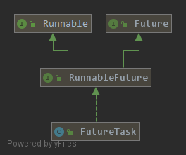

### FutureTask
#### 一. FutureTask继承体系
    
`RunnableFuture`接口继承了`Runnable`和`Future`接口，`FutureTask`类实现了`RunnableFuture`接口
```java
public interface Future<V> {

    /**
     * 尝试取消正在执行的任务，如果任务已经完成，或者已经被取消了，或者由于其他原因而不能被取消，或取消失败。
     * 如果取消的时候，任务没有开始执行，那么任务之后不会被执行。
     * 如果任务正在执行，那么参数mayInterruptIfRunning决定了是否要中断执行任务的线程。
     * 
     * 这个方法返回true后，后续对isDone 和 isCancelled 方法的调用都会返回true
     *
     * 取消成功返回true，否则返回false
     */
    boolean cancel(boolean mayInterruptIfRunning);

    /**
     * 任务在正常完成之前是否被取消
     */
    boolean isCancelled();

    /**
     * 返回任务是否完成
     * 任务完成包括 正常结束、由于异常结束、或者是任务被取消。
     */
    boolean isDone();

    /**
     * 等待任务完成，返回结果
     */
    V get() throws InterruptedException, ExecutionException;

    /**
     * get的超时版本，如果超时会抛TimeoutException
     */
    V get(long timeout, TimeUnit unit) throws InterruptedException, ExecutionException, TimeoutException;
}
```

```java
public interface RunnableFuture<V> extends Runnable, Future<V> {
    void run();
}
```

#### 二. FutureTask的状态和几个实例变量
```java
private volatile int state;
/**
 * 可能的状态变化
 * NEW -> COMPLETING -> NORMAL
 * NEW -> COMPLETING -> EXCEPTIONAL
 * NEW -> CANCELLED
 * NEW -> INTERRUPTING -> INTERRUPTED
 */
private static final int NEW          = 0; // 新建，初始化状态
private static final int COMPLETING   = 1; // 正在完成
private static final int NORMAL       = 2; // 任务正常执行完
private static final int EXCEPTIONAL  = 3; // 任务执行过程中抛异常了
private static final int CANCELLED    = 4; // 任务被取消了
private static final int INTERRUPTING = 5; // 正在中断
private static final int INTERRUPTED  = 6; // 中断完成
```
只能通过`set`，`setException`，`cancel`这几个方法改变状态
```java
// 任务正常执行完成
// 先将状态 NEW -> COMPLETING，然后设置任务返回值
// 设置完返回值后再修改状态 COMPLETING -> NORMAL
protected void set(V v) {
    if (STATE.compareAndSet(this, NEW, COMPLETING)) {
        outcome = v;
        STATE.setRelease(this, NORMAL); // final state
        finishCompletion();
    }
}

// 执行过程抛异常，则任务的返回值为异常对象    
// NEW -> COMPLETING -> EXCEPTIONAL
// 由于调用cancel方法产生的InterruptedException并不会在这里被设置
// 因为调用cancel后，在这里state不是NEW，CAS会失败
protected void setException(Throwable t) {
    if (STATE.compareAndSet(this, NEW, COMPLETING)) {
        outcome = t;
        STATE.setRelease(this, EXCEPTIONAL); // final state
        finishCompletion();
    }
}
```
```java
// 执行的任务
private Callable<V> callable;
// 返回的结果或从get()方法中抛出的异常
private Object outcome; // non-volatile, protected by state reads/writes
// 执行任务的线程
private volatile Thread runner;
// 等待队列的头节点
private volatile WaitNode waiters;
```
#### 三. 构造器
```java
public FutureTask(Callable<V> callable) {
    if (callable == null)
        throw new NullPointerException();
    this.callable = callable;
    this.state = NEW;       // ensure visibility of callable
}

// 将Runnable对象包装成Callable对象
public FutureTask(Runnable runnable, V result) {
    this.callable = Executors.callable(runnable, result);
    this.state = NEW;       // ensure visibility of callable
}
```
#### 四. run方法
```java
public void run() {
    // 如果state不是NEW(可能被取消，或任务已经执行过了) 或 任务已经由其他线程执行
    // 直接返回，不执行任务
    if (state != NEW ||
        !RUNNER.compareAndSet(this, null, Thread.currentThread()))
        return;
    try {
        Callable<V> c = callable;
        if (c != null && state == NEW) {
            V result;
            boolean ran;
            try {
                result = c.call(); // 执行任务
                ran = true;
            } catch (Throwable ex) {
                result = null;
                ran = false;
                // 设置异常状态
                setException(ex);
            }
            // 设置正常执行的返回结果
            if (ran)
                set(result);
        }
    } finally {
        runner = null;
        int s = state;
        // 如果正在中断，等待至响应中断完成
        if (s >= INTERRUPTING)
            handlePossibleCancellationInterrupt(s);
    }
}
```
#### 五. get方法
因调用`get()`方法而阻塞的线程会被封装成`WaitNode`对象并放到链表里排队
```java
static final class WaitNode {
    volatile Thread thread;
    volatile WaitNode next;
    WaitNode() { thread = Thread.currentThread(); }
}
```

```java
public V get() throws InterruptedException, ExecutionException {
    int s = state;
    // 如果任务还没完成，则等待至完成，并获取完成时的状态
    if (s <= COMPLETING)
        s = awaitDone(false, 0L);
    return report(s); // 返回结果
}
private int awaitDone(boolean timed, long nanos) throws InterruptedException {
    long startTime = 0L;    // Special value 0L means not yet parked
    WaitNode q = null;
    boolean queued = false;
    for (;;) {
        int s = state;
        // 任务完成，返回完成时的状态
        if (s > COMPLETING) {
            if (q != null)
                q.thread = null;
            return s;
        }
        else if (s == COMPLETING)
            // 正在设置结果，让出cpu时间给其他线程
            Thread.yield();
        else if (Thread.interrupted()) {
            // 线程被中断，抛出InterruptedException
            removeWaiter(q);
            throw new InterruptedException();
        }
        else if (q == null) {
            // 如果需要计时并且超时了，直接返回状态
            if (timed && nanos <= 0L)
                return s;
            q = new WaitNode();
        }
        else if (!queued)
            // 如果还没排队，头插法将当前线程加入链表
            queued = WAITERS.weakCompareAndSet(this, q.next = waiters, q);
        else if (timed) {
            // 需要计时
            final long parkNanos;
            if (startTime == 0L) { // 第一次，还没Park过
                startTime = System.nanoTime();
                if (startTime == 0L)
                    startTime = 1L;
                parkNanos = nanos;
            } else {
                long elapsed = System.nanoTime() - startTime;
                // 从开始到现在经历过的时间大于超时时间
                // 队列中删除此线程，返回状态
                if (elapsed >= nanos) {
                    removeWaiter(q);
                    return state;
                }
                parkNanos = nanos - elapsed;
            }
            // 重新检查一下状态，确定需要Park
            if (state < COMPLETING)
                LockSupport.parkNanos(this, parkNanos);
        }
        else // 没有设置超时，park
            LockSupport.park(this);
    }
}

// 根据任务完成时的状态处理结果
@SuppressWarnings("unchecked")
private V report(int s) throws ExecutionException {
    Object x = outcome;
    if (s == NORMAL) // 正常执行完，返回结果
        return (V)x;
    if (s >= CANCELLED)  // 任务取消后调用get方法，抛异常
        throw new CancellationException();
    throw new ExecutionException((Throwable)x); // 抛出执行任务过程中出现的异常
}
```
#### 六. cannel方法
```java
// 根据mayInterruptIfRunning设置值不同，
// 状态变化可能是 NEW -> INTERRUPTING -> INTERRUPTED 或 NEW -> CANCELLED
public boolean cancel(boolean mayInterruptIfRunning) {
    // 如果state不为NEW，或CAS修改状态失败(可能由其他线程在修改状态)，返回false
    if (!(state == NEW && STATE.compareAndSet
            (this, NEW, mayInterruptIfRunning ? INTERRUPTING : CANCELLED)))
        return false;
    try {    // in case call to interrupt throws exception
        if (mayInterruptIfRunning) {
            try {
                Thread t = runner;
                if (t != null)
                    t.interrupt(); // 中断线程
            } finally { // final state
                STATE.setRelease(this, INTERRUPTED);
            }
        }
    } finally {
        finishCompletion();
    }
    return true;
}
```
#### 七. finishCompletion
这个方法是在`set`，`setException`，`cancel`方法中最后被调用的，即任务完成之后被调用的。    
主要作用就是将因调用`get`方法而阻塞在链表中的线程全部唤醒，并最后执行`done()`方法。
```java
private void finishCompletion() {
    // assert state > COMPLETING;
    for (WaitNode q; (q = waiters) != null;) {
        if (WAITERS.weakCompareAndSet(this, q, null)) {
            for (;;) {
                Thread t = q.thread;
                if (t != null) {
                    q.thread = null;
                    LockSupport.unpark(t); // 唤醒线程
                }
                WaitNode next = q.next;
                if (next == null)
                    break;
                q.next = null; // unlink to help gc
                q = next;
            }
            break;
        }
    }

    // 一个空的钩子方法，子类可以重写它来实现自己的逻辑
    done();

    callable = null;        // to reduce footprint
}
```
#### 八. 获取状态的方法
```java
// 根据cancel方法参数不同，状态有两种变化，但都是>=CANCELLED
public boolean isCancelled() {
    return state >= CANCELLED;
}
// 只要不是NEW，就是done
public boolean isDone() {
    return state != NEW;
}
```
#### 九. 总结
* 当任务没完成时，调用`get`方法的线程会通过自旋加`LockSupport.park`或`LockSupport.parkNanos`方法等待至任务完成，同时该线程会被封装成`WaitNode`对象存放于一个链表中
* 任务正常执行完后会调用`set`方法，执行过程抛异常会执行`setException`方法，取消这个任务时调用`cancel`方法，取消任务又分为只将状态设为`CANCELLED`和中断线程两种。只有这三个方法才能改变任务的状态，对应于这四种情况，状态变化分别是：   
    1. NEW -> COMPLETING -> NORMAL
    2. NEW -> COMPLETING -> EXCEPTIONAL
    3. NEW -> CANCELLED
    4. NEW -> INTERRUPTING -> INTERRUPTED    
* `NORMAL`，`EXCEPTIONAL`，`CANCELLED`，`INTERRUPTED`这四种状态又意味着任务结束，所以上面三个方法最后都会调用`finishCompletion`方法来唤醒链表中所有的线程，让这些因调用`get`方法而阻塞的线程获取运行结果，继续执行
* 执行任务过程中抛出的异常会在调用`get`方法时包装成`ExecutionException`被抛出(不包括由`cancel`方法造成的`InterruptedException`)
* `get`方法返回结果之前任务已经被取消，`get`方法会抛`CancellationException`