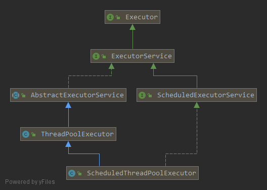
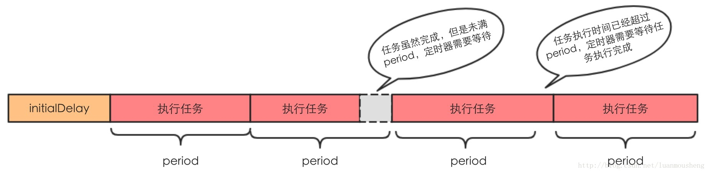
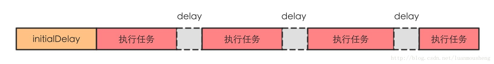
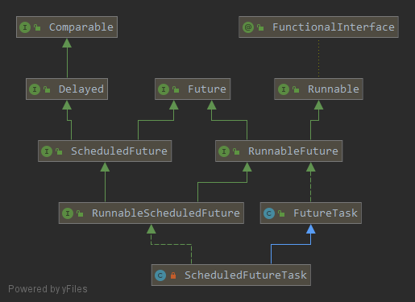

### ScheduleThreadPoolExecutor
#### 一. 继承体系
   
`ScheduleExecutorService`接口：
```java
public interface ScheduledExecutorService extends ExecutorService {

    // 延迟delay后执行command，只执行一次
    public ScheduledFuture<?> schedule(Runnable command, long delay, TimeUnit unit);

    // 同上，只不过这个是有返回值的
    public <V> ScheduledFuture<V> schedule(Callable<V> callable, long delay, TimeUnit unit);

    // 延迟initialDelay时间后，每过period时间执行一次，这里的period是两次任务开始的时间间隔
    public ScheduledFuture<?> scheduleAtFixedRate(Runnable command, long initialDelay, long period, TimeUnit unit);

    // delay是一次执行结束和下一次执行开始的时间间隔
    public ScheduledFuture<?> scheduleWithFixedDelay(Runnable command, long initialDelay, long delay, TimeUnit unit);

}
```
`scheduleAtFixedRate`:   

`scheduleWithFixedDelay`:   

#### 二. 调度的具体实现
以`scheduleAtFixedRate`方法为例，所有的调度方法在经过参数校验后都会将任务包装成一个`RunnableScheduledFuture`类型的对象，然后都会调用`delayedExecute`方法将任务放到队列里：
```java
public ScheduledFuture<?> scheduleAtFixedRate(Runnable command, long initialDelay, long period, TimeUnit unit) {
    if (command == null || unit == null)
        throw new NullPointerException();
    if (period <= 0L)
        throw new IllegalArgumentException();
    ScheduledFutureTask<Void> sft =
        new ScheduledFutureTask<Void>(command,
                                        null,
                                        triggerTime(initialDelay, unit),
                                        unit.toNanos(period),
                                        sequencer.getAndIncrement());
    RunnableScheduledFuture<Void> t = decorateTask(command, sft);
    sft.outerTask = t;
    delayedExecute(t);
    return t;
}
```
`delayedExecute`方法主要作用就是在线程池还可以继续接受任务的前提下，将任务放进一个阻塞队列里，然后线程池里的线程会在一个循环里不断地从队列里取出任务执行。
```java
private void delayedExecute(RunnableScheduledFuture<?> task) {
    if (isShutdown())
        reject(task);
    else {
        super.getQueue().add(task);
        if (!canRunInCurrentRunState(task) && remove(task))
            task.cancel(false);
        else
            ensurePrestart();
    }
}
```
队列`DelayedWorkQueue`是`ScheduleThreadPoolExecutor`里的一个内部类：
```java
static class DelayedWorkQueue extends AbstractQueue<Runnable> implements BlockingQueue<Runnable> { ... }
```
这个队列内部是用堆实现的一个优先队列，前面提到过，任务会被包装成一个`RunnableScheduledFuture`类型的对象，放到这个队列里，而这种类型都实现了`Delayed`接口，也就都有`getDelay`方法，就是通过这个方法的返回值大小来确定任务的优先级，`getDelay`方法返回值越小，任务越先被执行： 



线程池里的线程就是调用队列的`take()`方法来获取任务并执行：
```java
private Thread leader; 

private final Condition available = lock.newCondition();

public RunnableScheduledFuture<?> take() throws InterruptedException {
    final ReentrantLock lock = this.lock;
    lock.lockInterruptibly();
    try {
        for (;;) {
            // 获取堆顶任务，即最先将被执行的任务
            RunnableScheduledFuture<?> first = queue[0]; 
            if (first == null) // 队列空，线程等待
                available.await();
            else {
                // 获取离任务执行时刻还有多久
                long delay = first.getDelay(NANOSECONDS);
                if (delay <= 0L) // 任务已经可以执行了
                    return finishPoll(first); // 从队列中移除任务，并返回任务
                first = null;
                // 还没到任务可以执行的时刻
                if (leader != null) // 已经有其他线程获取了堆顶任务，那么此线程等待
                    available.await(); // 【1】
                else {  // 还没有其他线程获取堆顶任务，那么此线程获取它(此线程引用赋给leader)
                    Thread thisThread = Thread.currentThread();
                    leader = thisThread;
                    try { // 等待到任务可以执行的时刻
                        available.awaitNanos(delay); // 【2】
                    } finally {
                        // 如果leader是此线程，清空leader
                        if (leader == thisThread)
                            leader = null;
                    }
                }
            }
        }
    } finally {
        // 如果leader为null 并且 队列里还有任务，那么唤醒其他在【1】处等待的线程
        if (leader == null && queue[0] != null) // 【3】
            available.signal();
        lock.unlock();
    }
}
```
当线程池里的线程从`take`方法里返回时，返回的任务已经是需要立即被执行了的，从上面代码里可以看出，如果堆顶任务没到可以执行的时刻，那么线程会等待到其可以执行，然后返回。   

假如现在又两个线程A和B，A先进入`take`方法，获取堆顶任务`first`，然后`getDelay`发现还没到任务可以执行的时刻，所以它会将`leader`设为自己，然后在【2】处等待至任务可以执行；此时线程B进入`take`方法，它获取堆顶任务然后发现没到可以执行的时刻，进而发现`leader`也不为空，所以B会在【1】处等待；然后A从【2】处超时唤醒，清空`leader`并进入下一次循环，在`if (delay <= 0L)`那里直接返回任务，并执行【3】处的代码，唤醒线程B，B从【1】处被唤醒后进入下一次循环，继续获取任务...

线程获取到任务后就要执行，`ScheduledFutureTask`是`RunnableScheduledFuture`的实现类，内部重写了`run`方法，用来对任务进行重复调度：
```java
public void run() {
    if (!canRunInCurrentRunState(this))
        cancel(false);
    else if (!isPeriodic()) // 任务不需要重复执行(period == 0)，那就只执行这一次
        super.run();
    else if (super.runAndReset()) { // 需要重复执行，执行完后
        setNextRunTime();           // 设置下次执行时间
        reExecutePeriodic(outerTask); // 并重新放回队列里
    }
}
```
这里对下次执行时间的设置，和`Timer`一样，通过`period`的正负来区分是`scheduleAtFixedRate`还是`scheduleWithFixedDelay`：
```java
private void setNextRunTime() {
    long p = period;
    if (p > 0)
        time += p;  // scheduleAtFixedRate 直接在上次计划执行时间上加 period
    else
        time = triggerTime(-p); // scheduleWithFixedDelay 在当前时刻(即本次任务完成时刻)上加 period
}

long triggerTime(long delay) {
    return System.nanoTime() + ((delay < (Long.MAX_VALUE >> 1)) ? delay : overflowFree(delay));
}
```