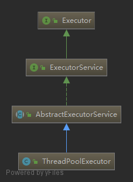
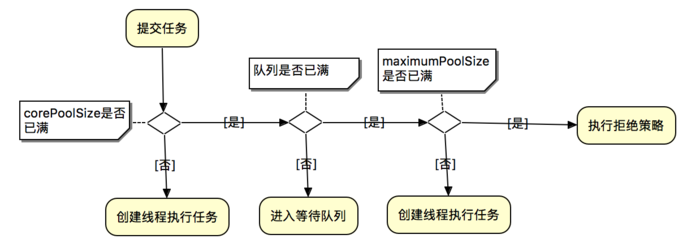

### ThreadPoolExecutor
#### 一. ThreadPoolExecutor的继承层次
    
1. `Execotur`接口定义了一个执行被提交任务的方法`execute`，被提交的任务可以在一个新建的线程中执行，在一个池化的线程中执行，或者在调用`execute`方法的线程中同步执行，这取决于具体的实现类
```java
public interface Executor {
    void execute(Runnable command);
}
```
2. `ExecutorService`接口增加了可以返回`Future`的方法`submit`，让线程池停止接受新任务的方法`shutdown`与`shutdownNow`，以及提交批量任务的`invokeAll`与`invokeAny`方法
```java
public interface ExecutorService extends Executor {

    void shutdown();

    List<Runnable> shutdownNow();

    boolean isShutdown();

    boolean isTerminated();

    boolean awaitTermination(long timeout, TimeUnit unit) throws InterruptedException;

    <T> Future<T> submit(Callable<T> task);

    <T> Future<T> submit(Runnable task, T result);

    Future<?> submit(Runnable task);

    <T> List<Future<T>> invokeAll(Collection<? extends Callable<T>> tasks) throws InterruptedException;

    <T> List<Future<T>> invokeAll(Collection<? extends Callable<T>> tasks, long timeout, TimeUnit unit) throws InterruptedException;

    <T> T invokeAny(Collection<? extends Callable<T>> tasks) throws InterruptedException, ExecutionException;

    <T> T invokeAny(Collection<? extends Callable<T>> tasks, long timeout, TimeUnit unit) throws InterruptedException, ExecutionException, TimeoutException;
}
```
3. `AbstractExecutorService`是一个实现了`ExecutorService`接口的抽象类，实现了`submit`，`invokeAny`与`invokeAll`方法，在这些方法的实现中，对任务的执行最终还是调用`Execotur`接口中定义的`execute`方法。在这个类中有个`newTaskFor`方法，用于将提交的任务包装成一个`RunnableFuture`对象作为`Future`对象从`submit`方法中返回，默认返回的是juc下的`FutureTask`类，可以自己重写这个方法，返回自己定义的`Future`对象。
```java
public <T> Future<T> submit(Callable<T> task) {
    if (task == null) throw new NullPointerException();
    RunnableFuture<T> ftask = newTaskFor(task);
    execute(ftask);
    return ftask;
}
protected <T> RunnableFuture<T> newTaskFor(Callable<T> callable) {
    return new FutureTask<T>(callable);
}    
```
4. `ThreadPoolExecutor`是线程池大部分逻辑的实现。
#### 二. 线程池的状态
```java
private final AtomicInteger ctl = new AtomicInteger(ctlOf(RUNNING, 0));
private static final int COUNT_BITS = Integer.SIZE - 3;  // 29
private static final int COUNT_MASK = (1 << COUNT_BITS) - 1;

// runState is stored in the high-order bits
private static final int RUNNING    = -1 << COUNT_BITS;
private static final int SHUTDOWN   =  0 << COUNT_BITS;
private static final int STOP       =  1 << COUNT_BITS;
private static final int TIDYING    =  2 << COUNT_BITS;
private static final int TERMINATED =  3 << COUNT_BITS;
```
* 线程池有五种状态：
    1. `RUNNING`：接受新的任务，并且可以处理队列中等待的任务
    2. `SHUTDOWN`： 不接受新任务，会等待所有任务处理完（包括阻塞队列中的任务）
    3. `STOP`：不接受新的任务，不处理阻塞队列中等待的任务，并且中断正在进行的任务
    4. `TIDYING`：所有任务已经终止，`workerCount`为0，进入此状态的线程池会运行`terminated()`钩子方法进入`TERMINATED`状态
    5. `TERMINATED`：`terminated()`方法已经完成
* 线程池状态变化：
    * `RUNNING` -> `SHUTDOWN`：调用`shutdown()`方法
    * `RUNNING`或`SHUTDOWN` ->  `STOP`：`shutdownNow()`
    * `SHUTDOWN` -> `TIDYING`：当等待队列和线程池都为空的时候
    * `STOP` -> `TIDYING`：当线程池为空
    * `TIDYING` -> `TERMINATED`：`terminated()`方法完成时
* 原子`int`变量`ctl`的高3位是`runState`即上面的五种状态，低29位是`workerCount`，活跃线程数量。
* 有几个和`ctl`有关的方法：
```java
// Packing and unpacking ctl
// 获取线程池状态
private static int runStateOf(int c)     { return c & ~COUNT_MASK; }
// 获取线程池活跃线程数
private static int workerCountOf(int c)  { return c & COUNT_MASK; }
// runState与workerCount包装成一个ctl
private static int ctlOf(int rs, int wc) { return rs | wc; }
```
#### 三. 主要的成员变量
```java
//任务缓存队列，用来存放等待执行的任务
private final BlockingQueue<Runnable> workQueue;

// 线程池的主要锁，对线程池状态的改变都要使用这个锁
private final ReentrantLock mainLock = new ReentrantLock();

// 存放所有的工作线程，只有获取了mainLock的时候才能访问此集合
private final HashSet<Worker> workers = new HashSet<>();

/**
    * Wait condition to support awaitTermination.
    */
private final Condition termination = mainLock.newCondition();

// 记录线程池中曾经出现过的最大线程数，只有获取了mainLock的时候才能访问
private int largestPoolSize;

// 记录已经执行完毕的任务个数
private long completedTaskCount;

// 线程工厂对象，用来创建线程
private volatile ThreadFactory threadFactory;

// 任务拒绝策略
private volatile RejectedExecutionHandler handler;

// 空闲线程存活时间（纳秒）
private volatile long keepAliveTime;

// 是否允许核心线程在空闲超时后消亡
private volatile boolean allowCoreThreadTimeOut;

// 核心线程数
private volatile int corePoolSize;

// 最大线程数
private volatile int maximumPoolSize;
```
* `corePoolSize`，核心线程数：当一个任务被`execute`方法提交时，如果正在运行的线程数小于`corePoolSize`，就创建一个新的线程来运行任务，即使有其他工作线程是空闲的；否则如果正在运行的线程数目大于等于`corePoolSize`，但是小于`maximumPoolSize`，将任务放入等待队列等待执行，如果等待队列已满，就创建一个新的线程用于执行任务，如果队列已满，且线程数已经达到`maximumPoolSize`，拒绝任务。默认情况下，线程池创建后，只有当任务到达时才会开始创建核心线程，但`prestartCoreThread`方法会创建一个空闲的核心线程等待任务到达，`prestartAllCoreThreads`方法会创建`corePoolSize`个空闲线程来等待任务到达。
* `workQueue`，等待队列，当任务提交时，如果线程数大于`corePoolSize`，就将任务放入等待队列。一般有三种阻塞队列策略可以使用：
    1. `Direct handoffs`：`SynchronousQueue`，提交一个任务时不排队，而是直接交给线程池，当没有线程可用时会排队失败从而新创建一个线程取执行任务。这种策略通常需要一个无界的`maximumPoolSize`来避免线程池拒绝执行任务，当任务提交速度大于任务处理速度时，可能会造成线程数无限制增长。
    2. `Unbounded queues`：`LinkedBlockingQueue`，无界队列，此时`maximumPoolSize`参数是无效的，而且线程池的最大线程数就是`corePoolSize`
    3. `Bounded queues`：`ArrayBlockingQueue`，有界队列，可以限制线程数目，但是参数值不好确定。
* `keepAliveTime`，如果线程池的线程数量超过`corePoolSize`，核心线程之外的线程在空闲超过一定时间就会被销毁。默认情况下，这只应用于超出核心线程之外的线程，但如果调用了`allowCoreThreadTimeOut`方法，这也会用于核心线程。
* 任务拒绝策略：当线程池`shutdown`后，或者阻塞队列满了，且线程数达到`maximumPoolSize`后，再提交任务会执行拒绝策略：
    1. 默认为`ThreadPoolExecutor.AbortPolicy`，直接抛`RejectedExecutionException`
    2. `ThreadPoolExecutor.CallerRunsPolicy`， 用调用`execute`方法的线程去执行任务
    3. `ThreadPoolExecutor.DiscardPolicy`，直接丢弃新提交的任务
    4. `ThreadPoolExecutor.DiscardOldestPolicy`，如果线程池没有`shutdown`，队列头的任务会被丢弃，然后重新尝试提交任务，如果失败，会重复上面过程。
#### 四. 构造器
```java
public ThreadPoolExecutor(int corePoolSize,
                            int maximumPoolSize,
                            long keepAliveTime,
                            TimeUnit unit,
                            BlockingQueue<Runnable> workQueue,
                            ThreadFactory threadFactory,
                            RejectedExecutionHandler handler) {
    if (corePoolSize < 0 ||
        maximumPoolSize <= 0 ||
        maximumPoolSize < corePoolSize ||
        keepAliveTime < 0)
        throw new IllegalArgumentException();
    if (workQueue == null || threadFactory == null || handler == null)
        throw new NullPointerException();
    this.corePoolSize = corePoolSize;
    this.maximumPoolSize = maximumPoolSize;
    this.workQueue = workQueue;
    this.keepAliveTime = unit.toNanos(keepAliveTime);
    this.threadFactory = threadFactory;
    this.handler = handler;
}
```
剩下的三个构造器最终都是调用这个构造器，它们对线程工厂或任务拒绝策略采用了默认值。
#### 五. execute

```java
public void execute(Runnable command) {
    if (command == null)
        throw new NullPointerException();
    int c = ctl.get();
    // 线程数小于核心线程数，创建新的核心线程
    if (workerCountOf(c) < corePoolSize) {
        if (addWorker(command, true))
            return;
        c = ctl.get();
    }
    // 线程数已达到核心线程数
    // 线程池处于RUNNING状态，并且任务向队列添加成功
    if (isRunning(c) && workQueue.offer(command)) {
        int recheck = ctl.get();
        // 如果线程池已经不是RUNNING状态，移除刚才添加到队列的任务，并执行拒绝策略
        if (! isRunning(recheck) && remove(command))
            reject(command);
        // 如果工作线程数量为0，创建一个线程什么也不做，之后会从队列中取出任务执行
        else if (workerCountOf(recheck) == 0)
            addWorker(null, false);
    }
    // 1. 线程池不是RUNNING状态
    // 2. 排队失败，要加一个新的线程
    else if (!addWorker(command, false))
        reject(command);
}
```
```java
// 添加线程，core=true是核心线程
private boolean addWorker(Runnable firstTask, boolean core) {
    retry:
    for (int c = ctl.get();;) {
        // Check if queue empty only if necessary.
        // private static boolean runStateAtLeast(int c, int s) {
        //     return c >= s;
        // }        
        if (runStateAtLeast(c, SHUTDOWN)
            && (runStateAtLeast(c, STOP)
                || firstTask != null
                || workQueue.isEmpty()))
            return false;

        for (;;) {
            if (workerCountOf(c) // 线程数已经达到限制了，返回false
                >= ((core ? corePoolSize : maximumPoolSize) & COUNT_MASK))
                return false;
            // 尝试CAS增加线程数，如果成功，跳出retry循环
            if (compareAndIncrementWorkerCount(c))
                break retry;
            c = ctl.get();  // Re-read ctl
            if (runStateAtLeast(c, SHUTDOWN))
                continue retry; // 如果线程池状态发生了变化，重新进入外层循环
            // 否则由于线程数目发生变化导致CAS失败，重新执行内层循环，尝试增加线程数目
        }
    }

    boolean workerStarted = false;
    boolean workerAdded = false;
    Worker w = null;
    try {
        w = new Worker(firstTask);
        final Thread t = w.thread;
        if (t != null) {
            final ReentrantLock mainLock = this.mainLock;
            mainLock.lock();
            try {
                int c = ctl.get();
                // 如果线程池处于RUNNING状态
                // 或处于SHUTDOWN状态但是firstTask为null(执行阻塞队列中的任务)
                // 向线程池中添加线程
                if (isRunning(c) ||
                    (runStateLessThan(c, STOP) && firstTask == null)) {
                    if (t.isAlive()) // precheck that t is startable
                        throw new IllegalThreadStateException();
                    // 添加到线程池
                    workers.add(w);
                    int s = workers.size();
                    if (s > largestPoolSize)
                        largestPoolSize = s;
                    workerAdded = true;
                }
            } finally {
                mainLock.unlock();
            }
            // 启动线程
            if (workerAdded) {
                t.start();
                workerStarted = true;
            }
        }
    } finally {
        if (! workerStarted)
            addWorkerFailed(w);
    }
    return workerStarted;
}
```
`Worker`类
```java
private final class Worker extends AbstractQueuedSynchronizer implements Runnable {

    private static final long serialVersionUID = 6138294804551838833L;

    // 用户执行任务的线程
    final Thread thread;
    // 构造Worker对象时传入的Runnable对象，作为线程的第一个任务
    // 可以为null
    Runnable firstTask;
    // 每个线程完成任务数
    volatile long completedTasks;

    Worker(Runnable firstTask) {
        setState(-1); // inhibit interrupts until runWorker
        this.firstTask = firstTask;
        this.thread = getThreadFactory().newThread(this);
    }

    /** Delegates main run loop to outer runWorker. */
    public void run() {
        runWorker(this);
    }

    // Lock methods
    //
    // The value 0 represents the unlocked state.
    // The value 1 represents the locked state.

    protected boolean isHeldExclusively() {
        return getState() != 0;
    }

    protected boolean tryAcquire(int unused) {
        if (compareAndSetState(0, 1)) {
            setExclusiveOwnerThread(Thread.currentThread());
            return true;
        }
        return false;
    }

    protected boolean tryRelease(int unused) {
        setExclusiveOwnerThread(null);
        setState(0);
        return true;
    }

    public void lock()        { acquire(1); }
    public boolean tryLock()  { return tryAcquire(1); }
    public void unlock()      { release(1); }
    public boolean isLocked() { return isHeldExclusively(); }

    void interruptIfStarted() {
        Thread t;
        if (getState() >= 0 && (t = thread) != null && !t.isInterrupted()) {
            try {
                t.interrupt();
            } catch (SecurityException ignore) {
            }
        }
    }
}
```
`Worker`类实现了`Runnable`接口，包装了一个线程对象，在构造线程对象时，把自身作为`Runnable`对象传入。    
同时`Worker`也继承自`AQS`，实现了一个不可重入的独占锁，在执行一个任务的前后获取锁和释放锁。    
启动线程后，开始执行`Worker`对象的`run`方法，`run`方法在内部调用线程池的`runWorker`方法：
```java
// 执行这个方法的线程时Worker里面的线程
final void runWorker(Worker w) {
    Thread wt = Thread.currentThread();
    Runnable task = w.firstTask;
    w.firstTask = null;
    w.unlock(); // 允许中断
    boolean completedAbruptly = true; // 是否是因为任务执行异常而退出
    try {
        // 如果Worker对象的firstTask不为null 或 从同步队列中获取到任务
        while (task != null || (task = getTask()) != null) { // 如果这里获取不到任务，
            w.lock(); // 获取锁，防止其他线程中断该线程         // 就要在下面执行processWorkerExit来销毁这个Worker
            // 如果线程池处于STOP，保证当前线程是中断状态(可能是此线程执行到这里时另一个线程执行了shutdownNow)
            // 否则保证当前线程不是被中断状态，因为线程是复用的，之前的任务的中断不能影响之后的任务
            if ((runStateAtLeast(ctl.get(), STOP) || (Thread.interrupted() && runStateAtLeast(ctl.get(), STOP))) 
                && !wt.isInterrupted())
                wt.interrupt();
            try {
                // beforeExecute与afterExecute是两个空的钩子方法，可以自己继承线程池去实现
                beforeExecute(wt, task);
                try {
                    task.run(); // 执行任务
                    afterExecute(task, null);
                } catch (Throwable ex) {
                    afterExecute(task, ex);
                    throw ex;
                }
            } finally {
                task = null;
                w.completedTasks++;
                w.unlock();
            }
        }
        completedAbruptly = false;
    } finally {
        processWorkerExit(w, completedAbruptly);
    }
}
```
```java
// 从阻塞队列中获取任务
private Runnable getTask() {
    boolean timedOut = false; // 从阻塞队列中取任务是否超时
    for (;;) {
        int c = ctl.get();
        // 如果状态>=SHUTDOWN，也就是不在RUNNING状态下
        // 线程池STOP 或 阻塞队列为空
        // 减少workerCount并返回null
        // 因为如果当前线程池状态的值是SHUTDOWN或以上时，不允许再向阻塞队列中添加任务
        // 如果此时为SHUTDOWN且阻塞队列为空，也就没必要继续获取任务了
        // 而如果为STOP，不会去执行阻塞队列中剩下的任务，也没必要去获取任务
        if (runStateAtLeast(c, SHUTDOWN)
            && (runStateAtLeast(c, STOP) || workQueue.isEmpty())) {
            decrementWorkerCount();
            return null;
        }
        int wc = workerCountOf(c);
        // 允许核心线程超时 或 线程数大于核心线程数
        // timed用于判断是否需要超时控制
        boolean timed = allowCoreThreadTimeOut || wc > corePoolSize;
        // 线程数量超过最大限制(可能执行了setMaximumPoolSize) 或 需要超时控制并且超时 
        // 且 线程池线程数量大于1 或 阻塞队列为空
        // 减少线程数量 并 返回null
        if ((wc > maximumPoolSize || (timed && timedOut))
            && (wc > 1 || workQueue.isEmpty())) {
            if (compareAndDecrementWorkerCount(c))
                return null;
            continue;
        }
        try {
            // 根据是否需要超时控制，采取不同策略从阻塞队列中获取任务
            Runnable r = timed ?
                workQueue.poll(keepAliveTime, TimeUnit.NANOSECONDS) :
                workQueue.take();
            if (r != null)
                return r;
            timedOut = true;
        } catch (InterruptedException retry) {
            timedOut = false;
        }
    }
}
```
线程池中的每个线程最终都会执行`processWorkerExit`这个方法退出，所以会在这里检查是否有必要将线程池状态转化为`TIDYING`以及`TERMINATED`。
```java
// 执行到这个方法有以下几种可能：
// 1. 执行的任务抛异常
// 2. 阻塞队列中获取不到任务，这个还分为以下两种情形：
//      (1) 获取任务超时
//      (2) 被shutdown或shutdownNow方法中断
private void processWorkerExit(Worker w, boolean completedAbruptly) {
    if (completedAbruptly) // 如果线程因为异常而退出，线程数减一
        decrementWorkerCount(); // 正常退出的话在getTask方法中已经减过了，这里就不用了

    final ReentrantLock mainLock = this.mainLock;
    mainLock.lock();
    try {
        completedTaskCount += w.completedTasks;
        workers.remove(w); // 移除线程
    } finally {
        mainLock.unlock();
    }
    // 根据线程池状态进行判断是否结束线程池
    tryTerminate();

    int c = ctl.get();
    if (runStateLessThan(c, STOP)) {
        // 当线程池状态是RUNNING 或 SHUTDOWN时
        // 如果线程不是因为异常而退出的，直接addWorker添加非核心线程去执行队列中的任务
        // 否则，算出一个最小的线程数量，如果当前线程数量比这个最小值大，直接返回，否则也addWorker
        if (!completedAbruptly) {
            int min = allowCoreThreadTimeOut ? 0 : corePoolSize;
            if (min == 0 && ! workQueue.isEmpty())
                min = 1;
            if (workerCountOf(c) >= min)
                return; // replacement not needed
        }
        addWorker(null, false);
    }
}
```
```java
// 根据线程池状态进行判断是否结束线程池
final void tryTerminate() {
    for (;;) {
        int c = ctl.get();
        if (isRunning(c) ||  // 正在运行，不能停止线程池
            runStateAtLeast(c, TIDYING) ||  // TIDYING 或 TERMINATED
            (runStateLessThan(c, STOP) && ! workQueue.isEmpty())) // SHUTDOWN并且队列不为空，此时要执行完队列中的任务，所以也不能停止线程池
            return;
        // 如果线程数量不为0，随机中断一个空闲线程并返回
        if (workerCountOf(c) != 0) { // Eligible to terminate
            interruptIdleWorkers(ONLY_ONE);
            return;
        }
        // 运行到这里说明线程数量为0，进入TIDYING状态
        final ReentrantLock mainLock = this.mainLock;
        mainLock.lock();
        try {
            // 尝试设置状态为TIDYING，如果设置成功，则调用terminated方法
            if (ctl.compareAndSet(c, ctlOf(TIDYING, 0))) {
                try {
                    terminated(); // 空的钩子方法
                } finally {
                    // 设置状态为TERMINATED 
                    ctl.set(ctlOf(TERMINATED, 0));
                    termination.signalAll();
                }
                return;
            }
        } finally {
            mainLock.unlock();
        }
        // else retry on failed CAS
    }
}
```
#### 六. shutdown
不再接受新提交的任务，但是会完成之前提交的任务，包括阻塞队列中的。
```java
public void shutdown() {
    final ReentrantLock mainLock = this.mainLock;
    mainLock.lock();
    try {
        // 安全策略判断
        checkShutdownAccess();
        // 线程池状态设置为SHUTDOWN
        advanceRunState(SHUTDOWN);
        // 中断空闲线程
        interruptIdleWorkers();
        onShutdown(); // hook for ScheduledThreadPoolExecutor
    } finally {
        mainLock.unlock();
    }
    tryTerminate();
}
```
```java
private void interruptIdleWorkers() {
    interruptIdleWorkers(false);
}

private void interruptIdleWorkers(boolean onlyOne) {
    final ReentrantLock mainLock = this.mainLock;
    mainLock.lock();
    try {
        // 遍历所有线程
        for (Worker w : workers) {
            Thread t = w.thread;
            // 获取到Worker对象锁说明线程是空闲的
            if (!t.isInterrupted() && w.tryLock()) {
                try {
                    t.interrupt();
                } catch (SecurityException ignore) {
                } finally {
                    w.unlock();
                }
            }
            if (onlyOne)
                break;
        }
    } finally {
        mainLock.unlock();
    }
}
```
> Worker继承AQS实现了一个不可重入的独占锁，在执行任务前，会加锁，此时其他线程去尝试获取此Worker对象锁会失败，这样就可以判定线程不是空闲的。

#### 七. shutdownNow
不再接受新提交的任务，同时也会尝试中断当前正在执行的任务，阻塞队列中剩下的任务也会被丢弃。返回尚未执行的任务。
```java
public List<Runnable> shutdownNow() {
    List<Runnable> tasks;
    final ReentrantLock mainLock = this.mainLock;
    mainLock.lock();
    try {
        // 安全策略判断
        checkShutdownAccess();
        // 线程池状态设置为STOP
        advanceRunState(STOP);
        // 中断所有线程，无论是否空闲
        interruptWorkers();
        // 取出队列中没有被执行的任务返回
        tasks = drainQueue();
    } finally {
        mainLock.unlock();
    }
    tryTerminate();
    return tasks;
}
```
```java
private void interruptWorkers() {
    // assert mainLock.isHeldByCurrentThread();
    for (Worker w : workers)
        w.interruptIfStarted();
}

// ThreadPoolExecutor.Worker
void interruptIfStarted() {
    Thread t;
    if (getState() >= 0 && (t = thread) != null && !t.isInterrupted()) {
        try {
            t.interrupt();
        } catch (SecurityException ignore) {
        }
    }
}
```