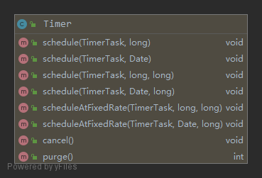

### Timer
#### 一. Timer的使用
`Timer`是一个定时器，可以实现对任务按照时间来进行调度
```java
public static void main(String[] args) {
    TimerTask task = new TimerTask() {
        @Override
        public void run() {
            Date date = new Date(this.scheduledExecutionTime());
            System.out.println(date);
        }
    };
    Timer timer = new Timer();
    timer.schedule(task, 0, 2000);
}
```
   
调度方式：
1. `schedule(TimerTask task, long delay)`：提交一个任务，在`delay`毫秒后执行一次（只会执行一次）
2. `schedule(TimerTask task, Date time)`：在`time`时刻执行任务，如果`time`是一个过去的时间，任务会立即被执行
3. `schedule(TimerTask task, long delay, long period)`：提交任务后`delay`毫秒开始执行任务，每次任务被调度完后，计划等待`period`再次调度
4. `schedule(TimerTask task, Date firstTime, long period)`：同上
5. `scheduleAtFixedRate(TimerTask task, long delay, long period)`：这里的`period`是任务两次计划开始执行时间之间的间隔
6. `scheduleAtFixedRate(TimerTask task, Date firstTime, long period)`：同上
#### 二. 主要成员变量
```java
private final TaskQueue queue = new TaskQueue();

private final TimerThread thread = new TimerThread(queue);
```
`TaskQueue`是一个优先队列，内部用一个`TimerTask`数组来实现一个堆，`TimerTask`有一个`nextExecutionTime`代表任务下次被执行的时间，优先队列以此为优先级对数组进行调整，堆顶的元素是具有最小`nextExecutionTime`的任务。   
`TimerThread`是用来调度所有任务的线程。内部有一个循环，从`TaskQueue`中不断取出任务进行执行。
```java
class TimerThread extends Thread {

    boolean newTasksMayBeScheduled = true;

    private TaskQueue queue;

    TimerThread(TaskQueue queue) {
        this.queue = queue;
    }

    public void run() {
        try {
            mainLoop();
        } finally {
            synchronized(queue) {
                newTasksMayBeScheduled = false;
                queue.clear();
            }
        }
    }

    private void mainLoop() {
        while (true) {
            try {
                TimerTask task;
                boolean taskFired;
                synchronized(queue) {
                    // 等待队列变成非空
                    while (queue.isEmpty() && newTasksMayBeScheduled)
                        queue.wait();
                    if (queue.isEmpty())
                        break; // Queue is empty and will forever remain; die

                    // Queue nonempty; look at first evt and do the right thing
                    long currentTime, executionTime;
                    task = queue.getMin(); // 从队列中取出最早将被执行的任务
                    synchronized(task.lock) {
                        if (task.state == TimerTask.CANCELLED) {
                            queue.removeMin();
                            continue;  // No action required, poll queue again
                        }
                        currentTime = System.currentTimeMillis();
                        executionTime = task.nextExecutionTime;
                        if (taskFired = (executionTime<=currentTime)) { // 任务已经可以执行了
                            if (task.period == 0) { // 不需要重复调度的任务，从队列中移除
                                queue.removeMin();
                                task.state = TimerTask.EXECUTED;
                            } else { //需要重复调度的任务，重新塞回队列
                                queue.rescheduleMin(
                                  task.period<0 ? currentTime   - task.period
                                                : executionTime + task.period);
                            }
                        }
                    }
                    if (!taskFired) // 任务还没到执行之间，等待
                        queue.wait(executionTime - currentTime);
                }
                if (taskFired)  // 执行任务
                    task.run();
            } catch(InterruptedException e) {
            }
        }
    }
}
```
#### 三. 调度方法
`Timer`的各种调度方法，最终都是调用内部的`sched`方法来实现的，这个方法主要是设置`TimerTask`对象的参数，并将其放入队列中：
```java
private void sched(TimerTask task, long time, long period) {
    if (time < 0)
        throw new IllegalArgumentException("Illegal execution time.");

    if (Math.abs(period) > (Long.MAX_VALUE >> 1))
        period >>= 1;

    synchronized(queue) {
        if (!thread.newTasksMayBeScheduled)
            throw new IllegalStateException("Timer already cancelled.");

        synchronized(task.lock) {
            if (task.state != TimerTask.VIRGIN)
                throw new IllegalStateException(
                    "Task already scheduled or cancelled");
            task.nextExecutionTime = time;
            task.period = period;
            task.state = TimerTask.SCHEDULED;
        }

        queue.add(task);
        if (queue.getMin() == task) // 唤醒因为队列空而wait的线程
            queue.notify();
    }
}
```
`schedule`和`scheduleAtFixedRate`在调用这个方法的时候有个重要的区别，`schedule`方法会传入一个负的`period`，以便在后面执行的时候来区分是哪种调度方式
```java
public void schedule(TimerTask task, Date firstTime, long period) {
    if (period <= 0)
        throw new IllegalArgumentException("Non-positive period.");
    sched(task, firstTime.getTime(), -period);
}

public void scheduleAtFixedRate(TimerTask task, long delay, long period) {
    if (delay < 0)
        throw new IllegalArgumentException("Negative delay.");
    if (period <= 0)
        throw new IllegalArgumentException("Non-positive period.");
    sched(task, System.currentTimeMillis()+delay, period);
}
```
在`TimerThread`的`mainLoop`方法中，每次调度时，如果任务需要重复调度，会判断`period`正负：
```java
queue.rescheduleMin(task.period < 0 ? currentTime   - task.period: executionTime + task.period);
```
这里也可以看出`schedule`方法和`scheduleAtFixedRate`方法的区别，`schedule`中，任务的下一个计划执行时间是在当前时间加上`period`，也就是说，计划下一次执行的时间只和这次任务完成调度的时间有关，而`scheduleAtFixedRate`更侧重一个固定的频率，任务下一次计划执行的时间是在这次计划执行时间上加`period`，第`n次计划执行时间 = firstTime + (n-1)*peroid`

#### 四. 使用ScheduledExecutorService代替Timer的原因
1. `Timer`是基于绝对时间的，对系统时间比较敏感，而`ScheduledThreadPoolExecutor`则是基于相对时间；
2. `Timer`是内部是单一线程，而`ScheduledThreadPoolExecutor`内部是个线程池，所以可以支持多个任务并发执行。
3. `Timer`运行多个`TimeTask`时，只要其中之一没有捕获抛出的异常，其它任务便会自动终止运行，使用`ScheduledThreadPoolExecutor`则没有这个问题。
4. 使用`ScheduledThreadPoolExecutor`更容易明确任务实际执行策略，更方便自行控制。
5. 默认`Timer`执行线程不是`daemon`线程, 任务执行完，主线程（或其他启动定时器的线程）结束时，`Timer`线程并没有结束。需要注意潜在内存泄漏问题