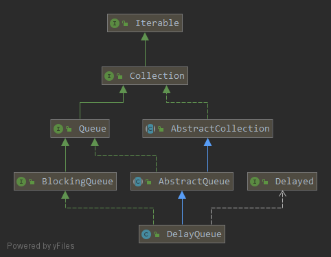

### 延迟队列DelayQueue
> 将任务放入延时队列中，只有到了延时时刻及之后，才能将任务取出，否则取不到。
#### 一. Delayed接口
延时队列中存放的是`Delayed`类型的元素
```java
public interface Delayed extends Comparable<Delayed> {

    // 返回离延时时刻还有多久
    long getDelay(TimeUnit unit);
}
```
`Delayed`接口继承了`Comparable`接口，用来比较延时时刻的先后。

#### 二. DelayQueue
    

延时队列内部使用一个优先队列来存放延时任务，通过对延时时刻进行比较，堆顶元素是最先需要被执行的，每次取任务时，先判断堆顶元素是否已经到达可执行时刻，如果达到，返回堆顶元素，否则根据不同方法返回null或阻塞或抛异常

例子：
```java
class Message implements Delayed {

    private String msg;
    private long executeTime;

    public Message(String msg, long executeTime) {
        this.msg = msg;
        this.executeTime = TimeUnit.NANOSECONDS.convert(executeTime, TimeUnit.MILLISECONDS) + System.nanoTime();
    }

    public String getMsg() {
        return msg;
    }

    @Override
    public long getDelay(TimeUnit unit) {
        return unit.convert(executeTime - System.nanoTime(), TimeUnit.NANOSECONDS);
    }

    @Override
    public int compareTo(Delayed o) {
        return Long.compare(executeTime, ((Message) o).executeTime);
    }
}

public class Main {

    public static void main(String[] args) throws InterruptedException {
        DelayQueue<Message> queue = new DelayQueue<>();
        System.out.println(System.currentTimeMillis());
        queue.add(new Message("one", 7000));
        queue.add(new Message("two", 3000));
        queue.add(new Message("three", 4500));
        while (true) {
            Message message = queue.take();
            System.out.println(System.currentTimeMillis() + ": " + message.getMsg());
        }
    }

}
```
```bash
1556802079269
1556802082277: two
1556802083774: three
1556802086275: one
```
