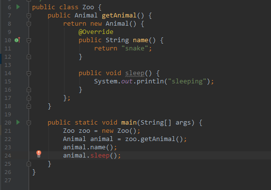

### 内部类
#### 一. 普通内部类（非static）
把类的定义置于外围类里面：
```java
public class Outer {

    public class Inner {
        public Outer getOuter() {
            return Outer.this;
        }

        public void g() {
            f();
        }
    }

    private int a = 3;

    private void f() {
        System.out.println("private methods in Outer");
    }

    public Inner getInner() {
        Inner inner = new Inner();
        return inner;
    }

    public static void main(String[] args) {
        Outer outer = new Outer();
        Inner inner = outer.getInner();
        inner.g();
    }
}
```
```java
public class Main {

    public static void main(String[] args) {
        Outer outer = new Outer();
        Outer.Inner inner = outer.getInner();
        inner.g();

        Outer.Inner inner2 = outer.new Inner();
        inner2.g();
    }
}
```
* 内部类有访问权限，`public`、 `protected`、 `默认的包访问权限`、 `private`。
* 在外部类内部的任何地方使用内部类都可以直接使用内部类类名，但是在其他类中使用要遵循`外部类名.内部类名`的格式。
* 新建一个内部类的对象必须要有*外部类对象*，直接创建内部类对象需要使用`外部类对象.new 内部类名`的格式，上面Outer类中的getInner方法，直接返回一个内部类对象的引用，但由于这个方法只有Outer类的对象才能调用，所以，这个内部类对象的创建还是离不开外部类对象。
* 创建一个内部类对象时，会秘密的捕获一个指向创建它的外部类的对象的引用，在内部类的方法中，可以使用`外部类名.this`返回这个外部类对象的引用。
* 内部类拥有外围类的所有元素的访问权，包括从成员变量到方法，从private到public，从static到非static，不管这个内部类是被嵌套多少层，只要是它所嵌入的。
* 内部类内部不能包含static成员和static方法，也不能包含嵌套类(static的内部类)。

#### 二. 嵌套类（static的内部类）
* 普通的内部类对象和创建它的外部类对象之间有联系，而嵌套类没有。
* 普通的内部类内部不能包含static成员和static方法，也不能包含嵌套类，而嵌套类可以包含所有这些东西。
* 嵌套类只能访问外部类的static成员变量和方法。
* 嵌套类使用起来就像普通的类多了一层命名空间：
```java
public class Outer {
    
    public static class Inner {
        public void f() {
            System.out.println("In static Inner");
        }
    }
}
```
```java
public class Main {
    public static void main(String[] args) {
        Outer.Inner inner = new Outer.Inner();
        inner.f();
    }
}
```
* 可以在接口中嵌套类，放到接口中的任何类都自动的是`public static`的，甚至可以在该内部类中实现该接口：
```java
public interface OutInterface {
    void f();

    class Inner implements OutInterface {
        public void f() {
            System.out.println("Inner in an interface");
        }

        public static void main(String[] args) {
            Inner inner = new Inner();
            inner.f();
        }
    }
}
```

#### 三. 局部内部类
* 定义在方法内部，或具有一定作用域的代码块内部，包括`static{}`与`{}`。
* 因为是在作用域里，所以不能用权限修饰词或static来修饰。
* 只能在该作用域里访问该类，在该作用域外无法使用该内部类。
* 如果要在该内部类里使用*该作用域内，内部类外*的变量，那这个变量一定要是`final`修饰的。
* 局部内部类可以访问外部类的任意成员变量和方法。
```java
public interface Fly {
    void flight();
}
```
```java
public class Outer {
    private Fly fly;

    private int speed = 100;

    private void g() {

    }

    {
        final int a = 0;
        class Plane implements Fly {
            int b;
            public void flight() {
                System.out.println("fly");
                b = a;
                b = speed;
                g();
            }
        }
        fly = new Plane();
    }

    public Fly getFly() {
        return fly;
    }

    public void test() {
        final int b = 0;
        if (true) {
            class Car implements Fly {
                private int a;
                public void flight() {
                    this.a = b;
                }
            }
            fly = new Car();
        }
    }


    public static void main(String[] args) {
        Outer outer = new Outer();
        Fly fly = outer.getFly();
        fly.flight();
    }
}
```
#### 四. 匿名内部类
```java
public interface Instrument {
    void play();
}
```
```java
public class Factory {
    public Instrument getInstrument() {
        return new Instrument() {
            public void play() {
                System.out.println("aaaa");
            }
        };
    }

    public static void main(String[] args) {
        Factory factory = new Factory();
        Instrument instrument = factory.getInstrument();
        instrument.play();
    }
}
```
```java
public abstract class Animal {
    public abstract String name();
}
```
```java
public class Zoo {
    public Animal getAnimal() {
        return new Animal() {
            @Override
            public String name() {
                return "snake";
            }
        };
    }
}
```
* 这里new关键字后面可以是接口，抽象类，甚至普通的类，在这里用接口就是返回一个实现了该接口的类的一个对象，并向上转型为该接口类型，如果用抽象类或类就是继承这个类。
* 如果在匿名类里添加父类或接口中没有的方法，可以，但是无法使用这个方法，因为匿名类没有名字，而返回的是一个父类或接口类型（只能访问自身类型中的方法，无法访问子类中的方法），在外部无法向下转型为该匿名类类型，也就无法访问该方法。如下图，很明显父类无法访问子类的方法。



#### 五. 继承内部类
如果一个类继承了另一个类中的内部类，那么这个类的构造器至少需要一个内部类所在的外部类的对象的引用，并且在构造器中*第一行*调用`外部类对象引用.super()`：
```java
public class Outer {

    public class Inner {

    }
}
```
```java
public class Inherit extends Outer.Inner {
    private int a;

    public Inherit(Outer outer) {
        outer.super();
    }

    public Inherit(Outer outer, int a) {
        outer.super();
        this.a = a;
    }

    public static void main(String[] args) {
        Outer outer = new Outer();
        Inherit inherit = new Inherit(outer, 3);
    }
}
```
#### 六. 继承外部类时内部类不会被覆盖
一个子类继承一个父类，子类和父类中各定义一个同名的内部类，并不会像方法那样被覆盖，这两个内部类是完全独立的两个实体，各自在自己的明明空间内：
```java
public class ParentOuter {
    public class Inner {
        public void f() {
            System.out.println("In Parent's Inner");
        }
    }

}
```
```java
public class ChildOuter extends ParentOuter {
    public class Inner {
        public void f() {
            System.out.println("In child's Inner");
        }
    }

}
```
```java
public class Main {
    public static void main(String[] args) {
        ParentOuter outer = new ChildOuter();
        System.out.println(outer.new Inner() instanceof ParentOuter.Inner);  // true
    }
}
```
这个例子说明由父类类型的对象引用生成的内部类对象类型仍然是父类中内部类的类型，并不会像方法那样被覆盖掉。