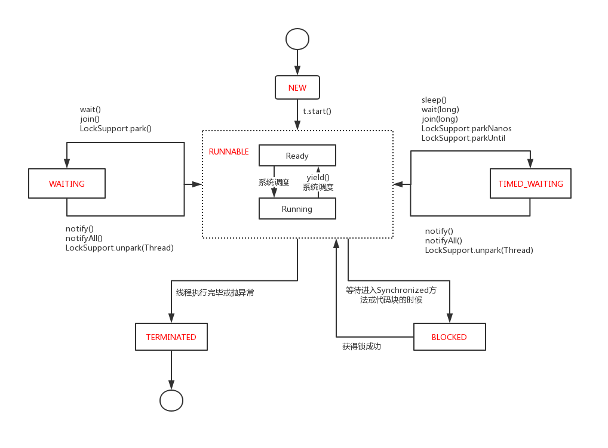

### 线程状态
线程有6中状态：
* New 新创建   
当用new操作符创建一个新的线程时，该线程还没有开始运行，处于新创建状态，还没有开始执行线程中的代码
* Runnable 可运行  
调用`start`方法后，线程处于可运行状态，一个可运行状态的线程可能正在运行也可能没有运行，这取决于操作系统给线程提供运行的时间 
* Blocked 被阻塞
* Waiting 等待
* Timed waiting 计时等待    
当线程处于被阻塞或等待状态时，它暂时不活动，不运行任何代码且消耗最少的资源，直到线程调度器重新激活它   
    * 当一个线程试图获取一个内部的对象锁，而该锁被其他线程持有，则该线程进入阻塞状态。当所有其他线程释放锁，并且线程调度器允许本线程持有它的时候，该线程将变成非阻塞状态
    * 当线程等待另一个线程通知调度器一个条件时，它自己进入等待状态，比如在调用`Object.wait`方法或`Thread.join`方法，或者是等待`java.util.concurrent`库中断`Lock`或`Condition`时，就会出现这种状况。
    * 有几个方法有一个超时参数，调用他们将导致线程进入计时等待状态，这一状态将保持到超时期满或者接收到适当的通知。带有潮湿参数的方法有`Thread.sleep` `Object.wait` `Thread.join` `Lock.tryLock`以及`Condition.await`的计时版。
* Terminated 被终止  
    线程因为如下两个原因之一被终止：
    * 因为`run`方法正常退出而自然死亡
    * 因为一个没有捕获的异常终止了`run`方法而意外死亡
    * 可以调用线程的`stop`方法杀死一个线程，该方法抛出一个`ThreadDeath`错误对象，由此来杀死线程，但此方法已经过时。

