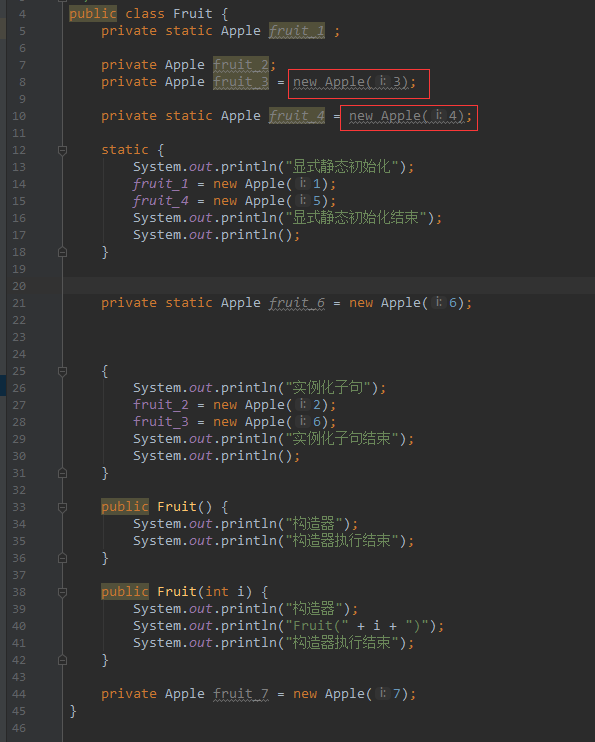

### 对象的初始化顺序
#### 一. 无继承情况下的初始化顺序
新建一个Apple类，一个Fruit类，在Fruit类里实例化多个Apple对象，在Main类的main方法里实例化Fruit对象
```java
public class Apple {
    public Apple(int i) {
        System.out.println("new Apple(" + i + ")");
        System.out.println("-------------------");
    }
}
```
```java
public class Fruit {
    private static Apple fruit_1 ;

    private Apple fruit_2;
    private Apple fruit_3 = new Apple(3);

    private static Apple fruit_4 = new Apple(4);

    static {
        System.out.println("显式静态初始化");
        fruit_1 = new Apple(1);
        fruit_4 = new Apple(5);
        System.out.println("显式静态初始化结束");
        System.out.println();
    }


    {
        System.out.println("实例化子句");
        fruit_2 = new Apple(2);
        fruit_3 = new Apple(6);
        System.out.println("实例化子句结束");
        System.out.println();
    }

    public Fruit() {
        System.out.println("构造器");
    }

}
```
```java
public class Main {
    public static void main(String[] args) throws Exception {
        Fruit fruit = new Fruit();
    }
}
```
输出：
```txt
new Apple(4)
-------------------
显式静态初始化
new Apple(1)
-------------------
new Apple(5)
-------------------
显式静态初始化结束

new Apple(3)
-------------------
实例化子句
new Apple(2)
-------------------
new Apple(6)
-------------------
实例化子句结束

构造器
```
然后我们修改一下Fruit类，添加两个新的成员变量：
```java
public class Fruit {
    private static Apple fruit_1 ;

    private Apple fruit_2;
    private Apple fruit_3 = new Apple(3);

    private static Apple fruit_4 = new Apple(4);

    static {
        System.out.println("显式静态初始化");
        fruit_1 = new Apple(1);
        fruit_4 = new Apple(5);
        System.out.println("显式静态初始化结束");
        System.out.println();
    }

    private static Apple fruit_6 = new Apple(6);

    {
        System.out.println("实例化子句");
        fruit_2 = new Apple(2);
        fruit_3 = new Apple(6);
        System.out.println("实例化子句结束");
        System.out.println();
    }

    public Fruit() {
        System.out.println("构造器");
    }

    private Apple fruit_7 = new Apple(7);
}
```
重新运行，输出：
```txt
new Apple(4)
-------------------
显式静态初始化
new Apple(1)
-------------------
new Apple(5)
-------------------
显式静态初始化结束

new Apple(6)
-------------------
new Apple(3)
-------------------
实例化子句
new Apple(2)
-------------------
new Apple(6)
-------------------
实例化子句结束

new Apple(7)
-------------------
构造器
```
静态成员fruit_4的初始化动作在显式静态初始化之前发生，而静态成员fruit_6的初始化动作却是在显式静态初始化之后，对于非静态的成员变量也可以看到相似的规律。
总结：  
> 无论是静态成员变量还是非静态的，显式的初始化代码块（即`static{}`与`{}`）与在成员变量处的初始化动作的优先级是相同的，即他们会按照在代码中的顺序依次执行，但都是在构造器执行之前执行。    

     

可以看到在IDEA中fruit_3与fruit_4变量处的`new Apple()`变为灰色，说明该代码无效，因为最后会被显式初始化代码块给覆盖掉。    

修改Fruit类构造器和Main类：
```java
public class Fruit {
    private static Apple fruit_1 ;

    private Apple fruit_2;
    private Apple fruit_3 = new Apple(3);

    private static Apple fruit_4 = new Apple(4);

    static {
        System.out.println("显式静态初始化");
        fruit_1 = new Apple(1);
        fruit_4 = new Apple(5);
        System.out.println("显式静态初始化结束");
        System.out.println();
    }

    private static Apple fruit_6 = new Apple(6);

    {
        System.out.println("实例化子句");
        fruit_2 = new Apple(2);
        fruit_3 = new Apple(6);
        System.out.println("实例化子句结束");
        System.out.println();
    }

    public Fruit() {
        System.out.println("构造器");
        System.out.println("构造器执行结束");
    }

    public Fruit(int i) {
        System.out.println("构造器");
        System.out.println("Fruit(" + i + ")");
        System.out.println("构造器执行结束");
    }

    private Apple fruit_7 = new Apple(7);
}
```
```java
public class Main {
    public static void main(String[] args) throws Exception {
        Fruit fruit = new Fruit();
        Fruit fruit_2 = new Fruit(2);
    }
}
```
输出： 
```txt
new Apple(4)
-------------------
显式静态初始化
new Apple(1)
-------------------
new Apple(5)
-------------------
显式静态初始化结束

new Apple(6)
-------------------
new Apple(3)
-------------------
实例化子句
new Apple(2)
-------------------
new Apple(6)
-------------------
实例化子句结束

new Apple(7)
-------------------
构造器
构造器执行结束
new Apple(3)
-------------------
实例化子句
new Apple(2)
-------------------
new Apple(6)
-------------------
实例化子句结束

new Apple(7)
-------------------
构造器
Fruit(2)
构造器执行结束
```

可以看到在new第二个Fruit对象时静态初始化并未执行，因为静态成员变量的初始化动作只会在类第一次加载时执行。

对象的初始化顺序：
1. 如果该类没有被加载，则先会加载该类，静态域先会被初始化为默认值，然后所有静态初始化动作会按照在代码中的顺序执行，包括位于静态变量处的初始化动作和`static{}`中的初始化动作。
2. 在堆上为该对象分配足够的存储空间，且这块空间会被清零，对象中的成员变量会获得默认值。
3. 按照代码中的顺序执行对象成员变量的初始化动作，包括位于变量定义处的初始化动作和`{}`中的初始化动作。
4. 执行构造器。

#### 二. 有继承的情况下
还是利用上面的Apple类，然后新建一个Parent类，一个Child类：
```java
public class Parent {
    private  Apple apple_1;
    private  Apple apple_2 = new Apple(2);
    private static Apple apple_3;
    private static Apple apple_4 = new Apple(4);

    public Parent(int i) {
        System.out.println("父类构造器");
        System.out.println("Parent(" + i + ")");
        System.out.println("-------------------");
    }

    static {
        System.out.println("父类static{}");
        apple_3 = new Apple(3);
        System.out.println("父类static{}结束");
        System.out.println("-------------------");
    }

    {
        System.out.println("父类{}");
        apple_1 = new Apple(1);
        System.out.println("父类{}结束");
        System.out.println("-------------------");
    }
}
```
```java
public class Child extends Parent {

    private Apple apple_5;
    private Apple apple_6 = new Apple(6);

    private static Apple apple_7;
    private static Apple apple_8 = new Apple(8);

    public Child(int i) {
        super(i);
        System.out.println("子类构造器");
        System.out.println("Child(" + i + ")");
        System.out.println("-------------------");
    }

    static {
        System.out.println("子类static{}");
        apple_7 = new Apple(7);
        System.out.println("子类static{}结束");
        System.out.println("-------------------");
    }

    {
        System.out.println("子类{}");
        apple_5 = new Apple(5);
        System.out.println("子类{}结束");
        System.out.println("-------------------");
    }
}
```
```java
public class Main {
    public static void main(String[] args) throws Exception {
        Child child_1 = new Child(10);
        System.out.println("child_1 created---------");
        Child child_2 = new Child(20);
    }
}
```
输出：
```txt
new Apple(4)
-------------------
父类static{}
new Apple(3)
-------------------
父类static{}结束
-------------------
new Apple(8)
-------------------
子类static{}
new Apple(7)
-------------------
子类static{}结束
-------------------
new Apple(2)
-------------------
父类{}
new Apple(1)
-------------------
父类{}结束
-------------------
父类构造器
Parent(10)
-------------------
new Apple(6)
-------------------
子类{}
new Apple(5)
-------------------
子类{}结束
-------------------
子类构造器
Child(10)
-------------------
child_1 created---------
new Apple(2)
-------------------
父类{}
new Apple(1)
-------------------
父类{}结束
-------------------
父类构造器
Parent(20)
-------------------
new Apple(6)
-------------------
子类{}
new Apple(5)
-------------------
子类{}结束
-------------------
子类构造器
Child(20)
-------------------
```
然后我们修改一下Main类中的main方法，再new一个父类对象：
```java
public class Main {
    public static void main(String[] args) throws Exception {
        Parent parent = new Parent(30);
        System.out.println("parent created---------");
        Child child_1 = new Child(10);
        System.out.println("child_1 created---------");
        Child child_2 = new Child(20);
    }
}
```
输出：
```txt
new Apple(4)
-------------------
父类static{}
new Apple(3)
-------------------
父类static{}结束
-------------------
new Apple(2)
-------------------
父类{}
new Apple(1)
-------------------
父类{}结束
-------------------
父类构造器
Parent(30)
-------------------
parent created---------
new Apple(8)
-------------------
子类static{}
new Apple(7)
-------------------
子类static{}结束
-------------------
new Apple(2)
-------------------
父类{}
new Apple(1)
-------------------
父类{}结束
-------------------
父类构造器
Parent(10)
-------------------
new Apple(6)
-------------------
子类{}
new Apple(5)
-------------------
子类{}结束
-------------------
子类构造器
Child(10)
-------------------
child_1 created---------
new Apple(2)
-------------------
父类{}
new Apple(1)
-------------------
父类{}结束
-------------------
父类构造器
Parent(20)
-------------------
new Apple(6)
-------------------
子类{}
new Apple(5)
-------------------
子类{}结束
-------------------
子类构造器
Child(20)
-------------------
```
可以看到，与上面的相比，由于先new了一个父类对象导致父类已经被加载，所以在new child_1时父类的静态变量初始化动作没有执行。  

总结，在有继承的情况下的初始化顺序：  
1. 父类静态成员的初始化动作，包括位于静态变量处的初始化动作和`static{}`中的初始化动作（前提：父类未被加载）
2. 子类静态成员的初始化动作，包括位于静态变量处的初始化动作和`static{}`中的初始化动作（前提：子类未被加载）
3. 父类对象成员变量的初始化动作，包括位于变量定义处的初始化动作和`{}`中的初始化动作。
4. 执行父类构造器
5. 子类对象成员变量的初始化动作，包括位于变量定义处的初始化动作和`{}`中的初始化动作。
6. 执行子类构造器