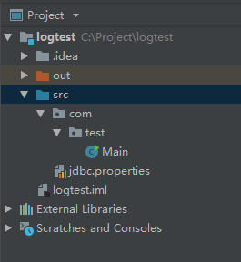
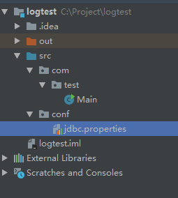
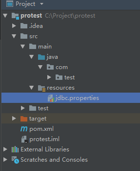

### 读取配置文件（*.properties）
#### 一. 普通java项目
1. 配置文件直接放在`src`目录下     
 
  
用`java.util.Properties`读取：
```java
package com.test;

import java.io.IOException;
import java.io.InputStream;
import java.util.Enumeration;
import java.util.Properties;

public class Main {
    public static void main(String[] args) throws IOException {
        Properties properties = new Properties();
        InputStream inputStream = Main.class.getClassLoader().getResourceAsStream("jdbc.properties");
        properties.load(inputStream);
        Enumeration keys = properties.keys();
        while (keys.hasMoreElements()) {
            String key = (String) keys.nextElement();
            System.out.println(key + ": " + properties.getProperty(key));
        }
    }
}
```
用`java.util.ResourceBundle`读取：
```java
package com.test;

import java.util.ResourceBundle;
import java.util.Set;

public class Main {
    public static void main(String[] args) {
        ResourceBundle bundle = ResourceBundle.getBundle("jdbc");
        Set<String> keys = bundle.keySet();
        for (String key : keys) {
            System.out.println(key + ": " + bundle.getString(key));
        }
    }
}
```
2. 放在包下   
   

用`java.util.Properties`读取：
```java
InputStream inputStream = Main.class.getClassLoader().getResourceAsStream("conf/jdbc.properties");
```   
用`java.util.ResourceBundle`读取：
```java
ResourceBundle bundle = ResourceBundle.getBundle("conf.jdbc");
```

#### 二. maven项目
maven项目一般将配置文件放在`resources`目录下，就相当于直接放在类路径下 
  
用`java.util.Properties`读取：
```java
InputStream inputStream = Main.class.getClassLoader().getResourceAsStream("jdbc.properties");
```
用`java.util.ResourceBundle`读取：
```java
ResourceBundle bundle = ResourceBundle.getBundle("jdbc");
```
