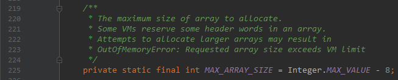

### ArrayList
  
  
#### 一. Fields
1. `DEFAULT_CAPACITY`：默认容量，10
2. `MAX_ARRAY_SIZE`：可开辟数组的最大长度  
  
3. `EMPTY_ELEMENTDATA`：一个空数组，用于一个空的列表
4. `elementData`：存放元素的数组，如果`elementData == EMPTY_ELEMENTDATA`，则在第一次添加元素的时候数组会被扩容为`DEFAULT_CAPACITY`
5. `size`：存放元素的个数
#### 二. Constructors
1. `ArrayList()`：创建一个空的列表   

2. `ArrayList(int)`：根据给定容量创建列表，若容量小于0，抛异常   
  
3. `ArrayList(Collection<? extends E>)`：由给定容器创建列表  
   
之所以要判断一下数组类型是否是`Object[]`，是因为有的容器的`toArray()`方法返回的数组的实际类型并不是`Object[]`类型，这样向里面添加元素就会抛`java.lang.ArrayStoreException`。比如：   
```java
public static void main(String[] args) {
    List<String> list = Arrays.asList("a", "b", "c");
    System.out.println(list.toArray().getClass());   // class [Ljava.lang.String;
}
```
#### 三. Methods
1. `indexOf`，`lastIndexOf`，查找给定元素在列表中的下标，若找不到返回`-1`。采用线性查找，一个正向搜索，一个反向搜索。如果给定元素为`null`，则在查找过程中会判断数组中元素是否为`null`；如果给定元素不为`null`，则会调用给定元素的`equal`方法与数组每个元素比较。采用这种比较方式是为了避免空指针异常。   
   
2. `contains`方法判断给定对象是否在列表中，采用上面的`indexOf`方法判断返回的下标是否大于0。
3. `toArray()`方法，直接调用`Arrays.copyOf`方法返回一个`Object[]`类型的数组  
  
4. `T[] toArray(T[] a)`方法，返回列表泛型类型的数组，如果参数的数组长度小于元素个数，就新建一个数组，将所有元素复制进去并返回；否则就直接将所有元素复制到参数的数组中。   
   
5. `E get(int index)`，`E set(int index, E element)`这两个方法都是直接对底层的数组直接进行下标操作，但在操作之前有一个检查下标是否越界的过程。   
  
  
   
6. `add(E e)`方法：在列表尾部添加一个元素，添加之前要确保数组容量够用，即只添加一个元素的话，要确保数组容量至少为`size + 1`，否则需要扩容：   
      
    首先判断列表是否为空列表，即判断`elementData == EMPTY_ELEMENTDATA`，如果是，则最小容量为当前需要的最小容量和`DEFAULT_CAPACITY`(10)的最大值，这时才确定了真正用于扩容的最小容量，如果这个最小容量不超过数组的长度的话则不需要扩容，否则调用`grow`方法进行扩容。同时变量`modCount`加1，这个是用来防止并发修改用的。   
       
    首先设新容量为旧容量的1.5倍，如果此时新容量还是比所需要的最小容量小，则新容量为所需的最小容量`minCapacity`；接着判断新容量是否比`MAX_ARRAY_SIZE`大，如是大，则先判断`minCapacity`是否整型溢出，没溢出的话判断`minCapacity`是否比`MAX_ARRAY_SIZE`大，如果大，将`newCapacity`设为整型最大值，反之设为`MAX_ARRAY_SIZE`，这时确定了新的数组容量，调用`Arrays.copyOf`扩容。   
    即扩容时，首先为原容量的1.5倍，如果不能满足要求再看`MAX_ARRAY_SIZE`，如果`MAX_ARRAY_SIZE`也不能满足要求那就再取整型最大值`Integer.MAX_VALUE`。    
    由此可见，`ArrayList`的最大容量是`Integer.MAX_VALUE`，即`2^31-1`。   
      
    > 数组扩容是很耗费性能的操作，所以在使用`ArrayList`时如果能过估计存放元素的数量则尽量使用带设置容量的构造器，避免不必要的扩容。   

7. `add(int index, E element)`方法：下标为`index`及其后面的元素右移一位，然后把`element`插入在`index`处，首先检查插入的下标是否合法，合法插入下标为`[0, size]`，接着会检查是否需要扩容，然后把元素向右移动，将`element`插入。如果需要扩容的话，这个方法会发生两次数组元素复制，性能会很糟糕。   
   
8. `ensureCapacity(int minCapacity)`：手动扩容，可以减少自动扩容次数，提高性能。   

9. `E remove(int index)`：从列表移除下标为`index`处的元素，首先检查下标，然后计算`index`后面元素个数，如果大于0，则将这部分元素向左移动，否则，说明移除的是最后一个元素，什么也不用做。然后将原列表最后一个位置置为`null`同时`size`减1，这是为了尽快让垃圾回收器回收这个对象。   
  
10. `boolean remove(Object o)`：从列表中移除给定元素，采用线性查找。  

11. `clear`：清空列表，数组全部置为`null`，同时`size`置0  

12. `boolean addAll(Collection<? extends E> c)`：将c中元素全部添加进列表，先将c转化为数组，然后用`System.arraycopy`将这个数组复制到列表的数组里。  
    `boolean addAll(int index, Collection<? extends E> c)`：将c中所有元素插入到`index`处，验证下标后，调用两次`System.arraycopy`复制数组元素。  
  
  
13. `boolean removeAll(Collection<?> c)`：对于列表中的每个元素，如果不在c中，保留，否则移除，相当于集合的减操作。  
    `boolean retainAll(Collection<?> c)`：对于列表中的每个元素，如果在c中，保留，否则移除，相当于取集合的交集。  
    这两个方法都是调用`boolean batchRemove(Collection<?> c, boolean complement)`方法，通过控制参数`complement`来完成相应的功能。   
         
    `try`块中的循环，在`if`中保留符合条件的元素，如果正常执行完循环，则应`r == size`，`w`为新的列表元素个数。在`finally`中，如果`r != size`，说明上面的循环中`c.contains()`抛异常了，此时将`r`后面的元素全部复制到`w`后面。接着如果`w != size`说明列表已经修改过了，将`w`及其后面的元素全部置为`null`，`size`设为`w`。   
    
14. `Iterator<E> iterator()`返回一个迭代器，迭代器的实际类型是在`ArrayList`中定义的一个内部类`Itr`：  
    成员变量`cursor`是下一个将要访问的元素下标，`lastRet`是最后一次调用`next`方法返回的元素的下标，`expectedModCount`是存放该迭代器被创建时的`modCount`，用于防止并发修改，再每次调用`next`和`remove`方法时都会调用`checkForComodification`方法来比较`expectedModCount`与`modCount`是否相等，如果不等说明有并发修改，抛异常。  
    同时从`remove`方法的源码可以看出，不能连续两次调用`remove`方法，因为每调用一次后`lastRet`就会被置为-1。    
    
15. `ListIterator<E> listIterator()`返回一个`ListIterator`对象，实际类型为`ListItr`，继承`Itr`，额外提供了向前遍历、获取下标、插入、修改元素的功能。   
    `ListIterator<E> listIterator(int index)`返回一个从下标`index`开始的迭代器。       
        
       
    
16. `List<E> subList(int fromIndex, int toIndex)`：返回下标`[fromIndex, toIndex)`范围内的子序列。   
      
    先检查下标，然后返回子序列。  
    返回的实际类型为`ArrayList`里的一个内部类`SubList`，继承自`AbstractList`，实现了列表的大部分常用功能：    
    `parent`父列表，说明这个子列表是从哪个列表中创建的，`parentOffset`就是传入的`fromIndex`，即子列表起始位置相对于父列表起始位置的偏移量，`offset`是这个子列表起始位置相对于最原始的列表的起始位置的偏移量，`size`为子列表元素个数。  
    从源码可以看到，对子列表做的任何修改，都是通过下标变换后直接修改最原始列表的底层数组(`ArrayList.this.elementData`)，所以对子列表的修改，会反映到原列表上。
         
    
    