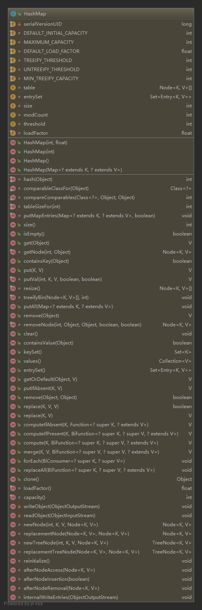

### HashMap
  
 
#### 一. 存储的节点
从Java8开始，`HashMap`中存储的键值对类型有两种，一种是普通的键值对`Node`，实现了`Map.Entry<K,V>`接口，提供了最基本的对于键值对的操作和用于单项链表的`next`指针，另一种是用于红黑树的键值对`TreeNode`类型，继承自`LinkedHashMap.Entry<K,V>`类，而`LinkedHashMap.Entry<K,V>`又是继承自`HashMap.Node<K,V>`，额外提供了对树的操作。
#### 二. Fields
```java
// 默认哈希桶数组的大小，为16
static final int DEFAULT_INITIAL_CAPACITY = 1 << 4; // aka 16
// 哈希桶数组最大尺寸，2^30
static final int MAXIMUM_CAPACITY = 1 << 30;
// 默认的负载因子，0.75
static final float DEFAULT_LOAD_FACTOR = 0.75f;
// 一个哈希桶中的元素冲突时会形成一个链表，链表长度大于此长度时会转成红黑树来提高查找效率。
static final int TREEIFY_THRESHOLD = 8;
// 红黑树中元素个数小于6时会转为链表
static final int UNTREEIFY_THRESHOLD = 6;
// 只有当哈希桶数组的尺寸达到此值时才会发生树化，否则当一个桶中元素大于8时应`resize`
static final int MIN_TREEIFY_CAPACITY = 64;
// 哈希桶数组
transient Node<K,V>[] table;
// 存放键集
transient Set<Map.Entry<K,V>> entrySet;
// 当前键值对数量
transient int size;
// 防止并发修改
transient int modCount;
// 下一次发生`resize`操作的键值对数量，等于`哈希桶数组容量 * 负载因子`
int threshold;
// 负载因子
final float loadFactor;
```
#### 三. Constructors
默认构造器采用默认的负载因子；   
接受一个`map`的构造器采用默认的负载因子，并将参数中的所有键值对放入其中；   
剩下的两个构造器可以设置负载因子和Map容量的大小，设置容量大小后会转为设置`threshold`为第一个大于等于`initialCapacity`的2的次方数，然后在第一次插入元素的时候，会扩容，并将哈希桶数组长度设为`threshold`，然后乘以负载因子得到新的`threshold`  
```java
public HashMap(int initialCapacity, float loadFactor) {
    if (initialCapacity < 0)
        throw new IllegalArgumentException("Illegal initial capacity: " +
                                            initialCapacity);
    if (initialCapacity > MAXIMUM_CAPACITY)
        initialCapacity = MAXIMUM_CAPACITY;
    if (loadFactor <= 0 || Float.isNaN(loadFactor))
        throw new IllegalArgumentException("Illegal load factor: " +
                                            loadFactor);
    this.loadFactor = loadFactor;
    this.threshold = tableSizeFor(initialCapacity);
}

public HashMap(int initialCapacity) {
    this(initialCapacity, DEFAULT_LOAD_FACTOR);
}

public HashMap() {
    this.loadFactor = DEFAULT_LOAD_FACTOR; // all other fields defaulted
}

public HashMap(Map<? extends K, ? extends V> m) {
    this.loadFactor = DEFAULT_LOAD_FACTOR;
    putMapEntries(m, false);
}
```
```java
static final int tableSizeFor(int cap) {
    int n = -1 >>> Integer.numberOfLeadingZeros(cap - 1);
    return (n < 0) ? 1 : (n >= MAXIMUM_CAPACITY) ? MAXIMUM_CAPACITY : n + 1;
}
```
#### 四. Methods
1. `hash`，计算key的哈希值，如果key为`null`，则哈希值为0，否则将key自身的`hashCode`右移16位后与`hashCode`做异或操作。(高位运算)      
    ```java
    static final int hash(Object key) {
        int h;
        return (key == null) ? 0 : (h = key.hashCode()) ^ (h >>> 16);
    }
    ```
2. `put`，`putVal`，`put`方法调用`putVal`向map中插入键值对：
    ```java
    public V put(K key, V value) {
        return putVal(hash(key), key, value, false, true);
    }

    final V putVal(int hash, K key, V value, boolean onlyIfAbsent, boolean evict) {
        Node<K,V>[] tab; Node<K,V> p; int n, i;
        // 数组不存在则先扩容
        if ((tab = table) == null || (n = tab.length) == 0)
            n = (tab = resize()).length;
        // 通过key计算出一个hash值，然后对数组长度进行取余，得到下标i
        // 如果数组中下标为i的位置为null，则说明没冲突，直接通过key value新建一个节点放在下标为i处
        // 当n为2的次方数时，(n - 1) & hash 等价于 hash % n，但&更快，所以哈希桶数组的长度总是2的次方数而不是选择一个素数
        if ((p = tab[i = (n - 1) & hash]) == null)
            tab[i] = newNode(hash, key, value, null);
        else {
            // 下标为i处不为null，发生冲突
            Node<K,V> e; K k;
            // 数组中下标为i的元素就是key，直接返回该节点，判断条件是hash相等，引用相等或equals方法为true
            if (p.hash == hash &&
                ((k = p.key) == key || (key != null && key.equals(k))))
                e = p;
            else if (p instanceof TreeNode)
                // 已经是红黑树了，直接对红黑树执行插入操作
                e = ((TreeNode<K,V>)p).putTreeVal(this, tab, hash, key, value);
            else {
                // 遍历链表，统计节点个数
                for (int binCount = 0; ; ++binCount) {
                    if ((e = p.next) == null) {
                        // 链表中没有找到该key，将要插入的键值对放入链表尾部
                        p.next = newNode(hash, key, value, null);
                        // 判断链表元素是否大于8，如果是，转化红黑树
                        if (binCount >= TREEIFY_THRESHOLD - 1) // -1 for 1st
                            treeifyBin(tab, hash);
                        break;
                    }
                    // 在链表中找到该key，返回该节点
                    if (e.hash == hash &&
                        ((k = e.key) == key || (key != null && key.equals(k))))
                        break;
                    p = e;
                }
            }
            // 要插入的key已经存在与map中，修改value，返回旧的value
            if (e != null) { // existing mapping for key
                V oldValue = e.value;
                if (!onlyIfAbsent || oldValue == null)
                    e.value = value;
                afterNodeAccess(e);
                return oldValue;
            }
        }
        // 要插入的key不在map中
        ++modCount;
        // 如果键值对个数大于`threshold`，resize操作
        if (++size > threshold)
            resize();
        afterNodeInsertion(evict);
        return null;
    }
    ```
3. `get`，`getNode`，根据key查找value
    ```java
    public V get(Object key) {
        Node<K,V> e;
        return (e = getNode(hash(key), key)) == null ? null : e.value;
    }

    final Node<K,V> getNode(int hash, Object key) {
        Node<K,V>[] tab; Node<K,V> first, e; int n; K k;
        // 哈希桶数组不为null，数组长度大于0，该key对应的桶不为null，说明该key存在
        if ((tab = table) != null && (n = tab.length) > 0 &&
            (first = tab[(n - 1) & hash]) != null) {
            // 数组中节点即为所查找节点
            if (first.hash == hash && // always check first node
                ((k = first.key) == key || (key != null && key.equals(k))))
                return first;
            if ((e = first.next) != null) {
                // 如果是红黑树，则通过红黑树的查找方式，否则遍历链表
                if (first instanceof TreeNode)
                    return ((TreeNode<K,V>)first).getTreeNode(hash, key);
                do {
                    if (e.hash == hash &&
                        ((k = e.key) == key || (key != null && key.equals(k))))
                        return e;
                } while ((e = e.next) != null);
            }
        }
        return null;
    }
    ```
4. `remove`，`removeNode`，移除key
    ```java
        public V remove(Object key) {
        Node<K,V> e;
        return (e = removeNode(hash(key), key, null, false, true)) == null ?
            null : e.value;
    }

    final Node<K,V> removeNode(int hash, Object key, Object value, boolean matchValue, boolean movable) {
        Node<K,V>[] tab; Node<K,V> p; int n, index;
        // 该key在map中
        if ((tab = table) != null && (n = tab.length) > 0 &&
            (p = tab[index = (n - 1) & hash]) != null) {
            Node<K,V> node = null, e; K k; V v;
            // 数组元素即为所要查找的节点
            if (p.hash == hash &&
                ((k = p.key) == key || (key != null && key.equals(k))))
                node = p;
            else if ((e = p.next) != null) {
                // 如果是红黑树
                if (p instanceof TreeNode)
                    node = ((TreeNode<K,V>)p).getTreeNode(hash, key);
                else {
                    // 否则遍历链表查找
                    do {
                        if (e.hash == hash &&
                            ((k = e.key) == key ||
                             (key != null && key.equals(k)))) {
                            node = e;
                            break;
                        }
                        p = e;
                    } while ((e = e.next) != null);
                }
            }
            //找到该节点
            if (node != null && (!matchValue || (v = node.value) == value ||
                                 (value != null && value.equals(v)))) {
                // 按照红黑树的方式移除
                if (node instanceof TreeNode)
                    ((TreeNode<K,V>)node).removeTreeNode(this, tab, movable);
                else if (node == p)
                    // 直接将数组该处的元素置为链表中下一个元素
                    tab[index] = node.next;
                else
                    p.next = node.next;
                ++modCount;
                --size;
                afterNodeRemoval(node);
                return node;
            }
        }
        return null;
    }
    ```
5. `resize`扩容：`HashMap`是先插入元素再扩容，但如果是刚刚初始化过的容器是先扩容再插入元素。    
    扩容是比较耗费性能的操作，如果可能，尽量使用可以指定`initialCapacity`的构造器来避免多次扩容。  
    ```java
    final Node<K,V>[] resize() {
        Node<K,V>[] oldTab = table;
        // 旧数组长度
        int oldCap = (oldTab == null) ? 0 : oldTab.length;
        // 旧键值对容量
        int oldThr = threshold;
        int newCap, newThr = 0;
        // oldCap > 0 说明并不是第一次扩容
        if (oldCap > 0) {
            // 数组长度超过最大值就不再扩容，将键值对容量限制设为整型最大值
            if (oldCap >= MAXIMUM_CAPACITY) {
                threshold = Integer.MAX_VALUE;
                return oldTab;
            }
            // 否则新的数组长度为原来的2倍(newCap = oldCap << 1)，键值对容量也变为原来2倍
            else if ((newCap = oldCap << 1) < MAXIMUM_CAPACITY &&
                     oldCap >= DEFAULT_INITIAL_CAPACITY)
                newThr = oldThr << 1; // double threshold
        }
        // 没扩容过，构造函数里设置了initialCapacity，将新的数组长度设为旧的键值对容量
        // 此时旧的键值对容量等于第一个不小于initialCapacity的2的次方数
        else if (oldThr > 0) // initial capacity was placed in threshold
            newCap = oldThr;
        // 没扩容过，均使用默认值
        else {               // zero initial threshold signifies using defaults
            newCap = DEFAULT_INITIAL_CAPACITY;  // 16
            newThr = (int)(DEFAULT_LOAD_FACTOR * DEFAULT_INITIAL_CAPACITY);  // 0.75 * 16
        }
        // 重新计算键值对容量，对应于可以设置initialCapacity的构造器
        if (newThr == 0) {
            float ft = (float)newCap * loadFactor;
            newThr = (newCap < MAXIMUM_CAPACITY && ft < (float)MAXIMUM_CAPACITY ?
                      (int)ft : Integer.MAX_VALUE);
        }
        threshold = newThr;
        // 扩容
        @SuppressWarnings({"rawtypes","unchecked"})
        Node<K,V>[] newTab = (Node<K,V>[])new Node[newCap];
        table = newTab;
        // 如果原来有元素
        if (oldTab != null) {
            // 遍历旧的数组
            for (int j = 0; j < oldCap; ++j) {
                Node<K,V> e;
                // 如果这个桶不为空
                if ((e = oldTab[j]) != null) {
                    oldTab[j] = null;
                    // 这个桶只有一个节点，计算新的下标值，直接移到新位置
                    if (e.next == null)
                        newTab[e.hash & (newCap - 1)] = e;
                    // 如果是红黑树
                    else if (e instanceof TreeNode)
                        ((TreeNode<K,V>)e).split(this, newTab, j, oldCap);
                    // 链表
                    else { // preserve order
                        Node<K,V> loHead = null, loTail = null;
                        Node<K,V> hiHead = null, hiTail = null;
                        Node<K,V> next;
                        // hash和oldCap相与后，要么为0，要么不为0
                        // 为0的话扩容后在数组中的下标不变，否则下标值为旧下标值+oldCap
                        // 以这两种结果为分类，将原链表中的元素分为两个链表
                        do {
                            next = e.next;
                            if ((e.hash & oldCap) == 0) {
                                if (loTail == null)
                                    loHead = e;
                                else
                                    loTail.next = e;
                                loTail = e;
                            }
                            else {
                                if (hiTail == null)
                                    hiHead = e;
                                else
                                    hiTail.next = e;
                                hiTail = e;
                            }
                        } while ((e = next) != null);
                        // 将两个链表分别放到对应下标位置
                        if (loTail != null) {
                            loTail.next = null;
                            newTab[j] = loHead;
                        }
                        if (hiTail != null) {
                            hiTail.next = null;
                            newTab[j + oldCap] = hiHead;
                        }
                    }
                }
            }
        }
        return newTab;
    }
    ```
    当n为2的次方数，n变为原来的2倍时，hash & (n - 1)的结果要么不变，要么增加原来的n值，如下图，n倍增后，n-1的mask范围增加了1位，所以再次与hash相与的结果是不变还是增加n，取决于hash中多出的这一位是0还是1，利用这个省去一部分计算时间，同时也将之前冲突的节点分散到两个不同的哈希桶中。      
    
6. `treeifyBin`将链表转化为红黑树，可以看到在转化之前先判断数组的长度是否小于`MIN_TREEIFY_CAPACITY`(64)，如果小于，则`resize`，不转化为红黑树
    ```java
    final void treeifyBin(Node<K,V>[] tab, int hash) {
        int n, index; Node<K,V> e;
        if (tab == null || (n = tab.length) < MIN_TREEIFY_CAPACITY)
            resize();
        else if ((e = tab[index = (n - 1) & hash]) != null) {
            TreeNode<K,V> hd = null, tl = null;
            do {
                TreeNode<K,V> p = replacementTreeNode(e, null);
                if (tl == null)
                    hd = p;
                else {
                    p.prev = tl;
                    tl.next = p;
                }
                tl = p;
            } while ((e = e.next) != null);
            if ((tab[index] = hd) != null)
                hd.treeify(tab);
        }
    }
    ```