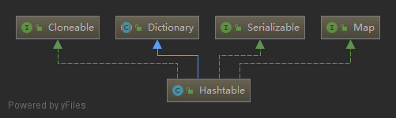

### Hashtable
   
`Hashtable`类继承抽象类`Dictionary`，实现了`Map`接口，但它的所有`public`方法都是`synchronized`修饰的，所以它是线程安全的。与`HashMap`类似，也是采用链地址法。    
#### 一. Constructors
负载因子默认是0.75，数组长度最小是1，默认是11
```java
public Hashtable(int initialCapacity, float loadFactor) {
    if (initialCapacity < 0)
        throw new IllegalArgumentException("Illegal Capacity: "+
                                            initialCapacity);
    if (loadFactor <= 0 || Float.isNaN(loadFactor))
        throw new IllegalArgumentException("Illegal Load: "+loadFactor);

    if (initialCapacity==0)
        initialCapacity = 1;
    this.loadFactor = loadFactor;
    table = new Entry<?,?>[initialCapacity];
    threshold = (int)Math.min(initialCapacity * loadFactor, MAX_ARRAY_SIZE + 1);
}

public Hashtable(int initialCapacity) {
    this(initialCapacity, 0.75f);
}

public Hashtable() {
    this(11, 0.75f);
}

public Hashtable(Map<? extends K, ? extends V> t) {
    this(Math.max(2*t.size(), 11), 0.75f);
    putAll(t);
}
```
#### 二. Methods
1. `containsValue`，查看table中是否包含指定的value，如果value为null，会抛空指针异常。这与`Hashtable`不能存放为null的value相对应。
    ```java
    public synchronized boolean contains(Object value) {
        if (value == null) {
            throw new NullPointerException();
        }
        Entry<?,?> tab[] = table;
        for (int i = tab.length ; i-- > 0 ;) {
            // 如果该哈希桶不为空，遍历此链表
            for (Entry<?,?> e = tab[i] ; e != null ; e = e.next) {
                if (e.value.equals(value)) {
                    return true;
                }
            }
        }
        return false;
    }

    public boolean containsValue(Object value) {
        return contains(value);
    }
    ```
2. `containsKey`，table中是否包含指定的key，如果key为null，则在调用key的hashcode方法时，会抛空指针异常，这与`Hashtable`不能存放为null的key相对应(put时也会调用key的hashcode方法，如果为null也会空指针异常，无法存入)。
    ```java
    public synchronized boolean containsKey(Object key) {
        Entry<?,?> tab[] = table;
        int hash = key.hashCode();
        // 先除去hash的符号位，然后对数组长度取模
        int index = (hash & 0x7FFFFFFF) % tab.length;
        for (Entry<?,?> e = tab[index] ; e != null ; e = e.next) {
            if ((e.hash == hash) && e.key.equals(key)) {
                return true;
            }
        }
        return false;
    }
    ```
3. `get`，先计算下标，然后遍历链表
    ```java
    @SuppressWarnings("unchecked")
    public synchronized V get(Object key) {
        Entry<?,?> tab[] = table;
        int hash = key.hashCode();
        int index = (hash & 0x7FFFFFFF) % tab.length;
        for (Entry<?,?> e = tab[index] ; e != null ; e = e.next) {
            if ((e.hash == hash) && e.key.equals(key)) {
                return (V)e.value;
            }
        }
        return null;
    }
    ```
4. `put`与扩容
    ```java
    public synchronized V put(K key, V value) {
        // value不能为null
        if (value == null) {
            throw new NullPointerException();
        }

        Entry<?,?> tab[] = table;
        int hash = key.hashCode();
        int index = (hash & 0x7FFFFFFF) % tab.length;
        @SuppressWarnings("unchecked")
        Entry<K,V> entry = (Entry<K,V>)tab[index];
        for(; entry != null ; entry = entry.next) {
            // 如果key已经存在，直接替换
            if ((entry.hash == hash) && entry.key.equals(key)) {
                V old = entry.value;
                entry.value = value;
                return old;
            }
        }
        // key不在table中，添加进去
        addEntry(hash, key, value, index);
        return null;
    }

    private void addEntry(int hash, K key, V value, int index) {
        Entry<?,?> tab[] = table;
        if (count >= threshold) {
            // 如果键值对的数量已经达到了threshold先扩容
            rehash();
            // 扩容后数组引用指向新的数组，重新计算下标值
            tab = table;
            hash = key.hashCode();
            index = (hash & 0x7FFFFFFF) % tab.length;
        }

        // 创建新的Entry，插到链表头部
        @SuppressWarnings("unchecked")
        Entry<K,V> e = (Entry<K,V>) tab[index];
        tab[index] = new Entry<>(hash, key, value, e);
        count++;
        modCount++;
    }

    @SuppressWarnings("unchecked")
    protected void rehash() {
        int oldCapacity = table.length;
        Entry<?,?>[] oldMap = table;

        // 新容量等于旧容量的2倍加1
        int newCapacity = (oldCapacity << 1) + 1;
        // 新容量比最大容量大
        if (newCapacity - MAX_ARRAY_SIZE > 0) {
            // 如果旧的容量已经达到最大容量了，则什么也不做直接返回
            if (oldCapacity == MAX_ARRAY_SIZE)
                // Keep running with MAX_ARRAY_SIZE buckets
                return;
            // 新的容量设为最大容量
            newCapacity = MAX_ARRAY_SIZE;
        }
        Entry<?,?>[] newMap = new Entry<?,?>[newCapacity];

        modCount++;
        // 计算新的扩容键值对数量阈值
        threshold = (int)Math.min(newCapacity * loadFactor, MAX_ARRAY_SIZE + 1);
        table = newMap;
        // 对原数组中的每个元素重新计算下标，插入新数组
        for (int i = oldCapacity ; i-- > 0 ;) {
            for (Entry<K,V> old = (Entry<K,V>)oldMap[i] ; old != null ; ) {
                Entry<K,V> e = old;
                old = old.next;

                int index = (e.hash & 0x7FFFFFFF) % newCapacity;
                e.next = (Entry<K,V>)newMap[index];
                newMap[index] = e;
            }
        }
    }
    ```
5. `remove`
    ```java
    public synchronized V remove(Object key) {
        Entry<?,?> tab[] = table;
        int hash = key.hashCode();
        int index = (hash & 0x7FFFFFFF) % tab.length;
        @SuppressWarnings("unchecked")
        Entry<K,V> e = (Entry<K,V>)tab[index];
        for(Entry<K,V> prev = null ; e != null ; prev = e, e = e.next) {
            // 在链表中找到，删除，返回value
            if ((e.hash == hash) && e.key.equals(key)) {
                if (prev != null) {
                    prev.next = e.next;
                } else {
                    tab[index] = e.next;
                }
                modCount++;
                count--;
                V oldValue = e.value;
                e.value = null;
                return oldValue;
            }
        }
        return null;
    }
    ```
6. `entrySet`返回键值对的集合，返回的是一个`Collections.SynchronizedSet`类型的对象，将这个`Hashtable`对象传进去，作为锁对象，这样就可以实现线程安全的访问。
    ```java
    public Set<Map.Entry<K,V>> entrySet() {
        if (entrySet==null)
            entrySet = Collections.synchronizedSet(new EntrySet(), this);
        return entrySet;
    }
    ```
