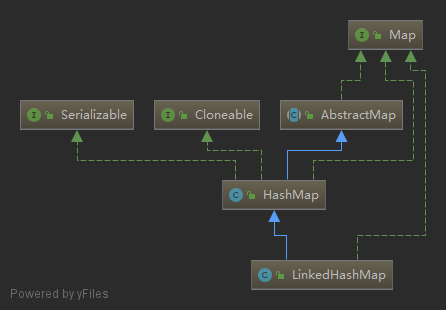
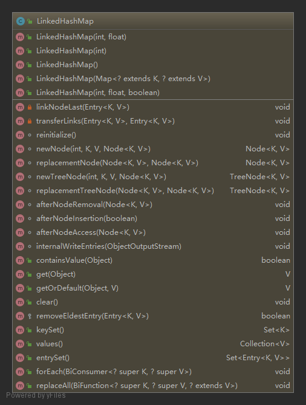

### LinkedHashMap
    
   

> `LinkedHashMap`继承自`HashMap`，对`Map`的操作都是直接使用`HashMap`的，但又用链表维护了一份键值对的顺序，默认采用插入顺序，也可以选择访问顺序，即LRU算法，将每次访问过的键值对放在链表尾部

#### 一. 节点
```java
static class Entry<K,V> extends HashMap.Node<K,V> {
    Entry<K,V> before, after;
    Entry(int hash, K key, V value, Node<K,V> next) {
        super(hash, key, value, next);
    }
}
```
这个节点类继承自`HashMap.Node<K,V>`，并添加了双向链表的`before`，`after`指针。
#### 二. Fields
```java
// 链表头
transient LinkedHashMap.Entry<K,V> head;
// 链表尾
transient LinkedHashMap.Entry<K,V> tail;
// 是否采用访问顺序
final boolean accessOrder;
```
#### 三. Constructors
除了最后一个构造器可以设置`accessOrder`外，其他的构造器都和`HashMap`的差不多，`accessOrder`默认为`false`，即按照插入顺序
```java
public LinkedHashMap(int initialCapacity, float loadFactor) {
    super(initialCapacity, loadFactor);
    accessOrder = false;
}

public LinkedHashMap(int initialCapacity) {
    super(initialCapacity);
    accessOrder = false;
}

public LinkedHashMap() {
    super();
    accessOrder = false;
}

public LinkedHashMap(Map<? extends K, ? extends V> m) {
    super();
    accessOrder = false;
    putMapEntries(m, false);
}

public LinkedHashMap(int initialCapacity,
                        float loadFactor,
                        boolean accessOrder) {
    super(initialCapacity, loadFactor);
    this.accessOrder = accessOrder;
}
```
#### 四. Fields
1. `containsValue`查看所有键值对中是否包含给定的value，这个实现起来要比`HashMap`的简单一些，直接遍历链表就行。
    ```java
    public boolean containsValue(Object value) {
        for (LinkedHashMap.Entry<K,V> e = head; e != null; e = e.after) {
            V v = e.value;
            if (v == value || (value != null && value.equals(v)))
                return true;
        }
        return false;
    }
    ```
2. `get`和`getOrDefault`，利用`HashMap`中的`getNode`方法找到该键值对，然后如果使用了LRU算法的话，将这个键值对移动到链表尾部
    ```java
    public V get(Object key) {
        Node<K,V> e;
        if ((e = getNode(hash(key), key)) == null)
            return null;
        if (accessOrder)
            afterNodeAccess(e);
        return e.value;
    }

    public V getOrDefault(Object key, V defaultValue) {
       Node<K,V> e;
       if ((e = getNode(hash(key), key)) == null)
           return defaultValue;
       if (accessOrder)
           afterNodeAccess(e);
       return e.value;
   }

    void afterNodeAccess(Node<K,V> e) { // move node to last
        LinkedHashMap.Entry<K,V> last;
        if (accessOrder && (last = tail) != e) {
            LinkedHashMap.Entry<K,V> p =
                (LinkedHashMap.Entry<K,V>)e, b = p.before, a = p.after;
            p.after = null;
            if (b == null)
                head = a;
            else
                b.after = a;
            if (a != null)
                a.before = b;
            else
                last = b;
            if (last == null)
                head = p;
            else {
                p.before = last;
                last.after = p;
            }
            tail = p;
            ++modCount;
        }
    }
    ```
3. `afterNodeRemoval`，`afterNodeInsertion`再加上上面的`afterNodeAccess`，是`HashMap`中定义的三个空方法，用于在执行过访问修改操作后执行的回调，`LinkedHashMap`实现了这几个方法，用于维护链表。    
    `afterNodeRemoval`是移除节点后从链表中删除节点的回调。   
    `afterNodeInsertion`方法是用来执行每次插入操作后，是否移除最久未使用的节点，即链表首部，但由于`removeEldestEntry`方法在`LinkedHashMap`中总是返回`false`，所以默认并不会移除，可以自己继承并重写这个方法来实现。
    ```java
    void afterNodeRemoval(Node<K,V> e) { // unlink
        LinkedHashMap.Entry<K,V> p =
            (LinkedHashMap.Entry<K,V>)e, b = p.before, a = p.after;
        p.before = p.after = null;
        if (b == null)
            head = a;
        else
            b.after = a;
        if (a == null)
            tail = b;
        else
            a.before = b;
    }

    void afterNodeInsertion(boolean evict) { // possibly remove eldest
        LinkedHashMap.Entry<K,V> first;
        if (evict && (first = head) != null && removeEldestEntry(first)) {
            K key = first.key;
            removeNode(hash(key), key, null, false, true);
        }
    }
    ```
4. `put`，`LinkedHashMap`并没有实现自己的`put`方法，而是使用`HashMap`的`put`方法，其中会调用`putVal`方法，`putVal`方法在需要新插入一个键值对时，会调用一个叫`newNode`的方法来新建节点，`LinkedHashMap`重写了这个方法来向链表中插入节点，同时新建的节点类型也改为`LinkedHashMap.Entry<K,V>`
    ```java
    Node<K,V> newNode(int hash, K key, V value, Node<K,V> e) {
        LinkedHashMap.Entry<K,V> p =
            new LinkedHashMap.Entry<>(hash, key, value, e);
        linkNodeLast(p);
        return p;
    }

    // link at the end of list
    private void linkNodeLast(LinkedHashMap.Entry<K,V> p) {
        LinkedHashMap.Entry<K,V> last = tail;
        tail = p;
        if (last == null)
            head = p;
        else {
            p.before = last;
            last.after = p;
        }
    }
    ```
    类似的还有以下几个方法，
    ```java
    Node<K,V> replacementNode(Node<K,V> p, Node<K,V> next) {
        LinkedHashMap.Entry<K,V> q = (LinkedHashMap.Entry<K,V>)p;
        LinkedHashMap.Entry<K,V> t =
            new LinkedHashMap.Entry<>(q.hash, q.key, q.value, next);
        transferLinks(q, t);
        return t;
    }

    TreeNode<K,V> newTreeNode(int hash, K key, V value, Node<K,V> next) {
        TreeNode<K,V> p = new TreeNode<>(hash, key, value, next);
        linkNodeLast(p);
        return p;
    }

    TreeNode<K,V> replacementTreeNode(Node<K,V> p, Node<K,V> next) {
        LinkedHashMap.Entry<K,V> q = (LinkedHashMap.Entry<K,V>)p;
        TreeNode<K,V> t = new TreeNode<>(q.hash, q.key, q.value, next);
        transferLinks(q, t);
        return t;
    }
    ```