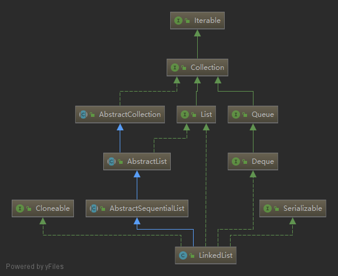
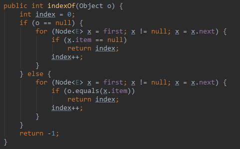
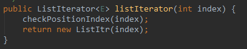

### LinkedList
  
  

#### 一. 节点   
`LinkedList`内部是一个双向链表，元素均存放在一个节点对象中，节点类：   
   
`item`为存放数据，`next`与`prev`分别是后继与前驱指针。
#### 二. Fields
1. `size`：存放元素个数   
2. `first`与`last`分别为指向链表第一个元素和最后一个元素的指针。  
    对于`first`总满足`(first == null && last == null) || (first.prev == null && first.item != null)`  
    对于`last`总满足`(first == null && last == null) || (last.next == null && last.item != null)`   
    其中`(first == null && last == null)`表示链表为空，后者代表不为空的情况。
#### 三. Constructors
1. `LinkedList()`，默认构造器，什么也不做，构造一个空链表。
2. `LinkedList(Collection<? extends E> c)`：创建一个包含c中所有元素的链表。这个构造器先调用上面的默认构造器，然后调用`addAll(Collection<? extends E> c)`方法将c中元素全部添加进链表，添加的顺序是c的迭代器遍历元素的顺序。   
       
    `addAll(Collection<? extends E> c)`中又调用了`addAll(int index, Collection<? extends E> c)`方法   
       
    `addAll(int index, Collection<? extends E> c)`是将c中元素插入到链表中下标`index`处。在上面的调用中，`index`就是`size`，即将c中元素插入到链表尾部，而在构造器中调用时，`size`为0。   
    首先检查插入位置下标是否在`[0, size]`区间，然后判断c是否有元素，如果没有直接返回。   
    接着定义了两个指针，`pred`和`succ`，`succ`指向下标为`index`处的节点，`pred`指向`succ`的前驱节点，如果`index == size`，则由于`size`处为空，所以`succ = null`，它的前驱节点自然就是链表尾节点；否则调用`node(int index)`方法来遍历链表，查找下标为`index`的节点，在`node()`方法内部，为了提高查找效率，如果查找的下标小于`size`的一半，正向遍历，否则反向遍历。 
    然后通过一个循环将元素插入链表，最后如果需要的话调整链表尾指针，修改元素个数。       
       
    
#### 四. Methods
1. `getFirst`与`getLast`，通过`first`与`last`指针直接返回首元素和尾元素，如果链表为空则抛`NoSuchElementException`   
       
2. `removeFirst`与`removeLast`，移除首元素与尾元素，若链表为空则抛`NoSuchElementException`，否则调用内部的一个私有方法`unlinkFirst(Node<E> f)`与`unlinkLast(Node<E> l)`移除。   
            
    移除完后要判断下链表是否为空，若为空则要将尾指针或头指针置为`null`     
         
3. `addFirst(E e)`与`addLast(E e)`，向头部或尾部添加元素，在内部直接调用私有方法`linkFirst(E e)`与`linkLast(E e)`    
             
    如果添加之前链表为空则需要修改尾指针或头指针     
           
4. `contains(Object o)`方法，判断链表中是否包含元素o，在内部调用`indexOf(Object o)`获取o首次出现的下标，然后判断下标是否为-1。    
        
    在`indexOf`内部采用线性搜索：       
       
    与`indexOf`类似的还有`lastIndexOf`，返回元素最后一次出现的下标，也是线性搜索，只不过是反向遍历：   
    
5. `add(E e)`：向链表尾部添加元素，在内部调用上面的`linkLast`方法：   
       
6. `remove(Object o)`，从链表中移除元素o，采用线性搜索，在链表中找到o后，调用`unlink(Node<E> x)`方法移除。      
       
       
7. `clear`，清空链表，循环链表，将每个节点数据引用、前驱指针、后继指针置为`null`(让没用的对象尽量早些被回收掉)，将头指针与尾指针置为`null`，`size`置0：  
      
8. `get(int index)`，获取指定下标处的元素，检查下标后直接调用`node(int index)`方法。   
        
9. `set(int index, E element)`修改下标为`index`的元素为`element`，先检查下标，然后调用`node()`方法返回该下标处节点引用，直接修改节点中的数据。  
       
10. `add(int index, E element)`将元素`element`插入到下标为`index`处，即在原链表下标为`index`的元素前面新链接一个节点。先检查下标，如果下标为`size`，直接调用`linkLast`将元素添加到链表尾部；否则，先调用`node`方法返回`index`下标处节点的引用，然后调用`linkBefore(E e, Node<E> succ)`在这个节点前面插`element`。    
        
    
11. `remove(int index)`移除下标为`index`处的元素。先调用`node`返回此处节点的引用，然后调用`unlink`方法从链表移除此节点。  
    
12. `toArray()`：返回一个包含链表中所有元素的`Object[]`类型的数组，新建一个`size`大小的数组，然后遍历链表，将链表中的每个元素填入数组：   
       
    `T[] toArray(T[] a)`返回链表的泛型类型的数组，如果传入的数组长度小于`size`则会新建一个`T`类型的数组，否则就直接将链表元素装入参数中的数组：  
    
13. 与双端队列有关的操作：`peek()`，`element()`，`poll()`，`remove()`，`offer(E e)`，`offerFirst(E e)`，`offerLast(E e)`，`peekFirst()`，`peekLast()`，`pollFirst()`，`pollLast()`，`push(E e)`，`pop()`，`removeFirstOccurrence(Object o)`(移除链表中第一个出现的o)，`removeLastOccurrence(Object o)`(移除链表中最后面的o)，这些方法几乎都是直接调用上面`LinkedList`原有的方法，最后一个移除链表中最后一个给定元素是直接反向遍历搜索，然后调用`unlink`移除元素。
14. 迭代器：在`LinkedList`中可以调用四个返回迭代器的方法：`listIterator(int)`，`descendingIterator()`，`iterator()`，`listIterator()`。    
    `LinkedList`类自身只实现了`listIterator(int)`与`descendingIterator()`方法。    
    `listIterator(int)`方法返回一个定义在`LinkedList`中一个实现了`ListIterator`接口的内部类类型：     
       
      
      
    `descendingIterator()`方法返回一个`Iterator`类型的单向迭代器，也是一个定义在`LinkedList`中的内部类，内部利用上面的双向迭代器对象完成单向迭代的功能。  
       
    在`LinkedList`类中并没有直接实现`iterator()`与`listIterator()`，而是继承自父类，这两个方法最终都是通过调用`listIterator(0)`来实现的。
15. `subList`获取子列表，在`LinkedList`类中没有直接实现此方法，而是继承自`AbstractList`，返回一个继承了`AbstractList`名为`SubList`的类，这个类只具有包访问权限。