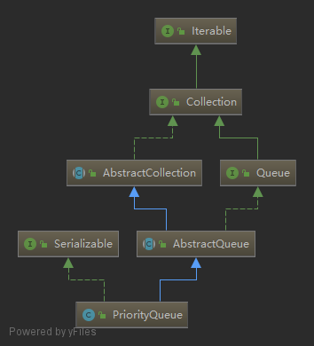
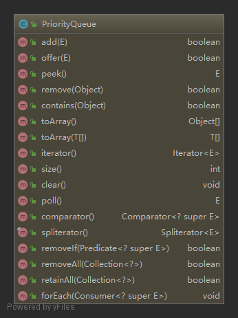

### PriorityQueue优先队列
    
   
优先队列，继承`AbstractQueue`类，内部用堆实现。  
#### 一. Fields
```java
// 默认容量
private static final int DEFAULT_INITIAL_CAPACITY = 11;
// 存放元素的数组
transient Object[] queue; 
// 元素个数
int size;
// 用于比较元素的比较器
private final Comparator<? super E> comparator;
// 防止并发修改
transient int modCount;   
```
#### 二. Constructors
前三个构造器最终都是调用`PriorityQueue(int initialCapacity, Comparator<? super E> comparator)`这个构造器来指定容量与比较器，容量如果没指定则默认为11，比较器没指定则为null，此时就需要存放的对象自身是可比较的，否则在`add`时会类型转换异常。
```java
public PriorityQueue() {
    this(DEFAULT_INITIAL_CAPACITY, null);
}

public PriorityQueue(int initialCapacity) {
    this(initialCapacity, null);
}

public PriorityQueue(Comparator<? super E> comparator) {
    this(DEFAULT_INITIAL_CAPACITY, comparator);
}

public PriorityQueue(int initialCapacity, Comparator<? super E> comparator) {
    if (initialCapacity < 1)
        throw new IllegalArgumentException();
    this.queue = new Object[initialCapacity];
    this.comparator = comparator;
}
```
还有由集合构造优先队列的构造器，第一个相当于将后两个整合了一下
```java
public PriorityQueue(Collection<? extends E> c) {
    // 由SortedSet或优先队列构造有限队列，比较器可以直接拿来用
    // 而且它们的toArray()方法返回的数组可以保证满足堆的要求(一个有序，另一个就是直接把堆的数组复制过来)
    if (c instanceof SortedSet<?>) {
        SortedSet<? extends E> ss = (SortedSet<? extends E>) c;
        this.comparator = (Comparator<? super E>) ss.comparator();
        initElementsFromCollection(ss);
    }
    else if (c instanceof PriorityQueue<?>) {
        PriorityQueue<? extends E> pq = (PriorityQueue<? extends E>) c;
        this.comparator = (Comparator<? super E>) pq.comparator();
        initFromPriorityQueue(pq);
    }
    else {
        this.comparator = null;
        initFromCollection(c);
    }
}

public PriorityQueue(PriorityQueue<? extends E> c) {
    this.comparator = (Comparator<? super E>) c.comparator();
    initFromPriorityQueue(c);
}

public PriorityQueue(SortedSet<? extends E> c) {
    this.comparator = (Comparator<? super E>) c.comparator();
    initElementsFromCollection(c);
}

private void initElementsFromCollection(Collection<? extends E> c) {
    Object[] es = c.toArray();
    int len = es.length;
    // 确保数组类型是Object[]
    if (es.getClass() != Object[].class)
        es = Arrays.copyOf(es, len, Object[].class);
    // 如果比较器为null，说明元素自身可比较，则不存在元素为null的情况
    if (len == 1 || this.comparator != null)
        for (Object e : es)
            if (e == null)
                throw new NullPointerException();
    this.queue = ensureNonEmpty(es);
    this.size = len;
}

private void initFromPriorityQueue(PriorityQueue<? extends E> c) {
    if (c.getClass() == PriorityQueue.class) {
        this.queue = ensureNonEmpty(c.toArray());
        this.size = c.size();
    } else {
        initFromCollection(c);
    }
}

private void initFromCollection(Collection<? extends E> c) {
    initElementsFromCollection(c);
    heapify();
}
// 把一个无序的数组调整成堆
private void heapify() {
    final Object[] es = queue;
    // i 是数组中最后一个非叶子节点，即树中倒数第二层中最右边的那个
    // 从这个下标开始遍历，每次向下调整
    int n = size, i = (n >>> 1) - 1; 
    final Comparator<? super E> cmp;
    if ((cmp = comparator) == null)
        for (; i >= 0; i--)
            siftDownComparable(i, (E) es[i], es, n);
    else
        for (; i >= 0; i--)
            siftDownUsingComparator(i, (E) es[i], es, n, cmp);
}
```
#### 三. Methods
1. `add`，`offer`向队列中添加元素，如果元素为null，抛空指针异常。如果底层数组满了，需要先扩容。
    ```java
    public boolean add(E e) {
        return offer(e);
    }

    public boolean offer(E e) {
        if (e == null)
            throw new NullPointerException();
        modCount++;
        int i = size;
        // 需要扩容
        if (i >= queue.length)
            grow(i + 1);
        // 调整节点，将e插入队列中合适的位置
        siftUp(i, e);
        size = i + 1;
        return true;
    }

    // 扩容  minCapacity为需要的最小长度
    private void grow(int minCapacity) {
        int oldCapacity = queue.length;
        // 如果旧容量小于64，扩为原来的2倍加2，否则扩为原来的1.5倍
        int newCapacity = oldCapacity + ((oldCapacity < 64) ?
                                         (oldCapacity + 2) :
                                         (oldCapacity >> 1));
        // 如果新容量大于MAX_ARRAY_SIZE
        // 如果所需最小容量小于0，则溢出，抛异常
        // 如果所需最小容量大于MAX_ARRAY_SIZE直接扩为Integer.MAX_VALUE
        // 否则扩为MAX_ARRAY_SIZE
        if (newCapacity - MAX_ARRAY_SIZE > 0)  // MAX_ARRAY_SIZE = Integer.MAX_VALUE - 8
            newCapacity = hugeCapacity(minCapacity);
        // 拷贝到新数组
        queue = Arrays.copyOf(queue, newCapacity);
    }

    private static int hugeCapacity(int minCapacity) {
        if (minCapacity < 0) // overflow
            throw new OutOfMemoryError();
        return (minCapacity > MAX_ARRAY_SIZE) ?
            Integer.MAX_VALUE :
            MAX_ARRAY_SIZE;
    }

    // 调整元素位置
    // 先将插入元素放在数组尾部，然后与它的父节点比较，如果它小于父节点则与父节点交换位置
    // 不断重复与父节点比较，知道插入它大于等于父节点
    private void siftUp(int k, E x) {
        // 如果构造器中传入比较器，用这个比较器比较
        if (comparator != null)
            siftUpUsingComparator(k, x, queue, comparator);
        else
            // 否则按照元素自身排序，对象必须是可比较的
            siftUpComparable(k, x, queue);
    }
    // 没有提供比较器，元素自身可比较
    private static <T> void siftUpComparable(int k, T x, Object[] es) {
        Comparable<? super T> key = (Comparable<? super T>) x;
        while (k > 0) {
            // 父节点下标
            int parent = (k - 1) >>> 1;
            Object e = es[parent];
            // 要插入元素和父节点元素比较
            if (key.compareTo((T) e) >= 0)
                // 如果key 大于等于父元素停止比较
                break;
            // 如果父元素大于等于插入元素，将父元素下移
            es[k] = e;
            k = parent;
        }
        // 找到key的位置
        es[k] = key;
    }
    // 使用提供的比较器插入元素
    private static <T> void siftUpUsingComparator(
        int k, T x, Object[] es, Comparator<? super T> cmp) {
        while (k > 0) {
            int parent = (k - 1) >>> 1;
            Object e = es[parent];
            if (cmp.compare(x, (T) e) >= 0)
                break;
            es[k] = e;
            k = parent;
        }
        es[k] = x;
    }
    ```
2. `peek`，返回堆顶元素
    ```java
    public E peek() {
        return (E) queue[0];
    }
    ```
3. `remove`，从队列中移除元素
    ```java
    public boolean remove(Object o) {
        // 遍历数组查找o的下标
        int i = indexOf(o);
        if (i == -1)
            return false;
        else {
            // 如果找到，移除
            removeAt(i);
            return true;
        }
    }

    E removeAt(int i) {
        // assert i >= 0 && i < size;
        final Object[] es = queue;
        modCount++;
        int s = --size;
        // 如果移除的元素是最后一个元素，直接置为null
        if (s == i) // removed last element
            es[i] = null;
        else {
            E moved = (E) es[s];
            es[s] = null;
            siftDown(i, moved);
            // if 成立说明 i 是叶子节点，即树最下面的那层
            // 是直接将数组最后一个元素放到 i 处，无法保证es[i]大于等于其父节点
            // 所以需要向上调整
            if (es[i] == moved) {
                siftUp(i, moved);
                // 如果调整了，即有元素发生交换，返回moved
                if (es[i] != moved)
                    return moved;
            }
        }
        return null;
    }
    // 从下标k开始到数组结尾，对于树是从上往下调整
    // 先将数组最后一个元素放在下标k处，然后与它的左右子节点中最小的比较
    // 如果它大于子节点中最小的那个，则与它交换位置，并继续与子节点比较
    // 直到它小于左右子节点，或它被移动到了叶子节点的位置
    private void siftDown(int k, E x) {
        if (comparator != null)
            siftDownUsingComparator(k, x, queue, size, comparator);
        else
            siftDownComparable(k, x, queue, size);
    }
    // 没有比较器
    private static <T> void siftDownComparable(int k, T x, Object[] es, int n) {
        // assert n > 0;
        Comparable<? super T> key = (Comparable<? super T>)x;
        int half = n >>> 1;           // loop while a non-leaf
        while (k < half) {  // k == half - 1时，k是数组最后一个元素的父节点下标
            // k的左子节点的下标
            int child = (k << 1) + 1; // assume left child is least
            Object c = es[child];
            // k的右子节点下标
            int right = child + 1;
            // c = 左右节点中较小的那个
            if (right < n && ((Comparable<? super T>) c).compareTo((T) es[right]) > 0)
                c = es[child = right];
            // 如果key比左右节点都小，说明key可以放在这里
            if (key.compareTo((T) c) <= 0)
                break;
            // 小的节点往上移
            es[k] = c;
            k = child;
        }
        es[k] = key;
    }

    private static <T> void siftDownUsingComparator(
        int k, T x, Object[] es, int n, Comparator<? super T> cmp) {
        // assert n > 0;
        int half = n >>> 1;
        while (k < half) {
            int child = (k << 1) + 1;
            Object c = es[child];
            int right = child + 1;
            if (right < n && cmp.compare((T) c, (T) es[right]) > 0)
                c = es[child = right];
            if (cmp.compare(x, (T) c) <= 0)
                break;
            es[k] = c;
            k = child;
        }
        es[k] = x;
    }
    ```
4. `poll`，移除堆顶元素
    ```java
    public E poll() {
        final Object[] es;
        final E result;
        // 如果堆顶不为空
        if ((result = (E) ((es = queue)[0])) != null) {
            modCount++;
            final int n;
            final E x = (E) es[(n = --size)];
            es[n] = null;
            // 如果移除完了还有元素剩余，从堆顶开始向下调整
            if (n > 0) {
                final Comparator<? super E> cmp;
                if ((cmp = comparator) == null)
                    siftDownComparable(0, x, es, n);
                else
                    siftDownUsingComparator(0, x, es, n, cmp);
            }
        }
        return result;
    }
    ```
5. `iterator`，返回一个迭代器，没有什么特定的顺序，只能保证第一个访问到的是最小的元素。
    ```java
    public Iterator<E> iterator() {
        return new Itr();
    }

    private final class Itr implements Iterator<E> {
        // 下一次调用next方法返回的元素的下标
        private int cursor;

         // 上一次调用next方法返回的元素的下标(如果是从数组中返回的)，初始为-1
         // 如果上一次访问的元素被移除或元素是从forgetMeNot中返回的，也设为-1
        private int lastRet = -1;

        // 在用迭代器remove时，有可能会将元素调整到lastRet前面
        // 此时如果继续只遍历数组，会将这个元素忘掉
        // 此时需要将这个元素放进这个队列，数组遍历完后，再调用next时从这个队列中取元素
        private ArrayDeque<E> forgetMeNot;

        // 如果上一次调用next方法返回的元素是从forgetMeNot中取出来的，则lastRetElt等于这个元素
        private E lastRetElt;
        // 防止并发修改
        private int expectedModCount = modCount;

        Itr() {}                        // prevent access constructor creation
        // 判断是否还有元素可以遍历，即数组没遍历完或forgetMeNot队列不为空
        public boolean hasNext() {
            return cursor < size ||
                (forgetMeNot != null && !forgetMeNot.isEmpty());
        }
        // 返回一个元素
        public E next() {
            // 判断是否有并发修改
            if (expectedModCount != modCount)
                throw new ConcurrentModificationException();
            // 如果数组没遍历完，直接返回数组中下一个元素
            if (cursor < size)
                return (E) queue[lastRet = cursor++];
            // 数组遍历完了，但是forgetMeNot中还有元素没访问到，从这里取出一个元素
            if (forgetMeNot != null) {
                lastRet = -1;
                lastRetElt = forgetMeNot.poll();
                if (lastRetElt != null)
                    return lastRetElt;
            }
            throw new NoSuchElementException();
        }

        public void remove() {
            if (expectedModCount != modCount)
                throw new ConcurrentModificationException();
            // 如果上一个元素是从数组返回的，调用removeAt移除
            if (lastRet != -1) {
                E moved = PriorityQueue.this.removeAt(lastRet);
                lastRet = -1;
                // moved == null说明没有元素被调整到lastRet前面，直接cursor--
                if (moved == null)
                    cursor--;
                else {
                // 如果有元素被移动到lastRet前面，则继续按照下标迭代会将它忽略掉
                // 因此要将它放入forgetMeNot队列中
                    if (forgetMeNot == null)
                        forgetMeNot = new ArrayDeque<>();
                    forgetMeNot.add(moved);
                }
            } else if (lastRetElt != null) {
                // 上一个元素是从forgetMeNot返回的
                PriorityQueue.this.removeEq(lastRetElt);
                lastRetElt = null;
            } else {
                throw new IllegalStateException();
            }
            expectedModCount = modCount;
        }
    }
    // 找到o的下标后再调removeAt
    void removeEq(Object o) {
        final Object[] es = queue;
        for (int i = 0, n = size; i < n; i++) {
            if (o == es[i]) {
                removeAt(i);
                break;
            }
        }
    }
    ```