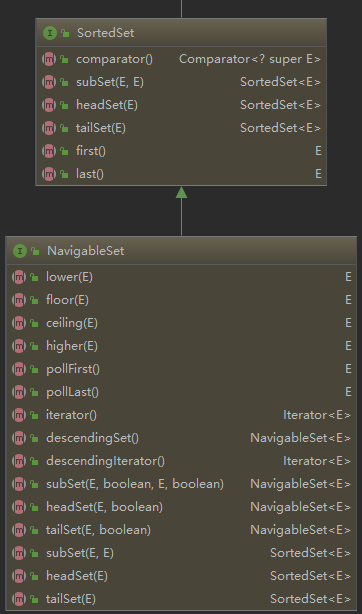

### 集合类的主要组成
#### 一.   
Java集合类库的用途是保存对象，并将其划分两个不同的概念：
1. `Collection`：一个独立元素的序列，这些元素都服从一条或多条规则。
2. `Map`：一组成对的键值对对象，允许你使用键来查找值。
#### 二. `Collection`接口
1. `Iterable`接口：定义了返回一个迭代器的方法，迭代器用于遍历并选择序列中的对象，`Collection`接口继承了此接口    
       
`Iterator`接口：定义了迭代器的行为：  

2. `Collection`接口：继承`Iterable`接口，并定义了一些对序列的通用的操作方法，如：添加、移除、判空、获取元素个数、判断某个对象是否在序列中。但并没有提供由下标随机存取对象的方法。    
  
3. `List`接口：继承`Collection`接口，并添加了通过下标操作元素的方法：通过下标插入、移除、修改、获取元素、获取子序列的方法。同时也定义了返回一个双向迭代器(`ListIterator`)的方法   
     
`ListIterator`接口继承`Iterator`接口，并定义了双向迭代的方法   
 
4. `Queue`接口：继承`Collection`接口，并提供了队列的操作，这些操作可以分为抛异常的和不抛异常的：  
抛异常的：  
`add`：在队列已满时添加元素会抛`IllegalStateException`    
`remove`：在队列为空时移除队头元素会抛`NoSuchElementException`   
`element`：在队列为空时获取队头元素会抛`element`    
不抛异常的：    
`offer`：在队列已满时返回`false`  
`poll`：在队列为空时移除队头元素返回`null`   
`peek`：在队列为空时获取队头元素返回`null`   
    
5. `Deque`接口：继承`Queue`接口，提供了双端队列的操作，即队列两端都可以添加删除元素  

6. `Set`接口：继承`Collection`接口，规定元素不允许重复，方法定义与`Collection`接口相同   
 
7. `SortedSet`接口：继承`Set`接口，提供排序的功能，存放的元素并不按照插入顺序，而是按照对象的比较函数进行排序。同时也提供了按照对象比较来获取最大最小元素和一定范围的集合子集视图的方法。   

8. `NavigableSet`接口：继承`SortedSet`接口，提供了根据对象比较来定位元素、获取一定范围内的子集视图、反向遍历集合的方法  

9.  `RandomAccess`接口：一个标记接口，用来表明实现了这个接口的list支持快速（通常是常数时间）随机访问，`ArrayList`实现了这个接口   
#### 三. `Map`接口  
1. `Map`接口：定义了键值对的操作  
   
2. `SortedMap`接口：继承`Map`接口，类似于`SortedSet`接口，提供对键的比较操作实现对键的排序  

3. `NavigableMap`接口，继承`SortedMap`接口，类似于`NavigableSet`接口  

---

#### 四. `Abstract`类
每个`java.util`容器都有自己的`Abstract`类，他们提供了该容器的部分实现，我们可以通过继承他们来定制自己的容器，而不是从头开始自己实现所有功能。    
  

---
