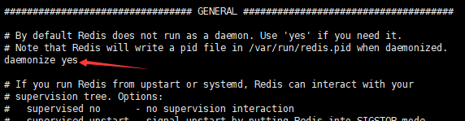

### centos 7下基本环境配置  
#### 一. jdk配置
1. 新建一个目录
```shell
mkdir /usr/java
```
2. 上传jdk压缩包到 /usr  
3. 解压jdk压缩包到上面新建的目录
```shell
cd /usr
tar xzf jdk-8u161-linux-x64.tar.gz -C /usr/java
```
4. 设置环境变量
编辑`/etc/profile`，添加以下内容：
```shell
# set java environment
export JAVA_HOME=/usr/java/jdk1.8.0_161
export CLASSPATH=$JAVA_HOME/lib/tools.jar:$JAVA_HOME/lib/dt.jar:$JAVA_HOME/lib
export PATH=$JAVA_HOME/bin:$PATH
```
加载环境变量：
```shell
source /etc/profile
```
查看java版本信息：
```shell
java -version
```
出现版本信息说明配置成功：
```shell
java version "1.8.0_161"
Java(TM) SE Runtime Environment (build 1.8.0_161-b12)
Java HotSpot(TM) 64-Bit Server VM (build 25.161-b12, mixed mode)
```

#### 二. Mysql
安装：
```shell
wget http://dev.mysql.com/get/mysql-community-release-el7-5.noarch.rpm
rpm -ivh mysql-community-release-el7-5.noarch.rpm
yum install mysql-community-server
```
重启mysql服务：
```shell
service mysqld restart
```
初次安装后root账户没密码，进入后设置密码：
```shell
mysql -u root
```
```sql
set password for 'root'@'localhost' = password('yourpassword');
```
允许远程连接：
```sql
use mysql;
update user set host = '%' where user = 'root';
flush privileges;
```
执行第二句时报错：`ERROR 1062 (23000): Duplicate entry '%-root' for key 'PRIMARY'`，不用管。

#### 三. redis
上传安装包后解压，进入目录然后make：
```shell
tar xzf redis-4.0.10.tar.gz -C /usr
cd /usr/redis-4.0.10/
make
```
修改启动方式，改为从配置文件启动，否则用默认的启动方式需要控制台一直打开，关闭控制台redis也随之关闭    
`redis-4.0.10`目录下有个`redis.conf`文件，是默认的配置文件，复制一份到`src`目录下，然后修改`GENERAL`部分，将`daemonize no`修改为`daemonize yes`:   
   
然后从此配置文件启动redis，默认端口6379:  
```shell
./redis-server redis.conf
```
`./redis-cli`启动redis客户端来访问服务端.
关闭redis，在src目录下执行：
```shell
./redis-cli -p 6379 shutdown
```


