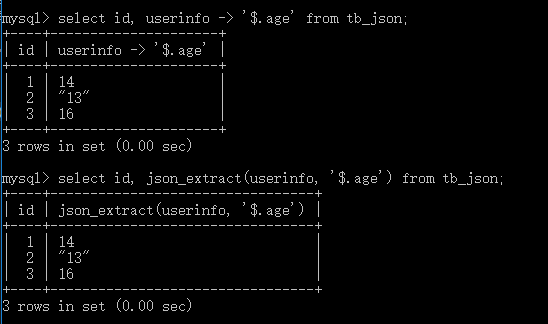
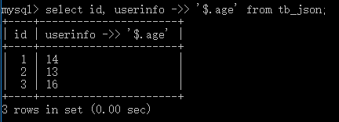

### json类型
```sql
create table tb_json (
    id int(11) not null primary key,
    userinfo json
);
```
```sql
insert into tb_json (id, userinfo) values (1, '{"username": "tom", "age": 14, "email": "123@xx.com"}'), (2, '{"username": "jim", "age": "13", "email": "354f@fd.com"}');
```
json_object函数构造json串
```sql
insert into tb_json (id, userinfo) values (3, json_object("username", "sam", "age", 16, "email", "su@ff.com"))
```
使用`json列 -> '$.键'`的格式来获取某个键值，与`json_extract(json列, '$.键')`等效   
如果传入的不是一个有效的键，则返回Empty set。  
该表达式可以用于select查询列表 ，where/having , order/group by中，但它不能用于设置值。  
```sql
select id, userinfo -> '$.age' from tb_json;
```
```sql
select id, json_extract(userinfo, '$.age') from tb_json;
```
   
`->>`相比于`->`会删除双引号
```sql
select id, userinfo ->> '$.age' from tb_json;
``` 
  
可以直接更新json的某个键值，MySQL提供了一下函数来处理json
```sql
update tb_json set userinfo = json_set(userinfo, '$.age', 20) where id = 2;
```