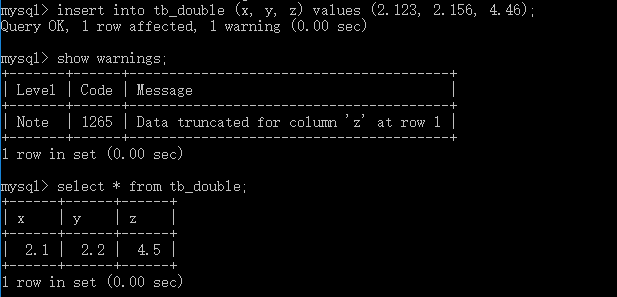

### 小数类型
|类型|说明|存储空间|
|--|--|--|
|float|单精度浮点数|4字节|
|double|双精度浮点数|8字节|
|decimal(M, D), dec|压缩的“严格”定点数|M+2字节|
* 浮点类型和定点类型都可以用`(M, N)`来表示，其中M称为精度，表示总共的位数；N称为标度，表示小数的位数。
* float和double在不指定精度时，默认会采用实际的精度（取决于计算机硬件和操作系统），decimal不指定精度时默认为(10, 0)。
* 浮点数相对于定点数的优点是在长度一定的情况下能够过表示更大的数据范围，缺点是会引起精度问题。
* Mysql中，定点数以字符串形式存储，在对精度要求比较高的时候（如货币，科学数据等）使用decimal类型比较好。
* 不论是定点数还是浮点数，当用户插入的数据精度超过其精度范围时，就会四舍五入处理，但float和double不会发出警告，而decimal会发出警告。
```sql
create table tb_double (
    x float(3, 1),
    y double(3, 1),
    z decimal(3, 1)
);
```
```sql
insert into tb_double (x, y, z) values (2.123, 2.156, 4.46);
```
```sql
select * from tb_double;
```
   
可以看到，超出精度范围的都被四舍五入处理了，且decimal在四舍五入时会发出警告。   
如果总位数超出限制，会报错：

