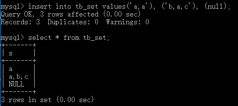

### 文本字符串类型
|类型|说明|存储空间|
|--|--|--|
|char(M)|固定长度非二进制字符串|M字节，1<=M<=255|
|varchar(M)|变长非二进制字符串|L+1字节，L<=M和1<=M<=65535|
|tinytext|非常小的非二进制字符串|L+1字节，L<2^8|
|text|小的非二进制字符串|L+2字节，L<2^16|
|meduimtext|中等大小的非二进制字符串|L+3字节，L<2^24|
|longtext|大的非二进制字符串|L+4，L<2^32|
|enum|枚举类型，只能有一个枚举字符串值|1或2个字节，取决于枚举值的数目（最大值65535）|
|set|一个集合，字符串对象可以有0个或多个set成员|1、2、3、4或8字节，取决于集合成员的数量（最多64个成员）|
#### char和varchar    
* char(M)为固定长度字符串，在定义时指定字符串长度，当保存时在右侧填充空格来达到长度，M表示列长度，范围时0 ~ 255个字符。在数据被检索时，尾部的空格会被删除。
* varchar(M)是长度可变字符串，M表示最大列长度，M的值的范围是0 ~ 65535。varchar的最大实际长度由最长的行的大小和使用的字符集确定，而其实际占用的空间为字符串的实际长度加1，内容开头用1到2个字节表示实际长度（长度超过255时需要2个字节）。
#### enum类型
enum是一个字符串对象，其值为表创建时在列规定中枚举的一列值：
```sql
字段名 enum('值1', '值2', ...'值n')
```
enum类型的字段在取值时，只能在指定的枚举列表中取，而且一次只能取一个。  
如果创建的成员中有空格时，其尾部的空格将被自动删除。  
enum值在内部用整数表示，每个枚举值均有一个索引值：列表值允许的成员从1开始编号，MySQL存储的就是这个索引编号，枚举最多可以有65535个元素。
```sql
create table tb_enum (
    en enum('one', 'two', 'three')
);
```
```sql
insert into tb_enum values ('one'), ('three'), (null);
```
   
如果将enum列声明为not null，则NULL值不合法。
#### set类型
set是一个字符串对象，可以有0或多个值，set列最多可以有64个成员：
```sql
字段名 set('值1', '值2',...'值n')
```
* 与enum类型相同，set值在内部用整数表示，列表中的每一个值都有一个索引编号。当创建表时，set成员值的尾部空格将自动删除。  
* 与enum类型不同的是，set类型的列可以从定义的列值中选择多个字符的联合，而不只是一个。  
* 如果插入set字段中列值有重复，那么MySQL会自动删除重复的值。   
* 插入set字段的顺序并不重要，MySQL会在存入数据库时按照定义的顺序显示。  
```sql
create table tb_set (
    s set('a', 'b', 'c')
);
```
```sql
insert into tb_set values('a,a'), ('b,a,c'), (null);
```
   
