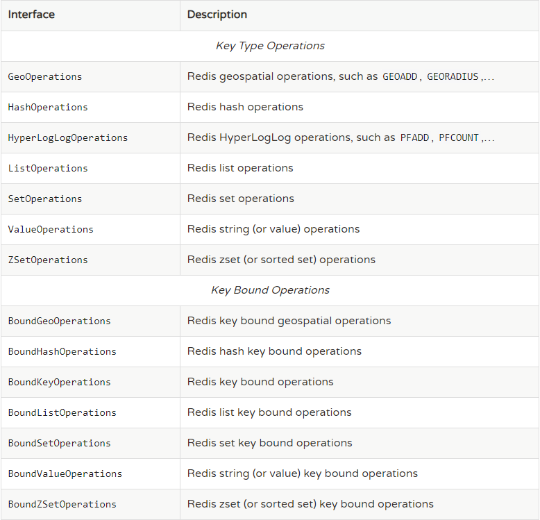
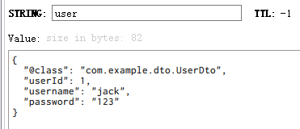

### Spring boot中使用Redis
pom.xm;
```xml
<dependency>
    <groupId>org.springframework.boot</groupId>
    <artifactId>spring-boot-starter-data-redis</artifactId>
</dependency>
<dependency>
    <groupId>org.apache.commons</groupId>
    <artifactId>commons-pool2</artifactId>
    <version>2.6.0</version>
</dependency>
```
application.properties
```text
spring.redis.database=0
spring.redis.host=39.107.230.68
spring.redis.port=6379
spring.redis.password=123456
# 最大连接数
spring.redis.lettuce.pool.max-active=50
# 连接池最大阻塞等待时间（使用负值表示没有限制）
spring.redis.lettuce.pool.max-wait=-1
# 最大空闲连接
spring.redis.lettuce.pool.max-idle=20
# 最小空闲连接
spring.redis.lettuce.pool.min-idle=10
spring.redis.timeout=1000ms
```
`spring data redis`提供了两个模板
* `RedisTemplate<K, V>`
* `StringRedisTemplate`，这个类同时也被声明为Bean了    
`StringRedisTemplate`是继承自`RedisTemplate`：
```java
package org.springframework.data.redis.core;

import org.springframework.data.redis.connection.DefaultStringRedisConnection;
import org.springframework.data.redis.connection.RedisConnection;
import org.springframework.data.redis.connection.RedisConnectionFactory;
import org.springframework.data.redis.serializer.RedisSerializer;

public class StringRedisTemplate extends RedisTemplate<String, String> {
    public StringRedisTemplate() {
        this.setKeySerializer(RedisSerializer.string());
        this.setValueSerializer(RedisSerializer.string());
        this.setHashKeySerializer(RedisSerializer.string());
        this.setHashValueSerializer(RedisSerializer.string());
    }

    public StringRedisTemplate(RedisConnectionFactory connectionFactory) {
        this();
        this.setConnectionFactory(connectionFactory);
        this.afterPropertiesSet();
    }

    protected RedisConnection preProcessConnection(RedisConnection connection, boolean existingConnection) {
        return new DefaultStringRedisConnection(connection);
    }
}
```
`RedisTemplate`提供了以下的操作：   
   
其中带Bound前缀的是在创建是为其绑定一个特定的key，之后都是对这个key进行操作   

---

可以实现自己的`RedisTemplate`，从而能够将任意类型的对象存储到redis中，这需要对key和value设定一个序列化器进行序列化，spring data redis提供了多个序列化器：  
* `StringRedisSerializer`：简单的字符串序列化，是最轻量级和高效的策略
* `JdkSerializationRedisSerializer`：使用JDK本身序列化机制，将pojo类通过ObjectInputStream/ObjectOutputStream进行序列化操作，最终redis-server中将存储字节序列，是目前最常用的序列化策略，对象必须实现Serializable接口，在存储内容时，除了属性的内容外还存了其它内容在里面，总长度长，且不容易阅读。
* `JacksonJsonRedisSerializer`：序列化object对象为json字符串，jackson-json工具提供了javabean与json之间的转换能力，可以将pojo实例序列化成json格式存储在redis中，也可以将json格式的数据转换成pojo实例。因为jackson工具在序列化和反序列化时，需要明确指定Class类型，因此此策略封装起来稍微复杂。（需要jackson-mapper-asl工具支持）
* `Jackson2JsonRedisSerializer`：同上
* `GenericJackson2JsonRedisSerializer`：也是将对象序列化成json，但是会在json中加入@class属性，类的全路径包名，方便反系列化
* `GenericToStringSerializer`： 可以将任何对象泛化为字符串并序列化
* `OxmSerializer`：提供了将javabean与xml之间的转换能力，目前可用的三方支持包括jaxb，apache-xmlbeans；redis存储的数据将是xml工具。不过使用此策略，编程将会有些难度，而且效率最低；不建议使用。（需要spring-oxm模块的支持）      

所以，一般情况下`GenericJackson2JsonRedisSerializer`是个比较合适的选择  

RedisTemplate中需要声明4种serializer，默认为`JdkSerializationRedisSerializer`:
1. `keySerializer`：对于普通K-V操作时，key采取的序列化策略
2. `valueSerializer`：value采取的序列化策略
3. `hashKeySerializer`：在hash数据结构中，hash-key的序列化策略
4. `hashValueSerializer`：hash-value的序列化策略
> 无论如何，建议key/hashKey采用StringRedisSerializer    

```java
package com.example.config;

import org.springframework.context.annotation.Bean;
import org.springframework.context.annotation.Configuration;
import org.springframework.data.redis.connection.RedisConnectionFactory;
import org.springframework.data.redis.core.RedisTemplate;
import org.springframework.data.redis.serializer.GenericJackson2JsonRedisSerializer;
import org.springframework.data.redis.serializer.StringRedisSerializer;

@Configuration
public class RedisTemplateConfig {

    @Bean
    public RedisTemplate<String, Object> objectRedisTemplate(RedisConnectionFactory factory) {
        RedisTemplate<String, Object> template = new RedisTemplate<>();
        template.setConnectionFactory(factory);
        template.setKeySerializer(new StringRedisSerializer());
        // 需要jackson的依赖
        template.setValueSerializer(new GenericJackson2JsonRedisSerializer());
        template.setHashKeySerializer(new StringRedisSerializer());
        template.setHashValueSerializer(new StringRedisSerializer());
        return template;
    }
}
```
测试类：
```java
@Resource
private RedisTemplate<String, Object> objectRedisTemplate;
@Test
public void contextLoads() {
    UserDto userDto = new UserDto(1L, "jack", "123");
    objectRedisTemplate.opsForValue().set("user", userDto);
    System.out.println(objectRedisTemplate.opsForValue().get("user"));
    userDto = (UserDto) objectRedisTemplate.opsForValue().get("user");
    System.out.println(userDto);
}
```
   
