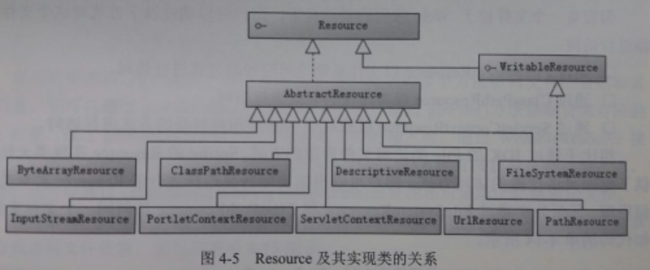

### Resource接口
> Spring设计了一个Resource接口，为应用提供了更强的底层资源访问能力
#### 一. 主要方法
```java
package org.springframework.core.io;

import java.io.IOException;
import java.io.InputStream;

public interface InputStreamSource {

    /**
     * 获取当前资源代表的输入流。除了InputStreamResource以外，其它Resource实现类每次调用getInputStream()方法都将返回一个全新的InputStream
     */
    InputStream getInputStream() throws IOException;
}
```
```java
package org.springframework.core.io;

import java.io.File;
import java.io.IOException;
import java.net.URI;
import java.net.URL;

public interface Resource extends InputStreamSource {
    /**
     * 资源是否存在
     */
    boolean exists();

    /**
     * 用于判断对应资源的内容是否可读。需要注意的是当其结果为true的时候，其内容未必真的可读，但如果返回false，则其内容必定不可读。
     */
    boolean isReadable();

    /**
     * 用于判断当前资源是否代表一个已打开的输入流，如果结果为true，则表示当前资源的输入流不可多次读取，
     * 而且在读取以后需要对它进行关闭，以防止内存泄露。
     * Resource接口的实现类中只有InputStreamResource的该方法返回结果为true，其他都为false
     */
    boolean isOpen();

    /**
     * 返回当前资源对应的URL。如果当前资源不能解析为一个URL则会抛出异常
     * @throws IOException
     */
    URL getURL() throws IOException;

    URI getURI() throws IOException;

    /**
     * 返回当前资源对应的File。如果当前资源不能以绝对路径解析为一个File则会抛出异常
     * @throws IOException
     */
    File getFile() throws IOException;

    long contentLength() throws IOException;

    long lastModified() throws IOException;

    Resource createRelative(String var1) throws IOException;
    
    String getFilename();

    String getDescription();
}
```

#### 二. 几个常用的实现类

1. ClasspathResource：获取类路径下的文件
2. FileSystemResource：获取文件系统里的文件，通过绝对路径访问
3. ServletContextResource：以相对于web应用根目录的方式进行访问，是针对于ServletContext封装的资源，用于访问ServletContext环境下的资源。ServletContextResource持有一个ServletContext的引用，其底层是通过ServletContext的getResource()方法和getResourceAsStream()方法来获取资源的。

#### 三. 资源加载
> 为了访问不同类型的资源，必须使用相应的Resource实现类，为了不显式地使用具体的Resource实现类，Spring提供了一个资源加载机制，可以通过不同的资源地址前缀识别不同的资源类型，还支持Ant风格带通配符的资源地址。 
1. 地址前缀：`classpath:`、`file:`、`http://`、`ftp://`、没有前缀（根据Application的具体实现类采用对应类型的Resource），注意，地址前缀与资源路径之间*不能有空格*
2. 资源路径支持Ant风格的匹配符：
    1. `?`：匹配文件名中的一个字符
    2. `*`：匹配文件名中的任意字符
    3. `**`：匹配多层路径

3. 资源加载接口：   
    * `ResourceLoader`接口：只有一个`getResource(String locatino)`方法，支持带地址前缀的资源路径，但不支持Ant通配符
    * `ResourcePatternResolver`接口，继承上一个接口，增加`getResources(String locationPattern)`方法，支持带地址前缀与Ant通配符的资源路径，返回匹配的所有资源组成的数组，`PathMatchingResourcePatternResolver`是Spring提供的该接口的标准实现类。