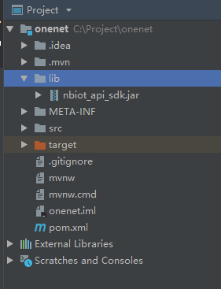

### Spring boot使用本地jar包
1. 项目下新建`lib`目录，把本地的jar包复制进去   
  
2. 修改`pom.xml`
```xml
<dependency>
    <groupId>nbiot_api_adk</groupId>
    <artifactId>cmcciot.onenet.nbapi</artifactId>
    <version>1.0-SNAPSHOT</version>
    <scope>system</scope>
    <systemPath>${project.basedir}/lib/nbiot_api_sdk.jar</systemPath>
</dependency>
```
```xml
<build>
    <plugins>
        <plugin>
            <groupId>org.springframework.boot</groupId>
            <artifactId>spring-boot-maven-plugin</artifactId>
            <!-- 不加这个的话，打包时本地jar打不进去 -->
            <configuration>
                <includeSystemScope>true</includeSystemScope>
            </configuration>
        </plugin>
    </plugins>
</build>
```