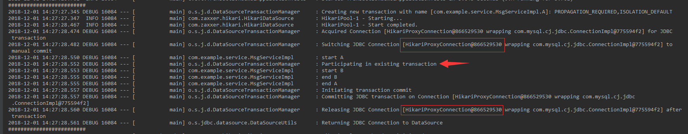
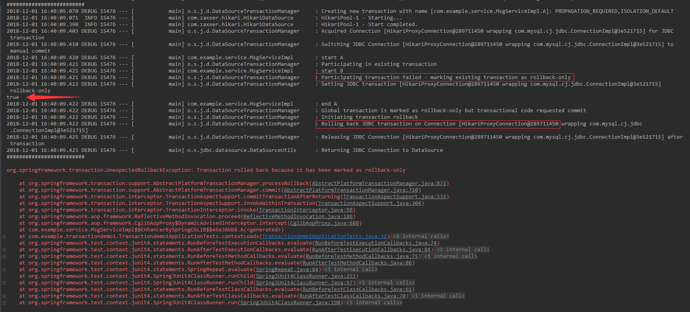
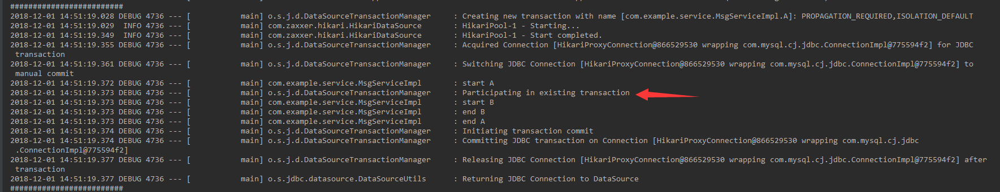
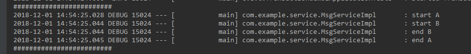
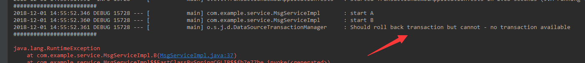
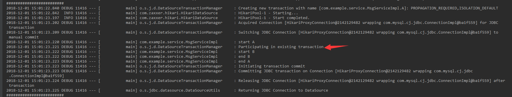
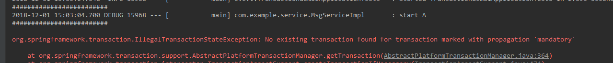
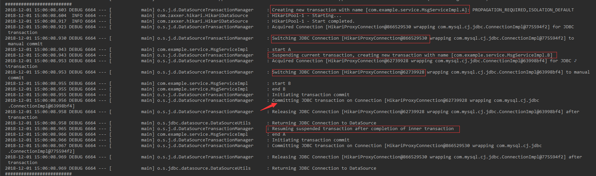
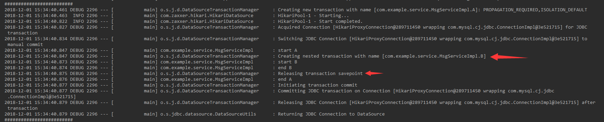
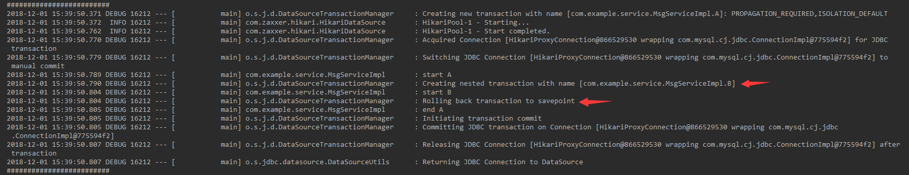

### Spring事务传播行为
> 事务传播行为，就是多个事务方法相互调用时，事务如何在这些方法间传播，Spring支持7种事务传播行为

|事务传播行为|说明|
|-|-|
|PROPAGETION_REQUIRED|如果当前没有事务，就新建一个事务；如果已经存在一个事务，就加入到这个事务中，这个是最常用的，也是Spring默认的事务传播行为|
|PROPAGATION_SUPPORTS|支持当前事务，如果当前没有事务，就以非事务方式执行|
|PROPAGATION_MANDATORY|使用当前事务，如果当前没有事务就抛出异常|
|PROPAGATION_REQUIRES_NEW|新建事务，如果当前存在事务，就把当前事务挂起|
|PROGAGATION_NOT_SUPPORTED|以非事务的方式运行，如果当前存在事务，就把当前事务挂起|
|PROGAGATION_NEVER|以非事务方式运行，如果当前存在事务，就抛出异常|
|PROGAGATION_NESTED|如果当前存在事务，就在这个嵌套事务内运行；如果当前没有事务，就新建一个事务|
> Jpa事务管理器不支持最后一个    

* 如果直接调用同一个Bean中的方法是不存在事务传播行为的，因为spring事务是基于动态代理，而`this`并非指向代理对象，所以想要让同一个类中的事务传播生效，需要获取代理对象，可以用`AopContext.currentProxy()`来获取，也可以在Bean中注入`ApplicationContext`，然后从里面再获取这个Bean。
* spring事务是基于动态代理的，所以会有些方法无法使用spring事务，比如`private`修饰的方法，这些方法是无法开启事务的，但有的书上说这些方法虽然无法开启事务，但是可以被传播事务。的确，这些无法开启事务的方法被一个有事务的方法调用时会和调用它的方法处于一个事务中，但是，这和事务传播并没有什么关系，这种情况和上面的调用同一个Bean中的方法是一样的，仅仅是因为被调用而处于一个事务中。

新建一个spring boot项目，添加MySQL和spring jdbc的依赖，然后配置好数据库，然后配置spring jdbc事务管理器的包日志级别为`debug`：
```shell
logging.level.org.springframework.jdbc.datasource=debug
```
MsgService接口：
```java
public interface MsgService {
    void A();

    void B();
}
```
在方法`A()`里调用`B()`，观察不同的事务传播行为
```java
@Resource
private MsgService msgService;

@Test
public void contextLoads() {
    msgService.A();
}
```
然后分别配置`B()`的事务传播为七个中的之一:   

1. `PROPAGETION_REQUIRED`：如果当前没有事务，就新建一个事务；如果已经存在一个事务，就加入到这个事务中   
```java
@Service
public class MsgServiceImpl implements MsgService {

    private static final Logger LOGGER = LoggerFactory.getLogger(MsgServiceImpl.class);

    @Resource
    private ApplicationContext applicationContext;

    @Override
    @Transactional(propagation = Propagation.REQUIRED)
    public void A() {
        LOGGER.debug("start A");
        MsgService msgService = (MsgService) applicationContext.getBean("msgServiceImpl");
        msgService.B();
        LOGGER.debug("end A");
    }

    @Override
    @Transactional(propagation = Propagation.REQUIRED)
    public void B() {
        LOGGER.debug("start B");
        LOGGER.debug("end B");
    }
}
```
运行结果：   
     
可以看到，方法`B()`加入到了`A()`的事务中，所以前后一共只用了一个数据库连接    
然后，让`B()`抛出一个异常，如果`A()`没有捕获，那事务肯定要回滚，如果捕获了呢？   
```java
@Override
@Transactional(propagation = Propagation.REQUIRED)
public void A() {
    LOGGER.debug("start A");
    MsgService msgService = (MsgService) applicationContext.getBean("msgServiceImpl");
    try {
        msgService.B();
    } catch (Exception e) {
        
    }
    System.out.println(TransactionAspectSupport.currentTransactionStatus().isRollbackOnly());
    LOGGER.debug("end A");
}

@Override
@Transactional(propagation = Propagation.REQUIRED)
public void B() {
    LOGGER.debug("start B");
    throw new RuntimeException();
}
```
   
依然还会回滚   
`A()`中加了一句获取当前事务状态的代码，可以看到`B()`抛出异常后，事务被设置为`rollbackOnly`，`A()`结束后事务管理器会根据事务的状态提交事务，如果事务已经被标识为`rollbackOnly`，则执行回滚。

2. `PROPAGATION_SUPPORTS`：支持当前事务，如果当前没有事务，就以非事务方式执行     
当`A()`有事务时：
```java
@Override
@Transactional(propagation = Propagation.REQUIRED)
public void A() {
    LOGGER.debug("start A");
    MsgService msgService = (MsgService) applicationContext.getBean("msgServiceImpl");
    msgService.B();
    LOGGER.debug("end A");
}

@Override
@Transactional(propagation = Propagation.SUPPORTS)
public void B() {
    LOGGER.debug("start B");
    LOGGER.debug("end B");
}
```
`B()`加入到`A()`的事务中：  
   
当`A()`没有事务时，注释掉`A()`方法上的事务注解：   
   
可以看到`B()`以非事务方式运行，如果此时在`B()`里面抛出一个异常，由于没有事务，所以无法回滚：     
   

3. `PROPAGATION_MANDATORY`：使用当前事务，如果当前没有事务就抛出异常
```java
@Override
@Transactional(propagation = Propagation.REQUIRED)
public void A() {
    LOGGER.debug("start A");
    MsgService msgService = (MsgService) applicationContext.getBean("msgServiceImpl");
    msgService.B();
    LOGGER.debug("end A");
}

@Override
@Transactional(propagation = Propagation.MANDATORY)
public void B() {
    LOGGER.debug("start B");
    LOGGER.debug("end B");
}
```
`B()`加入到了`A()`的事务中：  
   
此时注释掉`A()`上的事务注解，就会抛异常：   
   

4. `PROPAGATION_REQUIRES_NEW`：新建事务，如果当前存在事务，就把当前事务挂起    
当`A()`有事务：  
```java
@Override
@Transactional(propagation = Propagation.REQUIRED)
public void A() {
    LOGGER.debug("start A");
    MsgService msgService = (MsgService) applicationContext.getBean("msgServiceImpl");
    msgService.B();
    LOGGER.debug("end A");
}

@Override
@Transactional(propagation = Propagation.REQUIRES_NEW)
public void B() {
    LOGGER.debug("start B");
    LOGGER.debug("end B");
}
```
运行结果：   
   
当前事务挂起后，内层方法`B()`新建了一个事务，由于事务最终要依赖于数据库连接，所以内层事务又获取了一个连接，在`B()`方法执行完后，就提交事务。此时，如果在`B()`中抛出一个异常，如果`A()`没有捕获，则异常会经过`A()`抛出，所以内层和外层事务均会回滚，如果`A()`捕获了，则只回滚内层事务而不影响外层事务。    
`B()`新建的内层事务与当前事务是完全互不干扰的，无论是提交还是回滚事务。       
当`A()`没有事务时，则`B()`会新建一个事务：  
   

5. `PROGAGATION_NOT_SUPPORTED`：以非事务的方式运行，如果当前存在事务，就把当前事务挂起   
6. `PROGAGATION_NEVER`：以非事务方式运行，如果当前存在事务，就抛出异常   
7. `PROGAGATION_NESTED`：如果当前存在事务，就在这个嵌套事务内运行；如果当前没有事务，就新建一个事务   
```java
@Override
@Transactional(propagation = Propagation.REQUIRED)
public void A() {
    LOGGER.debug("start A");
    MsgService msgService = (MsgService) applicationContext.getBean("msgServiceImpl");
    msgService.B();
    LOGGER.debug("end A");
}

@Override
@Transactional(propagation = Propagation.NESTED)
public void B() {
    LOGGER.debug("start B");
    LOGGER.debug("end B");
}
```
      
可以看到，`B()`并没有新建一个事务，而是在`B()`开始时创建了一个`savepoint`，在`B()`成功执行后释放该`savepoint`，所以，如果在`B()`中抛出一个异常，被`A()`捕获，事务会回滚到这个`savepoint`然后继续执行`A()`中其他代码。   
  
