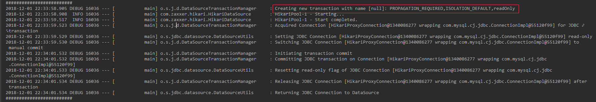
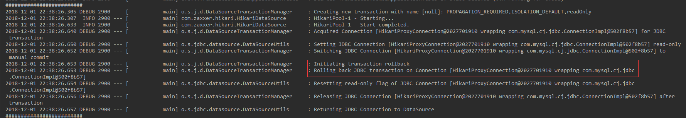
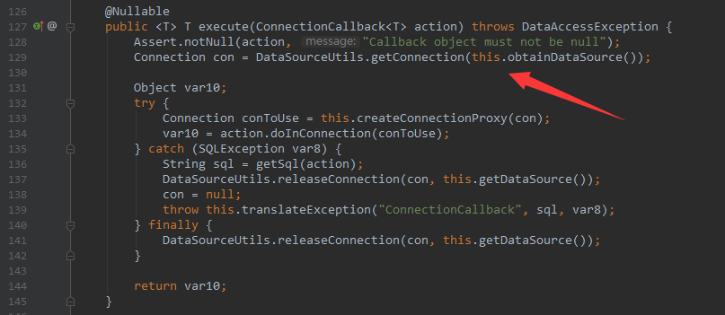

### Spring事务模型
#### 一. 三个核心接口
Spring事务中有三个核心接口：`PlatformTransactionManager`，`TransactionDefinition`和`TransactionStatus`，`PlatformTransactionManager`利用`TransactionDefinition`提供的事务属性配置信息创建事务，并用`TransactionStatus`来描述这个激活事务的状态。
1. `TransactionDefinition`定义了Spring支持的事务属性：事务隔离级别，事务传播行为，事务超时，只读状态。可以通过xml或注解的方式为一个需要事务的类或方法配置事务属性，如：
```java
@Transactional(propagation = Propagation.REQUIRED, isolation = Isolation.REPEATABLE_READ, timeout = 1000, readOnly = true)
```
2. `TransactionStatus`代表一个事务的具体运行状态，事务管理器可以通过该接口获取事务运行期状态，也可以通过该接口间接地回滚事务。该接口继承自`SavepointManager`接口，并拓展了该接口
```java
package org.springframework.transaction;

import java.io.Flushable;

public interface TransactionStatus extends SavepointManager, Flushable {
    // 判断当前事务是否是一个新的事务，如果返回false，则表示当前事务是一个已经存在的事务，或者当前操作未运行在事务环境中。
    boolean isNewTransaction();
    // 判断当前事务是否在内部创建了一个恢复点
    boolean hasSavepoint();
    // 将当前事务标记为rollbackOnly，从而通知事务管理器只能回滚该事务。
    void setRollbackOnly();

    boolean isRollbackOnly();

    void flush();
    // 判断当前事务是否已经结束（已经提交或回滚）
    boolean isCompleted();
}
```
`SavepointManager`接口提供了创建恢复点，回滚到某个恢复点以及释放某个恢复点对象的方法
```java
package org.springframework.transaction;

public interface SavepointManager {
    Object createSavepoint() throws TransactionException;

    void rollbackToSavepoint(Object var1) throws TransactionException;

    void releaseSavepoint(Object var1) throws TransactionException;
}
```
3. `PlatformTransactionManager`接口定义了事务管理的功能：提交或回滚事务。spring为不同的持久化框架提供了不同的该接口实现类，比如`JpaTransactionManager`，`DataSourceTransactionManager`。
```java
package org.springframework.transaction;

import org.springframework.lang.Nullable;

public interface PlatformTransactionManager {
    // 该方法根据事务定义信息从事务环境返回一个已经存在的事务，或者创建一个事务，
    // 并返回一个描述该事务状态的TransactionStatus对象
    TransactionStatus getTransaction(@Nullable TransactionDefinition var1) throws TransactionException;

    // 根据事务状态提交事务，如果事务被标记为rollbackOnly，则该方法执行回滚操作
    void commit(TransactionStatus var1) throws TransactionException;

    // 回滚事务，当commit方法抛出异常时，该方法将会被隐式调用
    void rollback(TransactionStatus var1) throws TransactionException;
}
```
一个实例：
```java
@Resource
private PlatformTransactionManager transactionManager;

@Override
public void test() {
    // 配置事务属性
    DefaultTransactionDefinition definition = new DefaultTransactionDefinition();
    definition.setPropagationBehavior(TransactionDefinition.PROPAGATION_REQUIRED);
    definition.setReadOnly(true);
    // 事务管理器用事务定义信息创建事务
    TransactionStatus status = transactionManager.getTransaction(definition);
    try {
        Thread.sleep(2000);
        // 完成业务，提交事务
        transactionManager.commit(status);
    } catch (Exception e) {
        // 出错，回滚事务
        transactionManager.rollback(status);
    }
}
```
将spring jdbc的事务管理器的包日志级别设为debug后输出：

   

可以看到成功创建了一个事务并提交。     
如果处理业务过程中抛出异常，则事务会回滚：
```java
@Override
public void test() {
    DefaultTransactionDefinition definition = new DefaultTransactionDefinition();
    definition.setPropagationBehavior(TransactionDefinition.PROPAGATION_REQUIRED);
    definition.setReadOnly(true);
    TransactionStatus status = transactionManager.getTransaction(definition);
    try {
        throwM();
        transactionManager.commit(status);
    } catch (Exception e) {
        transactionManager.rollback(status);
    }
}

private void throwM() {
    throw new RuntimeException();
}
```

   

#### 二. 事务同步管理器
事务是和线程紧密相关的，spring的事务同步管理器`TransactionSynchronizationManager`使用`ThreadLocal`为每个线程绑定一个数据库连接。比如在一个线程中，当一个Service的方法被执行时，如果这个方法需要一个事务，spring会在开启事务时，利用事务同步管理器为该线程绑定一个数据库连接，之后在当前线程的这个事务内，只要需要用到数据库连接，都是从`ThreadLocal`获取这个之前被绑定的连接，这也是为什么像`JdbcTemplate`这种单例的Bean能够正常工作在多线程环境中，因为`JdbcTemplate`在执行sql时也是从事务同步管理器中拿数据库连接的。    
   
`DataSourceUtils`是spring jdbc从事务同步管理器中获取数据库连接的工具类，spring为不同的持久化框架提供了一套从事务同步管理器中获取对应线程绑定资源的工具类，比如Jpa的`EntityManagerFactoryUtils`。      
所以，当我们使用这些持久化框架时，如果需要自己手动操作底层的连接，应该从这些工具类中获取，而不是直接从`DataSource`中获取，因为从数据源直接获取的连接不是和当前事务绑定的，从而无法参与到当前线程的事务。    
事务同步管理器同时也维护了当前事务配置的属性和运行状态信息：  
```java
public abstract class TransactionSynchronizationManager {
    // 当前线程对应的connection或session等类型的资源
    private static final ThreadLocal<Map<Object, Object>> resources = new NamedThreadLocal("Transactional resources");
    // 存放当前线程的事务执行过程中的回调操作
    private static final ThreadLocal<Set<TransactionSynchronization>> synchronizations = new NamedThreadLocal("Transaction synchronizations");
    // 当前线程的事务名称
    private static final ThreadLocal<String> currentTransactionName = new NamedThreadLocal("Current transaction name");
    // 当前线程的事务是否为只读
    private static final ThreadLocal<Boolean> currentTransactionReadOnly = new NamedThreadLocal("Current transaction read-only status");
    // 当前线程的事务隔离级别
    private static final ThreadLocal<Integer> currentTransactionIsolationLevel = new NamedThreadLocal("Current transaction isolation level");
    // 当前线程的事务是否被激活
    private static final ThreadLocal<Boolean> actualTransactionActive = new NamedThreadLocal("Actual transaction active");

    ...
}
```