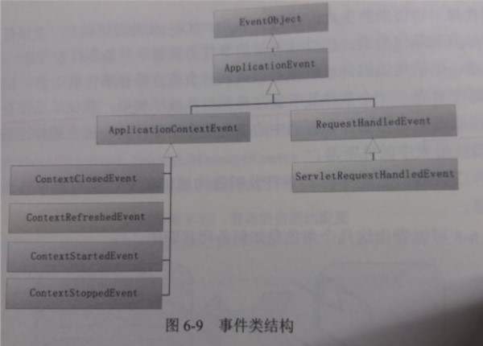
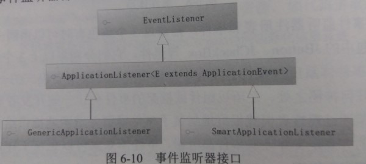
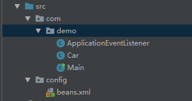
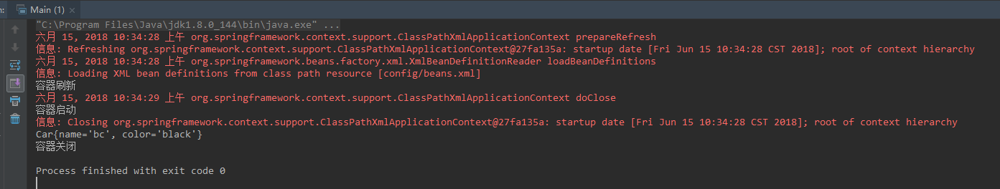
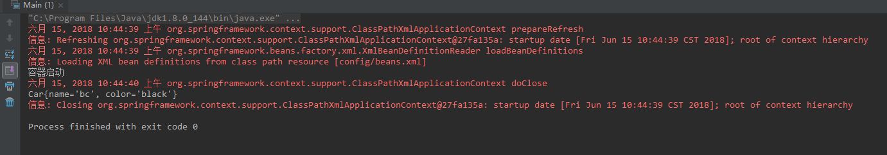

### 容器事件
#### 一. 事件类
Spring框架本身只定义了以下几个事件：  
   
* ApplicationContextEvent：容器事件，4个子类分别代表容器启动，刷新，停止，以及关闭事件，可以从这四个子类中获取ApplicationContext的引用。
* RequestHandleEvent：用于web应用中，当一个Http请求被处理后，产生该事件，只有在web.xml中定义了DispatcherServlet时才会产生改时间。
* 可以根据需要拓展ApplicationEvent定义自己的事件。
#### 二. 事件监听器接口   


1. `ApplicatonListener`接口只定义了一个方法：`onApplicationEvent(E event)`，用于接收ApplicationEvent事件对象，在该方法中编写事件的响应处理过程。
2. `SmartApplicationListener`接口：

    ```java
    public interface SmartApplicationListener extends ApplicationListener<ApplicationEvent>, Ordered {
        /**
        * 指定监听器支持哪种类型的容器事件，只会对该类型的事件做出响应
        */
        boolean supportsEventType(Class<? extends ApplicationEvent> var1);

        /**
        * 指定监听器仅对哪种事件源对象做出响应
        */
        boolean supportsSourceType(Class<?> var1);
    }
    ```

3. `GenericApplicationListener`接口，该接口的supportsEventType方法的参数不再仅限于ApplicationEvent的子类，而是采用可解析类型ResolvableType 
    ```java
    public interface GenericApplicationListener extends ApplicationListener<ApplicationEvent>, Ordered {
        /**
        * 指定监听器是否实际支持给定的事件类型，只会对该类型的事件做出响应
        */
        boolean supportsEventType(ResolvableType var1);

        /**
        * 指定监听器仅对哪种类型的事件源对象做出响应
        */
        boolean supportsSourceType(Class<?> var1);
    }
    ```

#### 三. 事件广播器
当发生容器事件时，容器将调用事件广播器将事件通知给事件监听器。   
实现`ApplicationEventMulticaster`接口便可定义自己的事件广播器，如果没有配置自定义的事件广播器，容器将采用默认的`SimpleApplicationEventMulticaster`

#### 四. 简单使用，监听容器的事件。   

```java
package com.demo;

import org.springframework.context.ApplicationContext;
import org.springframework.context.ApplicationEvent;
import org.springframework.context.ApplicationListener;
import org.springframework.context.event.ContextClosedEvent;
import org.springframework.context.event.ContextRefreshedEvent;
import org.springframework.context.event.ContextStartedEvent;
import org.springframework.context.event.ContextStoppedEvent;
import org.springframework.stereotype.Component;

@Component
public class ApplicationEventListener implements ApplicationListener {

    public static ApplicationContext context;
    
    @Override
    public void onApplicationEvent(ApplicationEvent applicationEvent) {
        if (applicationEvent instanceof ContextStartedEvent) {
            context = ((ContextStartedEvent) applicationEvent).getApplicationContext();
            System.out.println("容器启动");
        } else if (applicationEvent instanceof ContextRefreshedEvent) {
            System.out.println("容器刷新");
        } else if (applicationEvent instanceof ContextClosedEvent) {
            System.out.println("容器关闭");
        } else if (applicationEvent instanceof ContextStoppedEvent) {
            System.out.println("容器停止");
        }
    }
}
```
```java
package com.demo;

public class Car {
    private String name;
    private String color;

    public Car() {
    }

    public Car(String name, String color) {
        this.name = name;
        this.color = color;
    }

    public String getName() {
        return name;
    }

    public void setName(String name) {
        this.name = name;
    }

    public String getColor() {
        return color;
    }

    public void setColor(String color) {
        this.color = color;
    }

    @Override
    public String toString() {
        return "Car{" +
                "name='" + name + '\'' +
                ", color='" + color + '\'' +
                '}';
    }
}
```
```xml
<?xml version="1.0" encoding="UTF-8"?>
<beans xmlns="http://www.springframework.org/schema/beans"
       xmlns:xsi="http://www.w3.org/2001/XMLSchema-instance" xmlns:p="http://www.springframework.org/schema/p"
       xmlns:context="http://www.springframework.org/schema/context"
       xsi:schemaLocation="http://www.springframework.org/schema/beans http://www.springframework.org/schema/beans/spring-beans.xsd http://www.springframework.org/schema/context http://www.springframework.org/schema/context/spring-context.xsd">

    <context:component-scan base-package="com.demo"/>
    <bean id="car" class="com.demo.Car" p:color="black" p:name="bc"/>
</beans>
```
```java
package com.demo;

import org.springframework.context.support.ClassPathXmlApplicationContext;

public class Main {
    public static void main(String[] args) {
        ClassPathXmlApplicationContext applicationContext = new ClassPathXmlApplicationContext("config/beans.xml");
        applicationContext.start();
        Car car = (Car) ApplicationEventListener.context.getBean("car");
        System.out.println(car);
        applicationContext.close();
    }
}
```
运行后输出：   
   

使用`SmartApplicationListener`接口，删掉上面的ApplicationEventListener类，写一个SmartListener类，这个监听器只对容器启动事件感兴趣，很明显，事件源是ClassPathXmlApplicationContext：
```java
@Component
public class SmartListener implements SmartApplicationListener {
    public static ApplicationContext context;
    @Override
    public boolean supportsEventType(Class<? extends ApplicationEvent> aClass) {
        return aClass == ContextStartedEvent.class;
    }

    @Override
    public boolean supportsSourceType(Class<?> aClass) {
        return aClass == ClassPathXmlApplicationContext.class;
    }

    @Override
    public void onApplicationEvent(ApplicationEvent applicationEvent) {
        context = ((ContextStartedEvent) applicationEvent).getApplicationContext();
        System.out.println("容器启动");
    }

    @Override
    public int getOrder() {
        return 0;
    }
}
```
```java
public class Main {
    public static void main(String[] args) {
        ClassPathXmlApplicationContext applicationContext = new ClassPathXmlApplicationContext("config/beans.xml");
        applicationContext.start();
        Car car = (Car) SmartListener.context.getBean("car");
        System.out.println(car);
        applicationContext.close();
    }
}
```
输出：   


#### 五. 自定义事件   
拓展ApplicationContextEvent类，实现一个发送消息的事件：  
```java
package com.demo;

import org.springframework.context.ApplicationContext;
import org.springframework.context.event.ApplicationContextEvent;

public class MsgSendEvent extends ApplicationContextEvent {
    private String msg;

    public MsgSendEvent(ApplicationContext source, String msg) {
        super(source);
        this.msg = msg;
    }

    public String getMsg() {
        return msg;
    }
}
```
发送消息的Bean，用ApplicationContext来发布事件：
```java
package com.demo;

import org.springframework.beans.BeansException;
import org.springframework.context.ApplicationContext;
import org.springframework.context.ApplicationContextAware;
import org.springframework.stereotype.Component;

@Component
public class MsgSend implements ApplicationContextAware {
    private ApplicationContext context;

    @Override
    public void setApplicationContext(ApplicationContext applicationContext) throws BeansException {
        this.context = applicationContext;
    }

    public void sendMsg(String msg) {
        MsgSendEvent sendEvent = new MsgSendEvent(context, msg);
        System.out.println("发送消息：" + msg);
        context.publishEvent(sendEvent);
    }
}
```
发送消息事件监听器：
```java
package com.demo;

import org.springframework.context.ApplicationListener;
import org.springframework.stereotype.Component;

@Component
public class MsgSendListener implements ApplicationListener<MsgSendEvent> {
    @Override
    public void onApplicationEvent(MsgSendEvent msgSendEvent) {
        System.out.println("容器监听到发送消息：" + msgSendEvent.getMsg());
    }
}
```
获取发送消息的Bean，调用发送消息方法：
```java
package com.demo;

import org.springframework.context.support.ClassPathXmlApplicationContext;

public class Main {
    public static void main(String[] args) {
        ClassPathXmlApplicationContext applicationContext = new ClassPathXmlApplicationContext("config/beans.xml");
        MsgSend msgSend = (MsgSend) applicationContext.getBean("msgSend");
        msgSend.sendMsg("Hello, world!");
    }
}
```
运行输出：
```txt
发送消息：Hello, world!
容器监听到发送消息：Hello, world!
```