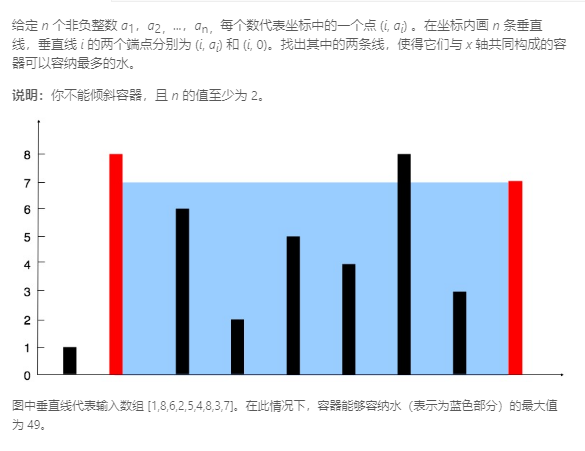

### 11. 盛最多水的容器
    
左右边界中较短的向内移动，这样才有可能找到更大的面积
```java
class Solution {
    public int maxArea(int[] height) {
        int len = height.length;
        int left = 0, right = len - 1;
        int max = (right - left) * Math.min(height[left], height[right]);
        while (left < right) {
            if (height[left] < height[right]) {
                left++;
            } else if (height[left] > height[right]) {
                right--;
            } else {
                left++;
                right--;
            }
            max = Math.max(max, (right - left) * Math.min(height[left], height[right]));
        }
        return max;
    }
}
```