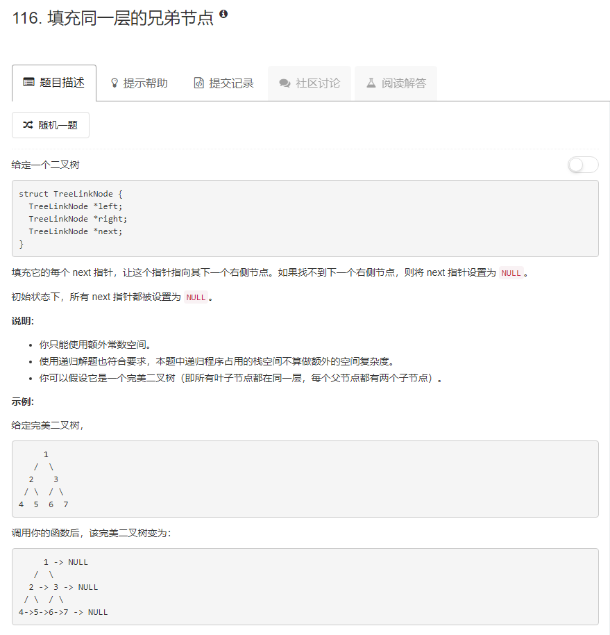

### 116. 填充同一层的兄弟节点
   
递归方法：  
首先把每一层总在最右侧的节点的next置为null，java中未初始化的引用总是null已经帮我们做好了这一步。   
然后根据图片，每个节点的左子树的next指向右子树，如果这个节点的next不为null，那么它的右子树的next应指向这个节点的右边的兄弟结点的左子树，将这个节点的子节点的next指针处理好后就可以递归处理他的子节点的子节点的next指针，所以递归终止条件就是这个节点的左节点为null，然后前面加一个输入为空的判断。
```java
/**
 * Definition for binary tree with next pointer.
 * public class TreeLinkNode {
 *     int val;
 *     TreeLinkNode left, right, next;
 *     TreeLinkNode(int x) { val = x; }
 * }
 */
public class Solution {
    public void connect(TreeLinkNode root) {
        if (root == null) {
            return;
        }
        if (root.left == null) {
            return;
        }
        root.left.next = root.right;
        if (root.next != null) {
            root.right.next = root.next.left;
        }
        connect(root.left);
        connect(root.right);
    }
}
```