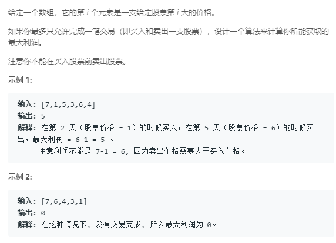

### 121. 买卖股票的最佳时机
   
前i天卖出的最大收益是max(第i天的价格-前i天的最小值, 前i天的最大收益)
```java
class Solution {
    public int maxProfit(int[] prices) {
        int len = prices.length;
        if (len == 0) return 0;
        int i = 0, min = prices[0];
        int res = 0;
        for (i = 0; i < len; i++) {
            if (prices[i] < min) {
                min = prices[i];
            }
            res = Math.max(prices[i] - min, res);
        }
        return res;
    }
}
```