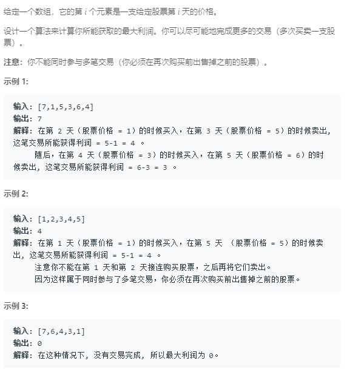

### 122. 买卖股票的最佳时机 II
  
数组中相邻两数，只要差值是正的就可以加入结果 
```java
class Solution {
    public int maxProfit(int[] prices) {
        int len = prices.length;
        if (len == 0)
            return 0;
        int res = 0;
        for (int i = 1; i < len; i++) {
            int tmp = prices[i] - prices[i - 1];
            if (tmp >= 0) {
                res += tmp;
            }
        }
        return res;
    }
}
```