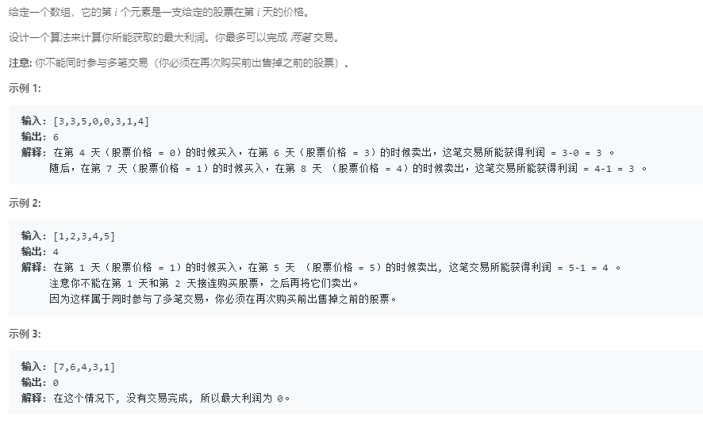

### 123. 买卖股票的最佳时机 III
     
dp1[i]是第i天之前最大利润，dp2[i]是第i天时候最大利润
```java
class Solution {
    public int maxProfit(int[] prices) {
        int len = prices.length;
        if (len <= 1)
            return 0;
        int min = prices[0];
        int[] dp1 = new int[len];
        dp1[0] = 0;
        // 正向遍历
        for (int i = 1; i < len; i++) {
            dp1[i] = Math.max(prices[i] - min, dp1[i - 1]);
            if (min > prices[i])
                min = prices[i];
        }

        int max = prices[len - 1];
        int[] dp2 = new int[len];
        dp1[len - 1] = 0;
        // 反向遍历
        for (int i = len - 2; i >= 0; i--) {
            dp2[i] = Math.max(max - prices[i], dp2[i + 1]);
            if (max < prices[i])
                max = prices[i];
        }
        int res = 0;
        for (int i = 0; i < len; i++) {
            res = Math.max(res, dp1[i] + dp2[i]);
        }
        return res;
    }
}
```