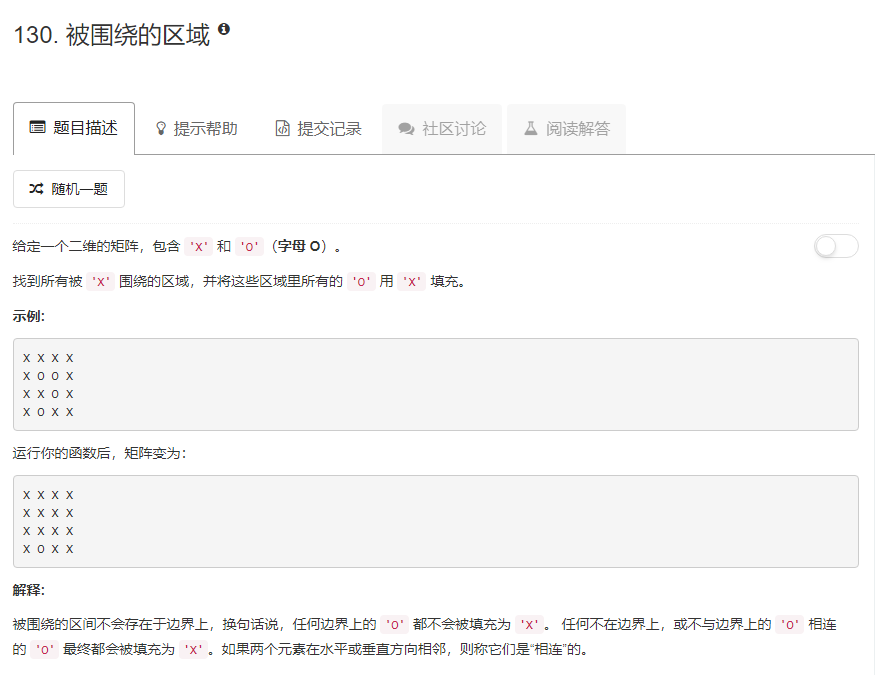

### 130. 被围绕的区域
   
从四个边上的`O`开始深搜，将搜索到的`O`做上标记，然后对整个数组进行遍历，遇到没坐标记的`O`就将它改为`X`   
```java
class Solution {
    boolean[][] visit;
    public void solve(char[][] board) {
        if (board.length == 0) return;
        int r = board.length, c = board[0].length;
        visit = new boolean[r][c];
        for (int i = 0; i < c; i++) {
            if (board[0][i] == 'O'&& !visit[0][i]) {
                dfs(board, 0, i);
            }
            if (board[r - 1][i] == 'O' && !visit[r - 1][i]) {
                dfs(board, r - 1, i);
            }
        }
        for (int i = 1; i < r - 1; i++) {
            if (board[i][0] == 'O' && !visit[i][0]) {
                dfs(board, i, 0);
            }
            if (board[i][c - 1] == 'O' && !visit[i][c - 1]) {
                dfs(board, i, c - 1);
            }
        }
        for (int i = 0; i < r; i++) {
            for (int j = 0; j < c; j++) {
                if (board[i][j] == 'O' && !visit[i][j]) {
                    board[i][j] = 'X';
                }
            }
        }
    }
    public void dfs(char[][] board, int i, int j) {
        if (board[i][j] == 'O' && !visit[i][j]) {
            visit[i][j] = true;
            if (i > 0) dfs(board, i - 1, j);
            if (i < board.length - 1) dfs(board, i + 1, j);
            if (j > 0) dfs(board, i, j - 1);
            if (j < board[0].length - 1) dfs(board, i, j + 1);
        }
    }
}
```