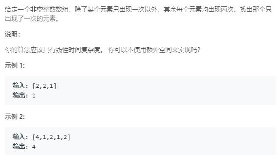

### 136. 只出现一次的数字
    
相同的两个数异或后为0，所有数都异或后剩下只出现一次的那个数与0异或，结果为只出现一次的数    
```java
class Solution {
    public int singleNumber(int[] nums) {
        int res = 0;
        for (int num: nums) {
            res ^= num;
        }
        return res;
    }
}
```