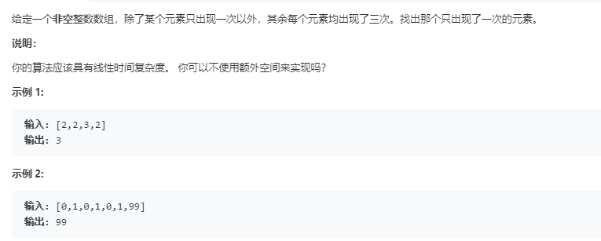

### 137. 只出现一次的数字 II
    
一个数字出现三次，那么它的每个二进制位也出现了三次，统计32个二进制位各自出现的总次数，对3取余，最后出现次数不为0的二进制位就是属于那个只出现一次的数字的。 
```java
class Solution {
    public int singleNumber(int[] nums) {
        int[] bits = new int[32];
        for (int num: nums) {
            for (int i = 0; i < 32; i++) {
                if ((num & (1 << i)) != 0)
                    bits[i]++;
            }
        }
        for (int i = 0; i < 32; i++) {
            bits[i] %= 3;
        }
        int res = 0;
        for (int i = 0; i < 32; i++) {
            if (bits[i] != 0) {
                res += 1 << i;
            }
        }
        return res;
    }
}
```