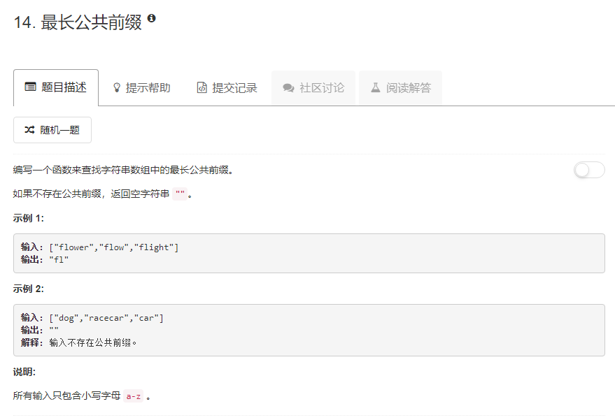

### 14. 最长公共前缀
   
```java
class Solution {
    public String longestCommonPrefix(String[] strs) {
        if (strs.length == 0) return "";
        String res = "";
        boolean flag = true;
        int i = 0;
        while (flag) {
            if (i >= strs[0].length()) {
                break;
            }
            char c = strs[0].charAt(i);
            for (int j = 1; j < strs.length; j++) {
                if (i >= strs[j].length() || strs[j].charAt(i) != c) {
                    flag = false;
                    break;
                }
            }
            if (flag) {
                res += c;
            }
            i++;
        }
        return res;
    }
}
```