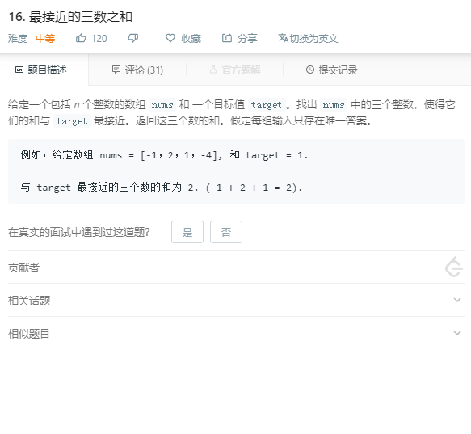

### 16. 最接近的三数之和
   
肯定不能三重循环暴力解决的，会超时。   
先指定一个数，然后轮流指定剩余两个数，先排序是因为可以根据当前的和来调整剩余的两个数来避免暴力循环。
```java
class Solution {
    public int threeSumClosest(int[] nums, int target) {
        Arrays.sort(nums);
        int res = nums[0] + nums[1] + nums[2];
        for (int i = 0; i < nums.length - 2; i++) {
            int left = i + 1, right = nums.length - 1;
            while (left < right) {
                int tmp = nums[i] + nums[left] + nums[right];
                if (Math.abs(tmp - target) < Math.abs(res - target)) {
                    res = tmp;
                }
                if (tmp < target) {
                    left++;
                } else if (tmp > target) {
                    right--;
                } else {
                    return target;
                }
            }
        }
        return res;
    }
}
```