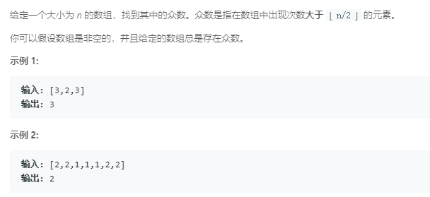
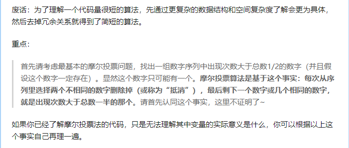
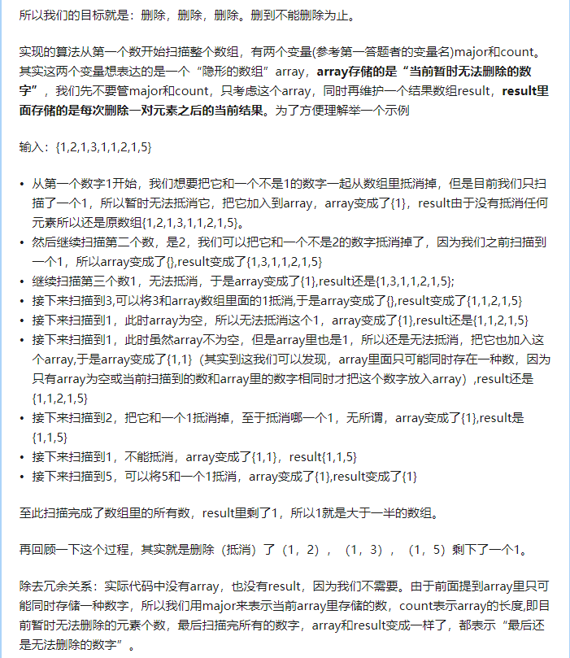
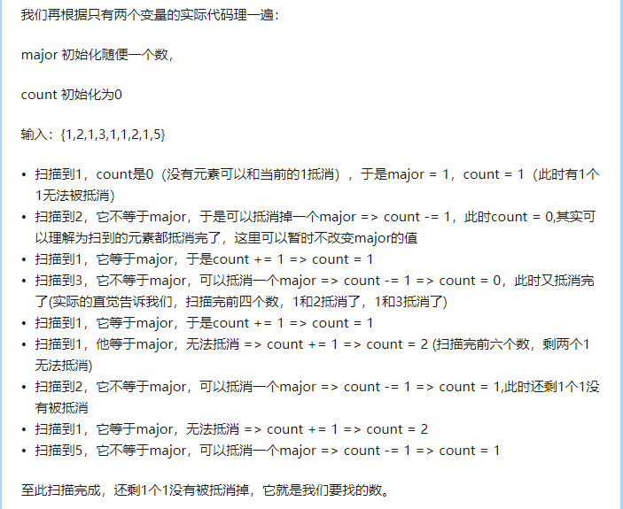

### 169. 求众数
   
方法一：排序
```java
class Solution {
    public int majorityElement(int[] nums) {
        Arrays.sort(nums);
        return nums[nums.length / 2];
    }
}
```
方法二：摩尔投票法
```java
class Solution {
    public int majorityElement(int[] nums) {
        int major = nums[0], count = 0;
        for (int num: nums) {
            if (count == 0) {
                major = num;
                count++;
            } else {
                if (num == major) {
                    count++;
                } else {
                    count--;
                }
            }
        }
        return major;
    }
}
```
关于算法原理（来自网络）：    
    
    
