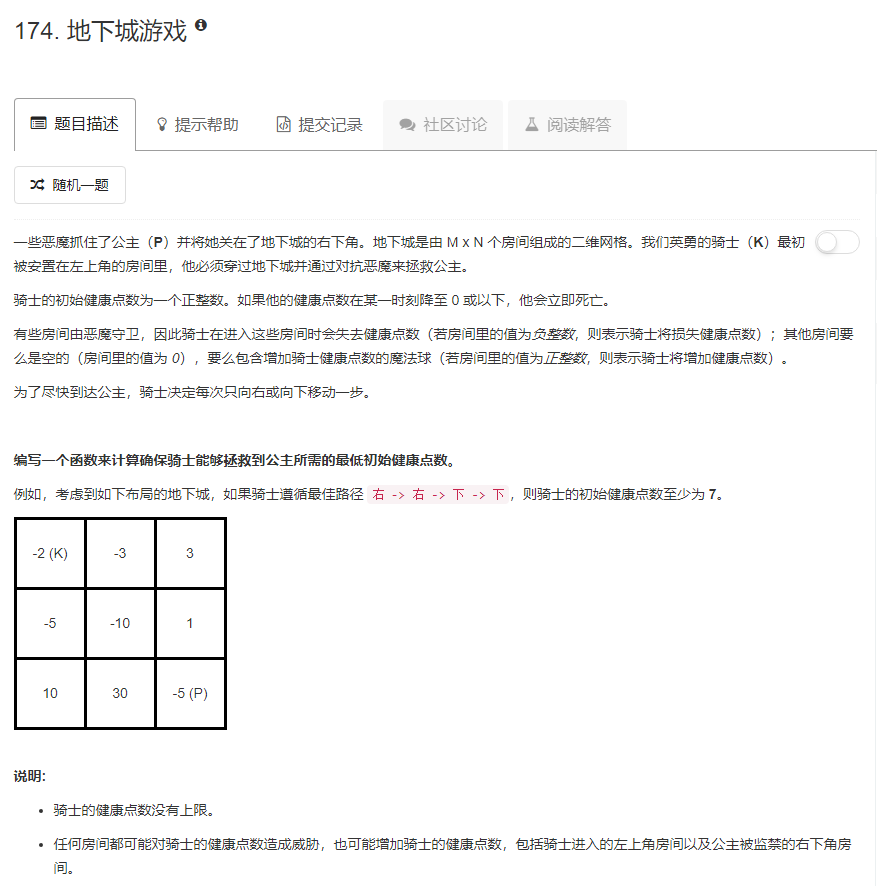

### 174. 地下城游戏
   
dp[i][j]表示骑士进入第房间dungeon[i][j]时能活下来所需的最小健康点数，很显然，进入最后一个房间所需的最小健康点数为`max(1, 1 - dungeon[m-1][n-1])`（dungeon[i][j]>0的话，只需1健康点数就可以进入这个房间，否则就是至少要1-dungeon[i][j]健康点数才可以进入这个房间）。  
对于其他房间，进入所需要的最少健康点数是`max(1, 进入下一个房间所需的最少健康点数-该房间的dungeon)`，位于最下一行和最右一列的只有一种走法，单独求；而其他的格子，都有向左或向右两种走法，取这两种走法所需的最小健康点数的最小值
```java
class Solution {
    public int calculateMinimumHP(int[][] dungeon) {
        int m = dungeon.length, n = dungeon[0].length;
        int i, j;
        int[][] dp = new int[m][n];
        dp[m - 1][n - 1] = Math.max(1, 1 - dungeon[m - 1][n - 1]);
        for (i = m - 2; i >= 0; i--) { // 最右一列
            dp[i][n - 1] = Math.max(1, dp[i + 1][n - 1] - dungeon[i][n - 1]);
        }
        for (i = n - 2; i >= 0; i--) { // 最下一行
            dp[m - 1][i] = Math.max(1, dp[m - 1][i + 1] - dungeon[m - 1][i]);
        }
        for (i = m - 2; i >= 0; i--) {
            for (j = n - 2; j >= 0; j--) {  // 向下走和向右走，取最小值
                dp[i][j] = Math.min(Math.max(1, dp[i + 1][j] - dungeon[i][j]), Math.max(1, dp[i][j + 1] - dungeon[i][j]));
            }
        }
        return dp[0][0];
    }
}
```