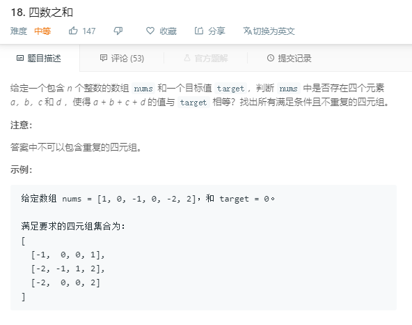

### 18. 四数之和
   
类似三数之和
```java
class Solution {
    public List<List<Integer>> fourSum(int[] nums, int target) {
        Arrays.sort(nums);
        Set<List<Integer>> res = new HashSet<>();
        int len = nums.length;
        for (int i = 0; i < len - 3; i++) {
            for (int j = i + 1; j < len - 2; j++) {
                int left = j + 1, right = len - 1;
                while (left < right) {
                    int sum = nums[i] + nums[j] + nums[left] + nums[right];
                    if (sum == target) {
                        List<Integer> list = new ArrayList<>(4);
                        Collections.addAll(list, nums[i], nums[j], nums[left], nums[right]);
                        res.add(list);
                        left++;
                        right--;
                    } else if (sum < target) {
                        left++;
                    } else {
                        right--;
                    }
                }
            }
        }
        return new ArrayList<>(res);
    }
}
```