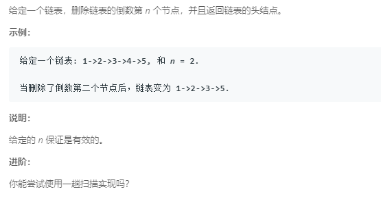

### 19. 删除链表的倒数第N个节点
   
快慢指针，第一个指针先指向第n + 1个位置，第二个指针指向head前面的位置，然后两个指针同时向后遍历，让两个指针总是保持相同的间距。
```java
/**
 * Definition for singly-linked list.
 * public class ListNode {
 *     int val;
 *     ListNode next;
 *     ListNode(int x) { val = x; }
 * }
 */
class Solution {
    public ListNode removeNthFromEnd(ListNode head, int n) {
        ListNode r = head;
        ListNode h = new ListNode(0);
        h.next = head;
        ListNode l = h;
        int count = 0;
        for (; count < n; count++, r = r.next) {

        }
        while (r != null) {
            l = l.next;
            r = r.next;
        }
        l.next = l.next.next;
        return h.next;
    }
}
```