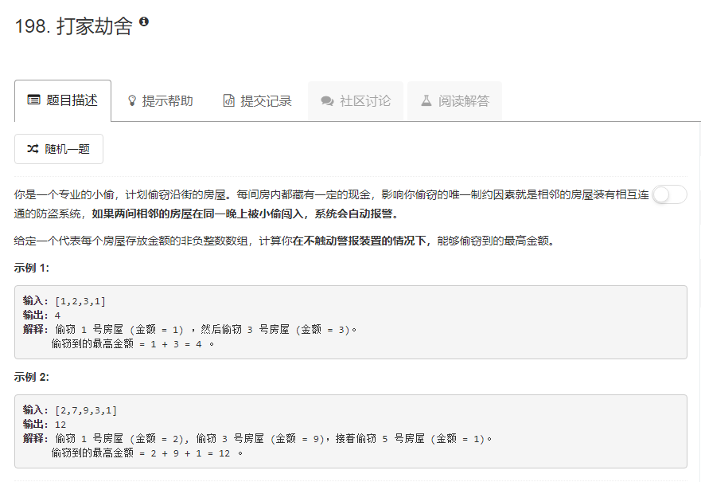

### 198. 打家劫舍
   
对于下标为i的房间，有两种情况：
1. 不拿第i个房间的，此时为dp[i - 1]
2. 拿第i个房间的，这样就不能拿第i-1个房间的，此时为dp[i - 2] + nums[i]   

取上面两种情况的最大值   
然后找初始状态，dp[0] = nums[0], dp[1] = max(nums[0], nums[1])
```java
class Solution {
    public int rob(int[] nums) {
        int len = nums.length;
        if (len == 0) {
            return 0;
        }
        if (len == 1) {
            return nums[0];
        }
        if (len == 2) {
            return Math.max(nums[0], nums[1]);
        }
        int[] dp = new int[len];
        dp[0] = nums[0];
        dp[1] = Math.max(nums[0], nums[1]);
        for (int i = 2; i < len; i++) {
            dp[i] = Math.max(dp[i - 1], dp[i - 2] + nums[i]);
        }
        return dp[len - 1];
    }
}
```