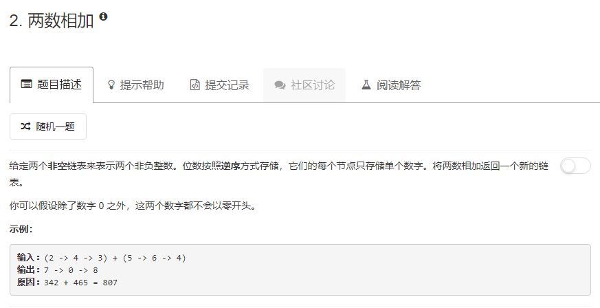

### 2. 两数相加  
   
注意处理进位，即两个链表都遍历完后可能还剩一个进位。  
```java
/**
 * Definition for singly-linked list.
 * public class ListNode {
 *     int val;
 *     ListNode next;
 *     ListNode(int x) { val = x; }
 * }
 */
class Solution {
    public ListNode addTwoNumbers(ListNode l1, ListNode l2) {
        ListNode p1 = l1, p2 = l2, res, cur;
        res = new ListNode(0);
        cur = res;
        int s = 0;
        while(p1 != null && p2 != null) {
            int tmp = p1.val + p2.val + s;
            ListNode node = new ListNode(tmp % 10);
            s = tmp / 10;
            cur.next = node;
            cur = cur.next;
            p1 = p1.next;
            p2 = p2.next;
        }
        while (p1 != null) {
            int tmp = p1.val + s;
            ListNode node = new ListNode(tmp % 10);
            s = tmp / 10;
            cur.next = node;
            cur = cur.next;
            p1 = p1.next;
        }
        while(p2 != null) {
            int tmp = p2.val + s;
            ListNode node = new ListNode(tmp % 10);
            s = tmp / 10;
            cur.next = node;
            cur = cur.next;
            p2 = p2.next;
        }
        if (s > 0) {
            cur.next = new ListNode(s);
        }
        return res.next;
    }
}
```