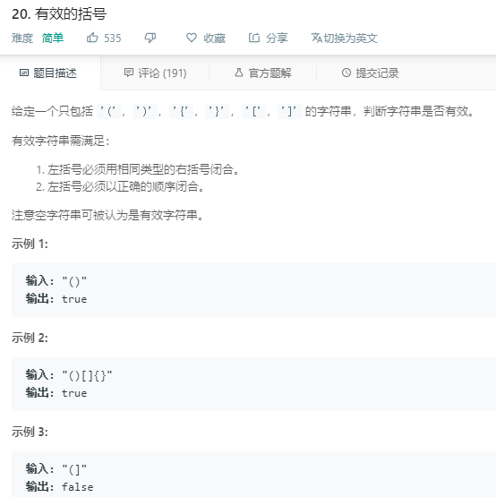

### 20. 有效的括号
   
模拟栈，遇左括号入栈，遇右括号时，如果栈顶没有相匹配的左括号返回false，遍历结束时如果栈不为空，说明有多余的左括号，返回false
```java
class Solution {
    public boolean isValid(String s) {
        char[] stack = new char[s.length()];
        int top = 0;
        for (int i = 0; i < s.length(); i++) {
            char ch = s.charAt(i);
            if (ch == '(' || ch == '[' || ch == '{') {
                stack[top++] = ch;
            } else {
                if (top == 0) {
                    return false;
                }
                char c = stack[top - 1];
                if (c == '(' && ch == ')' || c == '[' && ch == ']' || c == '{' && ch == '}') {
                    top--;
                } else {
                    return false;
                }
            }
        }
        return top == 0;
    }
}
```